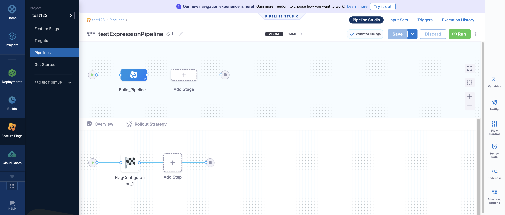
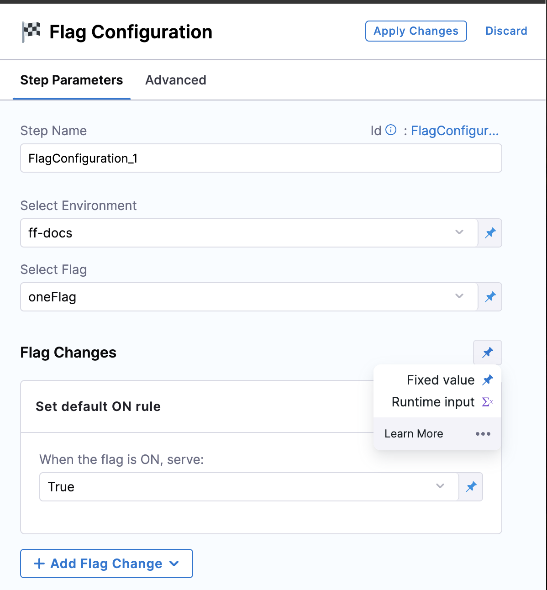
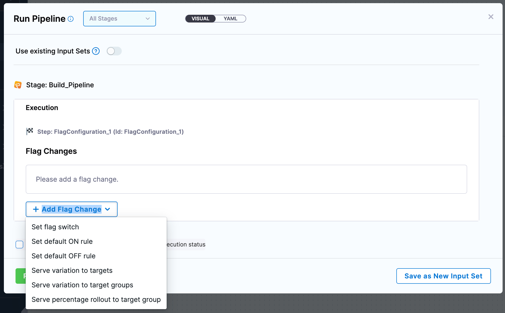

# Expression Pipelines

## What are Expression Pipelines? 

A Feature Flag Expression Pipeline enables you to combine flags with additional features. These features include:
 - creating flags that can now be fixed, set to a runtime of your choice or can have added expressions,
 - setting the environment to now being fixed, set to a runtime of your choice or can also have added expressions,
 - changing the subsections on each of your flags which can now be fixed, have a runtime set and can also have added expressions too.
 - the ability to turn the default on or off within sub-sections.

The ability to build Expression Pipelines has evolved since its first introduction as before, it was limited to fixed, and runtime options for the combined flag changes section as a whole but you can now add the aditional features at the sub-section level as well!

# Getting Started

## How To Set Up Your Expression Pipeline

If you want to set up your first pipeline, check out this Doc on how to [Build Your Feature Flag Pipeline](/docs/feature-flags/ff-build-pipeline/build-feature-flag-pipeline.md).

 1. Assuming you have a pipeline built, select the stage you want to edit within your pipeline. 
 2. On the bottom half of your page, you should see the *Overview* and *Rollout Strategy* tabs appear. 
 3. Select the *Flag Configuration* and a side menu should appear where you can set the Step Parameters. 
 4. Next to the *Flag Changes*, select the Pin symbol next to it. 
 5. From here, you can select *Fixed Value* or *Runtime Input*.
 6. If you select *Fixed Value*, a button should appear to *Add Flag Change*. From the Dropdown menu, you can select between the following choices:
    a. Set Flag Switch
    b. Set default ON rule
    c. Set default OFF rule
    d. Serve variation to targets
    e. Serve variation to target groups 
    f. Serve percentage rollout to target group

 If you're happy with what you select, click *Apply Changes* at the top right hand side of the page.

 7. If you select *Runtime Input*, a description box of the changes should appear. Click *Apply Changes* at the top right hand side of the page. 
 8. The menu should minimise allowing you to click *Save* before you run the pipeline. Please note that you cannot run the pipeline without saving it. 
 9. Once you select *Run*, a pop-up should appear where you can select the flag changes of your choice. 
 10. Once you have made your choice, select *Run Pipeline*. 

 

## How To Set Your Environment 

<!-- To be added -->

## How To Create Default Sub Sections 

<!-- to be added -->

# What Does Each Feature Flag Step Do?

<!--to be added -->

# Related Content

 - [Build Your Feature Flag Pipeline](/docs/feature-flags/ff-build-pipeline/build-feature-flag-pipeline.md)
 - [Add A Default Pipeline For Flag Changes](/docs/feature-flags/ff-build-pipeline/build-feature-flag-pipeline.md)