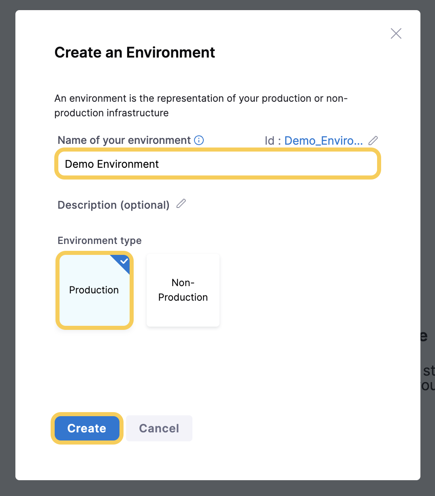

import create_project from './static/1-create-a-project-00.png'
import about_project from './static/1-create-a-project-01.png'
import invite_collabs from './static/1-create-a-project-02.png'

This topic contains instructions for completing the prerequisites, if you haven't done so already, for creating Feature Flags:

* Create a project
* Create an environment
* Create an SDK key

Before you can create a Feature Flag, you need to create a project in the Harness platform. A Feature Flag is available only for the project the flag is created in, so you need to create any flags in each project you want to use them for.

This topic describes how to create a project in the Harness Platform. For more information, go to [Harness Platform documentation](/docs/platform).

:::info note
Before you create a Feature Flag, you need to [create an Organization](/docs/platform/organizations-and-projects/create-an-organization). It's also useful to know about how Access Control works in Harness, to learn more about this, go to [Manage Access Control](/docs/feature-flags/secure-ff/rbac-at-ff/manage-access-control.md).
:::

## Create a project

1. In **Harness**, click **Feature Flags** and click **Create Project**.

	
	
	

1. In **About the Project**, in **Name**, enter the name for your project and select a color for it.
2. In the **Organization** drop-down menu, select the Organization for your project. If you need to create a new Organization, go to [Create a Harness Organization](/docs/platform/organizations-and-projects/create-an-organization#create-a-harness-org) and [Organizations and Projects](/docs/platform/organizations-and-projects/projects-and-organizations).
3. Click **Save and Continue**.

	
	
	

1. (Optional) In **Invite Collaborators**, in **Invite People to Collaborate**, add team members to the project.
2. (Optional) Assign a role to the collaborators and click **Add**. The roles you can select are:
	* Project Viewer
	* Project Admin
	* Pipeline Executer
	* Gitops Admin Role
	* Feature Flag Manage Role

	For more information about the permissions for each role, go to [Manage Access Control](/docs/feature-flags/secure-ff/rbac-at-ff/manage-access-control.md) and [Permissions Reference](/docs/platform/role-based-access-control/permissions-reference).

3. Click **Save and Continue**. Your project is created.

	
	
	

4. In your project, click **Feature Flags**.

## Create an environment 

Once you've created a project, you need to create an environment before you create a Feature Flag. Feature Flags can be used independently across multiple environments within a single project, for example:

* In Project X you have two environments, `Environment_A` and `Environment_B`.
* You create `Flag_1`.
* In `Environment_A` you could have `Flag_1` toggled `on`, but in `Environment_B`, `Flag_1` is toggled `off`.

 

This topic describes how to create an environment in the Harness platform. 

To read more about the Harness Platform, see [Harness Platform](/docs/platform).

### Before you begin

Before you create a Feature Flag, you must have:

1. [Created an Organization](/docs/platform/organizations-and-projects/create-an-organization)
1. [Created a project](#create-a-project)

### Create an environment

1. In your project, in **Environments**, click **Create an Environment**.
1. Enter a **Name** for your environment.

    Harness generates a unique identifier for names. For details and restrictions, go to [Entity Identifier Reference](/docs/platform/references/entity-identifier-reference).

1. Select the **Environment type** and click **Create**.

    

1. Your environment is created and you can find it listed in **Environments**.

## Create an SDK Key

After you’ve created your environment, you need to create an SDK key for it. You need to use this SDK key in your application’s code to authenticate your connection to the Harness Feature Flag client. 

:::info note
 You can view and copy the SDK key only immediately after it is created. For security, after you leave the page, the key is redacted and you can’t view it. Make sure you make a copy of the key to use in your application.
:::

To create an SDK key:

1. In the environment you created, in **Settings**, click **Create SDK Key**.
2. In **Create SDK Key**, in **Name**, enter a name for your SDK key.
3. In **Key Type**, select either **Client** or **Server** depending on the type of SDK you want to use. For more information about the SDK types Harness supports, go to [Chose a Client-side or Server-side SDK](/docs/feature-flags/ff-sdks/sdk-overview/client-side-and-server-side-sdks). If your organization needs to rotate the keys, you can choose to add more than one key for the same environment.
4. Click **Create**.
5. Copy and store your Secret.

    :::info note
     You can only view and copy the SDK key immediately after it is created. For security, after you leave the page, the key is redacted and you can’t view it. Make sure you make a copy of the key to use in your application.
    :::

