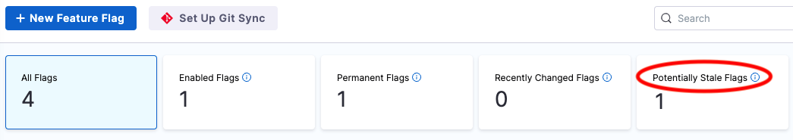
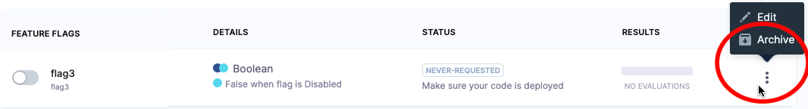

```mdx-code-block
import edit_flag from './static/2-edit-and-delete-a-feature-flag-06.png'
```

## Edit the details of a flag

After you have created a flag, you can edit the following details:

* Flag name
* Description
* Whether or not it is marked as permanent

To edit a flag:

1. In your Harness project, navigate to **Feature Flags > Feature Flags**.
1. Next to the flag you want to edit, select **more options** (**︙**), and then select **Edit**.

   

1. Edit the relevant details, and then select **Save**.

For more information, go to:

* [Change your flag variations](manage-variations.md)
* [Add prerequisite flags](/docs/feature-flags/add-prerequisites-to-feature-flag)
* [Manage your targets](/docs/feature-flags/ff-target-management/add-targets)

## Check for stale flags

You might want to check if you have stale flags so that you can decide whether to archive them. In Harness, flags are counted as potentially stale if in the past 60 days:

* They haven't been changed or evaluated.
* Their default rules or target rules haven't been added to, or updated.
* They haven't been toggled on or off.

If a flag gets stale, and then any of the above occurs, the flag is no longer considered stale.

To view a list of potentially stale flags:

* Go to **Feature Flags > Feature Flags**, and then select **Potentially Stale Flags**.

   


## Archive and restore flags

:::info note
This feature is currently behind the feature flag `FFM_7921_ARCHIVING_FEATURE_FLAGS`. Contact [Harness Support](mailto:support@harness.io) to enable the feature.
:::

To remove a flag from Harness you must archive it first. This gives you the option of restoring the flag within 30 days. After 30 days, an archived flag is permanently deleted. You can [check for stale flags](#check-for-stale-flags) to identify which flags you might want to archive.

### Archive a flag

You can archive a flag if it's not a prerequisite to other flags. If it is, remove it as a prerequisite, and then archive it.

:::info notes
1. When you archive a flag, it is removed from all environments.
2. You cannot archive a flag if it is a prerequisite to other flags. Remove the flag as a prerequisite, and then you can archive it.
:::

To archive a flag:

1. In your Harness project, navigate to **Feature Flags > Feature Flags**.
1. Next to the flag you want to archive, select **more options** (**︙**), and then select **Archive**.

   

   The Archive Flag confirmation screen appears next. If the flag you're archiving is a prerequisite to a second flag, you can select the second flag from this screen to remove the dependency, and then try archiving again. 

1. If you're sure you want to archive the flag, type the name or ID of the flag in the field provided, and then select **Archive**.

   You can restore this flag within 30 days.


### Restore a flag

Restoring a flag makes it available again for evaluation if the flag is referenced in your code. That is, you haven't removed the references to it when you archived the flag, or you've reinstated those references.

When you restore a flag, it's restored to all environments. All of the flag's configurations in an environment (including whether it's enabled or disabled) will be restored to the state they were in, in that environment, when the flag was archived. If you created new environments since the flag was archived, the flag will be disabled in those.

To restore a flag:

1. In your Harness project, navigate to **Feature Flags > Feature Flags**, and then select the **Archived** filter at the top of the page.

   A list of archived flags is displayed.

1. Next to the flag you want to restore, select **more options** (**︙**), and then select **Restore**.
1. On the confirmation screen, select **Restore**.

### Delete an archived flag

Archived flags are automatically deleted 30 days after you archive them. But if you're sure you want to delete the flag immediately, you can delete an archived flag before that 30-day period ends.

:::info note
When you delete a flag, it is permanently removed from all environments.
:::

To delete an archived flag:

1. In your Harness project, navigate to **Feature Flags > Feature Flags**, and then select the **Archived** filter at the top of the page.

   A list of archived flags is displayed.

1. Next to the flag you want to delete, select **more options** (**︙**), and then select **Delete**.
1. On the confirmation screen, select **Delete**.


