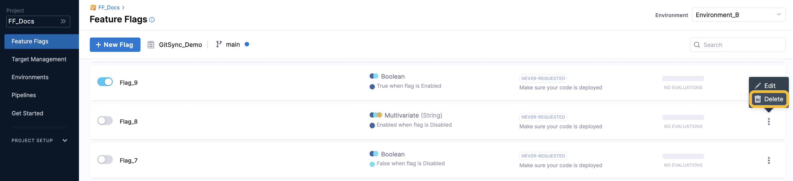
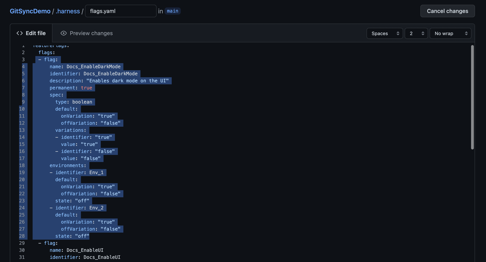

```mdx-code-block
import edit_flag from './static/2-edit-and-delete-a-feature-flag-06.png'
```

## Edit the details of a flag

After you have created a flag, you can edit the following details:

* Flag name
* Description
* Whether or not it is marked as permanent

To edit a flag:

1. In Harness, go to **Feature Flags**.
2. In your project, select **Feature Flags**. All your current flags are listed.
3. Next to the flag you want to edit, select **more options** (**︙**).
4. Select **Edit**. The flag details page appears.

   

5. Edit the relevant details, and then select **Save**.


### See also

* [Edit your flag variations](manage-variations.md)
* [Add prerequisite flags](/docs/feature-flags/add-prerequisites-to-feature-flag)
* [Manage your targets](/docs/feature-flags/ff-target-management/add-targets)

## Check for stale flags

You might want to check if you have stale flags so that you can decide whether to delete or archive them. In Harness, flags are counted as potentially stale if in the past 60 days:

* They haven't been changed or evaluated.
* Their default rules or target rules haven't been added to, or updated.
* They haven't been toggled on or off.

**To view a list of potentially stale flags:**

* Go to **Feature Flags > Feature Flags**, and then select **Potentially Stale Flags**.

   

## Delete a flag

When you are finished with a flag, it's best practice to remove it to keep your flags and application organized and tidy. You can [check for stale flags](#check-for-stale-flags) to identify which flags you might want to delete.

If you're not sure if you want to delete a flag yet, consider [archiving](#archive-a-flag) it (which lets you restore the flag within 30 days).

:::info note
 Make sure you are ready to delete the flag from all of your Environments. When you delete a flag on the Harness Platform or on Git, it is removed from all Environments.
:::


### Delete a flag using the Harness UI

**To delete a flag in the UI:**

1. In Harness, go to **Feature Flags**, then to the flag you want to delete.
2. Select **more options** (**︙**) next to the flag that you want to delete, then select **Delete**.

   

3. In **Delete Flag**, select **Delete**.


### Delete a flag using Git

**To delete a flag with Git:**

If you [have set up Git Experience to manage your flags](/docs/feature-flags/manage-featureflags-in-git-repos) via a `.yaml` file on Git, you can delete flags from there. To do this:


1. Go to the `.yaml` file where you manage your flags.
2. Find the flag you want to delete.
3. Delete the `- flag` object. For example, the following highlighted section would be deleted for the flag called `New_Flag:`

   

## Archive and restore flags

### Archive a flag

Unlike deleting a flag, archiving a flag gives you the option of restoring it within 30 days. You can [check for stale flags](#check-for-stale-flags) to identify which flags you might want to archive.

**To archive a flag:**

1. 

### Restore a flag

