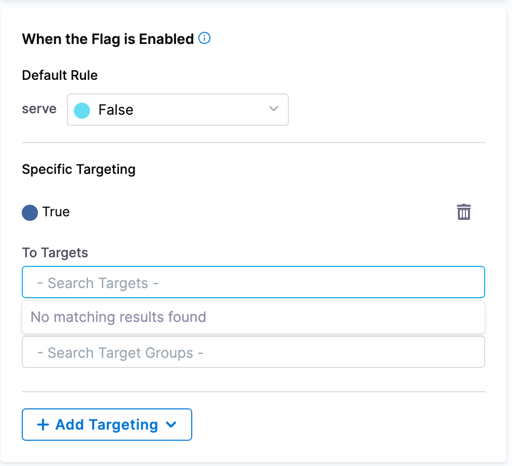

## Managing rules of your flags

### Editing rules

Within Harness Feature Flags, rules contains the targeting logic within your flags. The rules help describe what variation the flag should present to the user when the flag is enabled or disabled. 

When you create a Feature Flag within your project, you have the option to specify a specific variation using **Default Rules**. 

 

In order to do this, you would need to:

 1. Go into your **Project** and select **Feature Flags** on the left hand menu panel. 
 2. If editing the rule of an existing flag, double click on your chosen flag. 
 3. On the right hand side of the page, the **Targeting** option should already be selected and you can proceed to editing your rules for when the flag is enabled or when the flag is disabled. 
 4. Once you have made the changes you need, select **Save** at the bottom of the screen.  

Ensure the flag is turned on for your selected environment for your changes to run successfully. 

When editing your rules, you may have noticed the option to add **Targets** and, or, **Target Groups**. If you'd like to learn more on how to create **Targets** and **Target Groups**, have a look at some useful Harness docs on the topic:

 * [Add Targets](/docs/feature-flags/ff-target-management/add-targets.md)
 * [Add Target Groups](/docs/feature-flags/ff-target-management/add-target-groups.md)
 * [Targeting Users with Flags](/docs/feature-flags/ff-target-management/targeting-users-with-flags.md)

## Editing configuration

