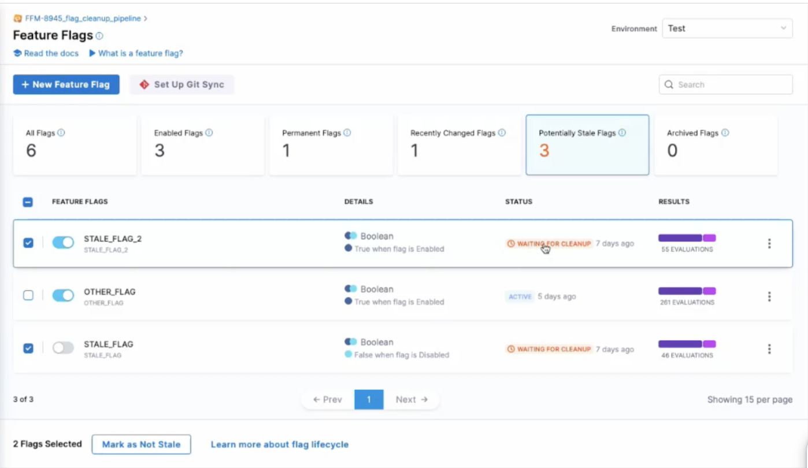
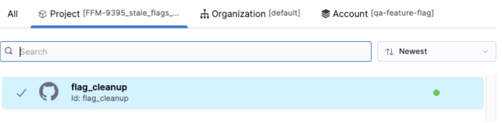
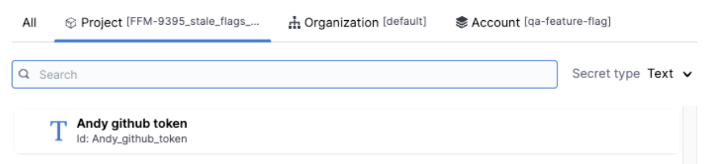
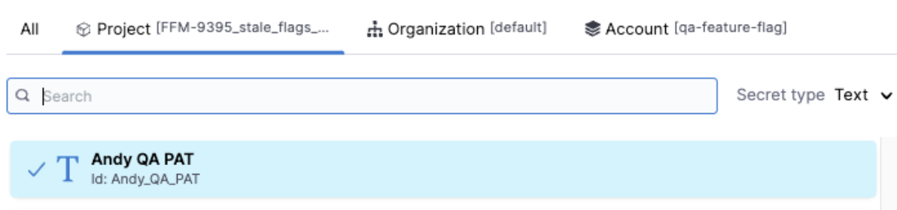
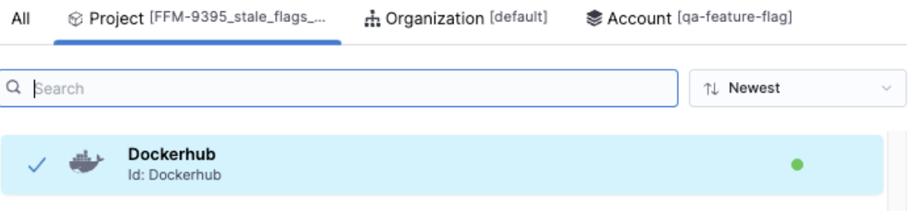
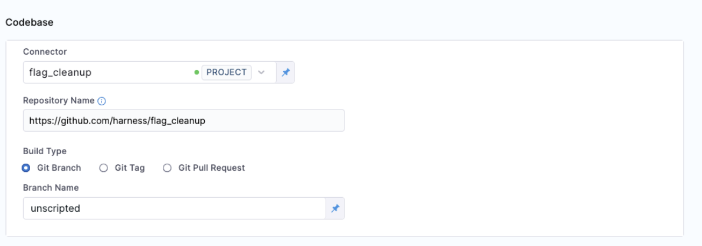
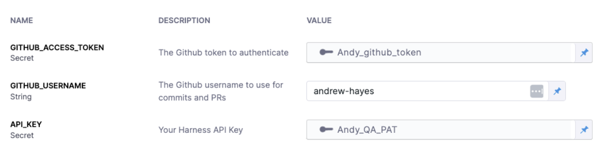
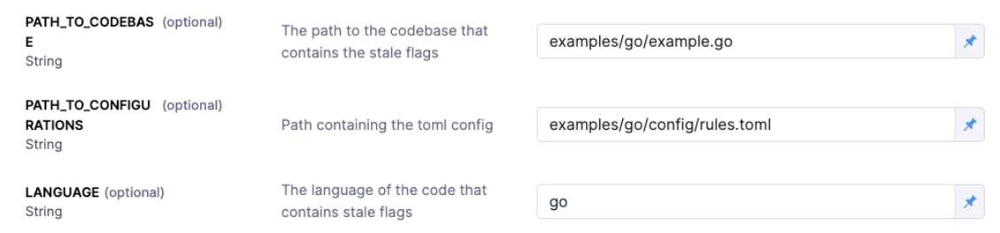
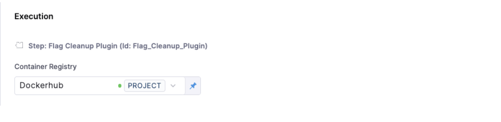
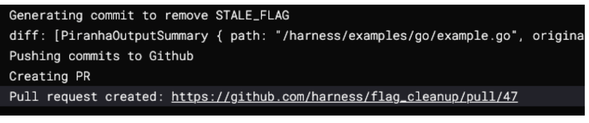

:::info note
Stale flag management and cleanup automation is a beta feature.
:::

## Manage stale flags

Harness Feature Flags helps to identify stale flags, as well as to automate the process of removing them from your code.

Stale flags are flags that are no longer needed as the change behind them has been widely rolled out and no longer needs any control in production. 

### Find potentially stale flags

- At the top of your Feature Flags overview screen, you will find a list of filters. 
- One of those filters is labeled **Potentially Stale Flags**. 
- Click this list to see which flags have been highlighted by Harness as potentially stale.

By seeing which flags are potentially stale, your team can choose to either manually clean them up, mark them for automated cleanup via Harness, or mark them as not being stale at all.

### Definition of potentially stale

Harness defines _potentially stale_ flags as follows 

- Flag has not had evaluations in the last 60 days.

Or

- Flags that have not had any modification to their targeting rules in longer than 60 days.

Or

- Flags that have been globally set to a single value for longer than 30 days.

### Mark flags for cleanup

When viewing all flags marked as potentially stale, you have two options within Harness

- **Mark as not stale** - this will remove the flag from the _potentially stale_ list for a period of 60 days. If the same criteria are met after 60 days, the flag will appear in the _potentially stale_ list again

- **Mark as Ready for Cleanup** - this will change the flag’s status to _ready for cleanup_ , which will appear in the UI and be used as a list for the flag cleanup pipeline.

Note that once a flag has been marked as _ready for cleanup_, you can still undo this decision by marking the flag as not stale.

## Flag cleanup automation 

### What’s needed

In order to leverage Harness’ flag cleanup automation pipeline, you will need the following:

- A valid cleanup [toml configuration file](https://www.google.com/url?q=https://github.com/harness/flag_cleanup/blob/unscripted/docs/1_understanding_rules.md&sa=D&source=docs&ust=1695064949403882&usg=AOvVaw19GoyueRvzdkIJXRnwLyhx)
- A Harness API key (so we can get the list of stale flags)
- A Dockerhub connector to download the cleanup plugin
- [A git connector on Harness](https://developer.harness.io/docs/platform/connectors/code-repositories/ref-source-repo-provider/git-hub-connector-settings-reference/) - to connect to your code
- A Github token to create the PR

### Languages supported for flag cleanup

At this time, the following languages are supported for flag cleanup automation:

- Java	
- Kotlin
- Go

### Set up a flag cleanup pipeline

In order to use flag cleanup automation during the beta phase, you will need to [import a pipeline template](https://developer.harness.io/docs/platform/git-experience/import-a-template-from-git/).

- The URL to import from is https://github.com/harness/flag_cleanup/blob/unscripted/docs/pipelines/flag_cleanup_pipeline.yaml
- Note that the identifier and the name must match

<iframe width="560" height="315" src="https://www.youtube.com/embed/sSP1nxrBwxo?si=dGI7vBmio6pfhWnX" title="YouTube video player" frameborder="0" allow="accelerometer; autoplay; clipboard-write; encrypted-media; gyroscope; picture-in-picture; web-share" allowfullscreen></iframe>

### Training your cleanup configuration file 

You will need update the rules file with the correct tree-sitter query.

<iframe width="560" height="315" src="https://www.youtube.com/embed/Y22vmMNwPYU?si=W-SHEQlHV-3cNYOg" title="YouTube video player" frameborder="0" allow="accelerometer; autoplay; clipboard-write; encrypted-media; gyroscope; picture-in-picture; web-share" allowfullscreen></iframe>

### Secrets configuration for Gitub

- A Github connector to connect to the repo to clone down the code to cleanup. The [demo repo is here](https://github.com/harness/flag_cleanup) and the branch to use is “unscripted”.

- A Github token to allow the creation of PRs.

- A Harness API key to get the list of flags marked for cleanup.

- A Docker connector to pull down the plugin image.

### Run the flag cleanup pipeline

Here we have the pipeline set up and our flags marked for cleanup. So now all we need to do is run the pipeline to do the cleanup.

- Select the repo for the codebase and the branch.

- Select the Github token, Github username and Harness API Key.

- Select what code to run against. In our example repo we have both Go and Java. This are the paths to run against the Go code:

- Select the DockerHub connector to pull down the plugin container. And hit run!

As the pipeline runs you will see logs from the plugin showing it getting the flags and performing the code changes.

You can then navigate to the PR and see the changes it made.
