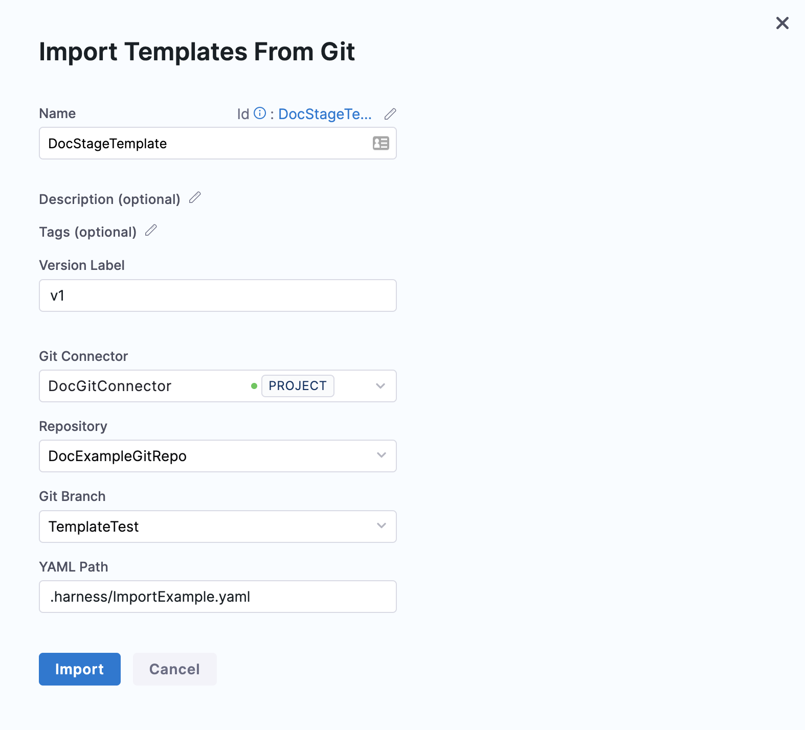

## Manage stale flags

Harness Feature Flags helps to identify stale flags and automates the process of removing them from your code.

Stale flags are flags that are no longer needed as the change behind them has been widely rolled out and no longer needs any control in production. Stale flags are flexible and can also be configured to a number of days set by the user for smoother Feature Flag management.

### The Different Flag States

To help manage your flags, here are the definitions of the different flag states:

 - Potentially Stale: 
 -- Any flag that meets any of these criteria (these are ORs, not ANDs)
 -- Has been disabled for more than 60 days 
 -- Is enabled but has not received any new targeting rules or rule updates or default rule changes for more than 60 days
 -- Is enabled but has not received any evaluations for more than 60 days

 - Enabled Flags:
 -- A flag that has been set to 'Enabled' or 'On'.

 - Active: 
 -- These are flags that have received evaluation data. 

 - Changed Last 24 Hours:
 -- Floats that have received new targeted rules or default rule changes recently.

 - Temporary:
 -- Any flag that is not marked as permanent. 

 - Permanent:
 -- Any flag marked as permanent.

### Navigating Flag Cleanup 

When viewing all flags marked as potentially stale, there are two options within Harness to help with Flag Clean-up:

 - **Mark as not stale** - This will remove the flag from the _potentially stale_ list for a period of 60 days. If the set criteria are met after 60 days, the flag will appear in the _potentially stale_ list again.

 - **Mark as Ready for Cleanup** - This will change the flag’s status to _ready for cleanup_ , which will appear in the UI and be used as a list for the flag cleanup pipeline.

Note that once a flag has been marked as _ready for cleanup_, you can still undo this decision by marking the flag as not stale.

## Automating Flag Cleanup

If you would like to automate the process of flag clean-up, here are some steps you can follow in order to put it in place:

### Pre-requisites

In order to leverage Harness’ flag cleanup automation pipeline, you will need the following:

- A valid cleanup [toml configuration file](https://github.com/harness/flag_cleanup/blob/unscripted/docs/1_understanding_rules.md).
- A Harness API key (so we can get the list of stale flags).
- A Dockerhub connector to download the cleanup plugin.
- [A git connector on Harness](https://developer.harness.io/docs/platform/connectors/code-repositories/ref-source-repo-provider/git-hub-connector-settings-reference/) - to connect to your code.
- A Github token to create the PR.

At this time, the following languages are supported for flag cleanup automation:

 - Java
 - Kotlin
 - Go

## Setting up a Flag Cleanup Pipeline

In order to use flag cleanup automation, you will need to import a Pipeline Template. You can use the followiung URL to import from: 

 `https://github.com/harness/flag_cleanup/blob/unscripted/docs/pipelines/flag_cleanup_pipeline.yaml`

Note that the identifier and the name **must** match.

Here are the steps below for setting up an Flag Cleanup Pipeline:

### Permissions

* To import a Template, make sure you have the **Create/Edit** permissions for Templates.

### Import a template

You can import a Template in the Account, Org, or Project scope.

This topic explains how to import a Template in the Project scope.

1. In your Harness Account, go to your Project.  
You can import a Template from the CI or CD module in Harness.  
This topic shows you how to import a Template to the CD module.
2. Click **Deployments**.
3. In **Project Setup**, click **Templates**.
4. Click **New Template** and then click **Import From Git**.
   

   
   
   The **Import Template From Git** settings appear.
   
   

5. Enter a **Name** for your Template.
6. In **Version Label**, enter a version for the Template.
7. In **Git Connector**, select or create a Git Connector to connect to your Git repo. For steps, see [Code Repo Connectors](https://harness.helpdocs.io/category/xyexvcc206-ref-source-repo-provider).

   IMPORTANT: Connector must use the Enable API access option and Token.

   

   Connector must use the Enable API access option and Token
   The Connector must use the **Enable API access** option and **Username and Token** authentication. Harness requires a token for API access. Generate the token in your account on the Git provider and add it to Harness as a Secret. Next, use the token in the credentials for the Git Connector.

   

8. In **Repository**, select the repository from where you want to import the Template. If you don't see your repository in the list, enter its name since only a select few repositories are filled here.
   

:::info note
   Create the repository in Git before entering it in **Select Repository**. Harness does not create the repository for you.
:::

9.  In **Git Branch**, select the branch from where you want to import the Template. If you don't see your branch in the list, enter its name since only a select few branches are filled here.

:::info note
Create the branch in your repository before entering it in **Git Branch**. Harness does not create the branch for you.
:::

10. Enter the **YAML Path** from where you want to import the Template. All your configurations are stored in Git in the Harness Folder. You can learn more about this in the [Harness Git Experience Overview Docs](../../platform/git-experience/git-experience-overview.md).

   

11. Click **Import**.  

    Click on your Template to proceed.  
    By default, Harness fetches your Template details from the default branch. If you have imported Template from some other branch, select the branch from where you imported the Template and continue.
    
    

If you'd like to see this demonstrated, check out the following YouTube video from Harness on how to 'Import Flag Cleanup As A Template': 

<DocVideo src="https://www.youtube.com/embed/sSP1nxrBwxo?si=dGI7vBmio6pfhWnX" />

### Run the flag cleanup pipeline

In this step, let's assumne the pipeline is set up and our flags are marked for cleanup. From here, all we need to do is run the pipeline to do the cleanup. Here is how to do that.:

1. Select the repo for the codebase and the branch.

2. Select the Github token, Github username, and Harness API Key.

3. Select what code to run against. The example repo includes both Go and Java. These are the paths to run against the Go code:

4. Select the DockerHub connector to pull down the plugin container, and then select **Run**.

As the pipeline runs, logs from the plugin show it getting the flags and performing the code changes.

You can then navigate to the PR and see the changes it made.

## Setting Up Your Cleanup Configuration File

To set up your cleanup configuration file, you will need to update the rules file with the correct tree-sitter query. Check out the following YouTube video from Harness about 'Understanding Tree Sitting Queries'.

<DocVideo src="https://www.youtube.com/embed/Y22vmMNwPYU?si=W-SHEQlHV-3cNYOg" />

### Secrets configuration for Gitub

You can find the repo for the Github connector that connects to the repo to clone down the code to cleanup [here](https://github.com/harness/flag_cleanup). The branch to use is titled, `unscripted`.

<!-- NEED TO CLARIFY THESE STEPS RATHER THAN DEPENDING ON IMAGES -->

Here this is done, follow these steps below:

 1. 

- A Github token to allow the creation of PRs.

- A Harness API key to get the list of flags marked for cleanup.

- A Docker connector to pull down the plugin image.

