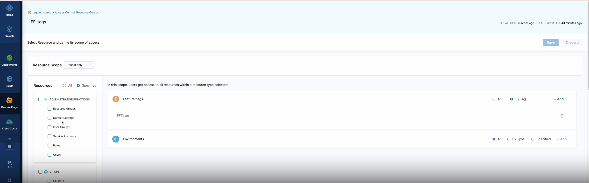

# Tagging Management Overview

## What is Tagging?

The Tagging Feature by Harness is a great way to organize and group your feature flags. You are able to create tags and assign them to, not only, categorize your Feature Flags, but also to manage permissions. 

This feature is incredibly exciting for our users as they can now create a resource group based on tags, environments or both when needed. The tags can also be used to support searching and filtering through your feature flags. Further to this, when creating a resource group using Tagging, you can further define permissions for users and for user groups.

## How To Use Tagging In Feature Flags

### Creating A Tag

There are two methods to creating a tag in Feature Flag. You can do this by either creating a new Feature Flag or by editing an existing one. Here are the steps you need to follow:

### Creating a Tag With A New Feature Flag

 1. On the Home Page of the Harness Application, head over to *Feature Flags*.
 2. Under the *Feature Flags* tab, click on *New Feature Flag*. 
 3. You may be asked to select between the type of Feature Flag you want to create which are either *Boolean* or *Multivariate*. Please select one of these choices. 
 3. Type the name of your Feature Flag and in the Tags box, type the name of your new tag and press *Enter*. 
 4. Press *Next* and go on to save your Flag. 
 5. Once saved, you should see the tags under your new Feature Flag. 

### Filtering Your Flags using Tags

  1. On the Home Page of the Harness Application, head over to *Feature Flags*.
  2. On the right hand side of the screen, you can type your tag or select the tag you want. 

### Editing A Tag 

  1. On the Home Page of the Harness Application, head over to *Feature Flags*.
  2. Under the *Feature Flags* section, you should see a list of your existing flags. 
  3. Select a flag that has a tag that you want to edit by clicking the three dots at the end of the flag and selecting *Edit*. This includes flags that don't have any assigned tags.
  4. On the next page, select the three dots located next to the name of your flag followed by *Edit* in the small dropdown menu that appears. 
  5. You can, then, edit the tags or remove them or create a new one within the Tags box. 

:::tip

If you're not familiar with RBAC, check out this blog post on [User and Role Management in the Harness Software Delivery Platform](https://harness.io/blog/continuous-delivery/user-role-management/).

:::

### Adding RBAC to Tags

RBAC (Role Based Access Control) is an area lets you control who can access your resources and what actions they can perform on the resources. You can do this by assigning tags to the users within the Resource Group. Here are the steps on how to do this:

 1. On the Home Page of the Harness Application, head over to *Feature Flags*.
 2. Under the *Feature Flags* tab, scroll down and click on the *Project Setup* dropdown menu. Click *Access Control*. 
 3. Click on the User you want to assign it to. If you do not have any users under this tab, click on *New User* on the top left of the screen and follow the steps to create one. 
 4. Under the *Resource Group* column, you'll find the Role and/or the Resource Group the user is assigned to. Click on the Resource Group. 
 5. On the left hand side should be a panel titled *Resources*. Scroll down until you reach the *Feature Flags* section and select your Resource Group. 
 6. On the right hand side of the page, select *By Tag*, followed by *Add Tag*.
 7. From there, you can asign any pre-existing tags to the Resource Group.
 8. The users under the assigned tags should be limited to whichever settings you have permitted for them such as permission to *Create/Edit* within Feature Flags. 

<!-- ### Managing Permissions Using Tagging -->

<!-- 
below to be edited in second draft

You can manage permissions of  

 1. On the Home Page of the Harness Application, head over to *Feature Flags*.
 2. Under the *Feature Flags* tab, scroll down and click on the *Project Setup* dropdown menu. Click *Access Control*. 
--> 
<!-- ### Best Practices to be added in second draft -->

# Related Content

 - [Manage access control](/docs/feature-flags/ff-security-compliance/manage-access-control.md)

 - [Creating a Feature Flag](/docs/feature-flags/ff-creating-flag/create-a-feature-flag.md)

