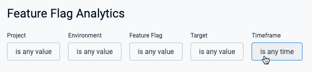
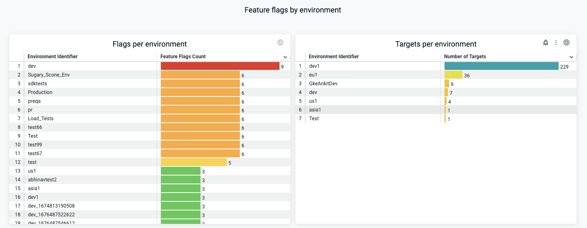

Feature Flags comes with an out-of-the-box dashboard that provides various aggregated views of data about your flags at an organization level, which includes flags across all projects in an organization. You can view, download, schedule, and alert on the dashboard data. You can download data from this dashboard to use in other tools, and you can also create your own custom dashboard.

For a complete guide to Harness dashboards, go to [Dashboards](/docs/category/dashboards-1).

This topic provides some highlights and useful information about the Feature Flags dashboard.

## Feature Flags dashboard highlights

### View the dashboard

To view the Feature Flags dashboard: 

1. In Harness, select **Dashboards** in the left navigation pane.
1. In the Dashboards page, select **Feature Flags**, and then choose **Feature Flag Analytics**.

	The dashboard is displayed, showing the total number of flags, targets, and environments in this Harness organization.

	

On the dashboard, you can explore various charts and graphs, select different areas of the cards to see information in tabular form and download it to use in other tools.

### Narrow down your data set

Chances are you'll have many flags across projects, environments, and targets, so it's important to filter the timeframe to zero in on the data set you want.

Use the filters at the top of the dashboard to narrow down some or all of these values:

### View flags by environment

These two charts are helpful to understand the number of flags or targets in each environment.

### View flags by type and status

### View flags created by user

This chart is helpful to see who in your organization is creating flags, and how many. One way to use this is to help adoption of feature flags usage by having the people who create a lot of flags help others to use them.

### View flags and targets created over time

## Download, schedule, and share dashboard data

## Alert on dashboard data

## Create a custom dashboard

