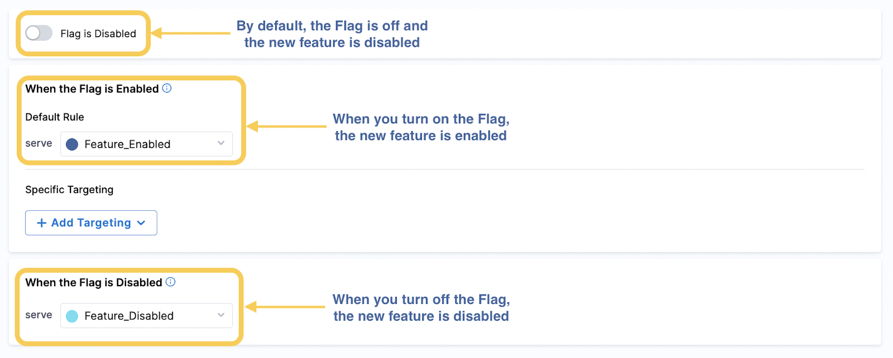
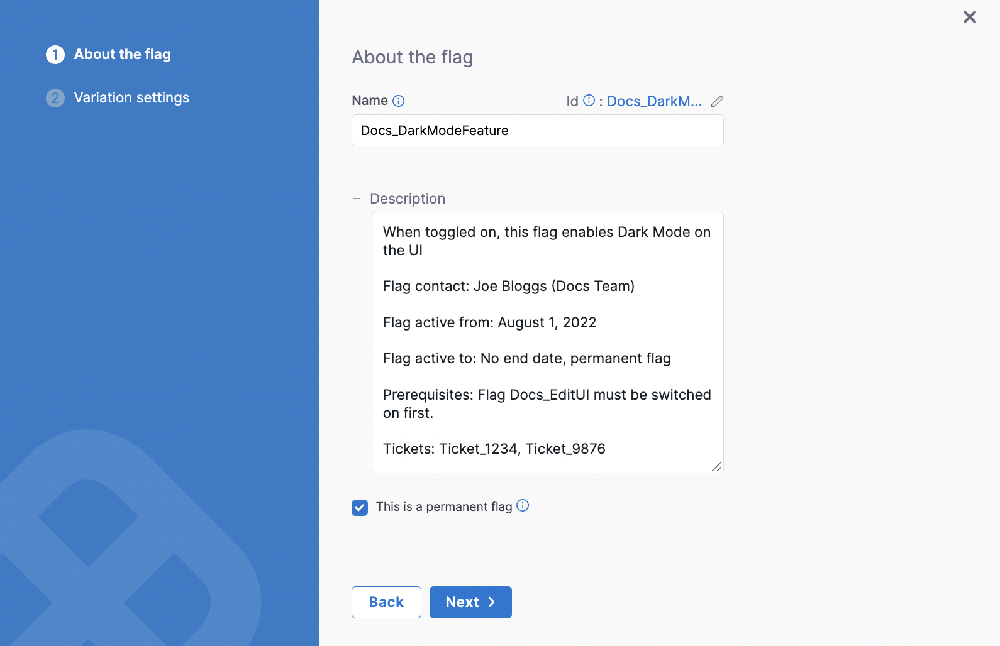

To help you get the most out of your Feature Flags, we’ve drawn up some best practices that you can implement to manage them. The points below aren’t mandatory but they can help you organize your Flags and plan for the future so you don’t have to revise them at a later date.

## Plan your Feature Flags

Before you even create a Feature Flag, it’s best practice to create a plan for it. While planning, there are a number of things to consider: 

### Flag use cases

Decide on what the Flag will be used for and how it will be used by your team, remember to think about the following:

* The purpose of the Flag, for example, if it will be used for a feature release, experiment, or to give particular users certain permissions.
* Who the Flag will be toggled on and off for.
* When the Flag will be toggled on and off.
* Which Environments you’ll use the Flag in.
* Whether the Flag will be temporary or permanent. For example, if you’re testing a new feature, you might create a temporary Flag that you can later delete after the feature has been successfully released. A permanent Flag could be used for daily operations such as ensuring only users with certain roles have access to features.
* If the Flag will impact any other Flags you have already created, or if any other Flags will impact the new Flag you’re creating.
* Whether you need a simple Boolean Flag, or a Multivariate Flag. If there is a chance your Flag will need to have more than two variations in the future, it’s best to create a Multivariate Flag to give yourself the flexibility to add more variations later.

### Default Flag Variation

The Variation of your Flags determine what will be served to your users. When deciding the Default Flag Variation, consider what is an intuitive Variation for what you’re using the Flag for. For example:

* If you are using a Flag to release a feature, you create a Feature Enabled and Feature Disabled Variation. Feature Disabled = False and Feature Enabled = True. The Variation that you assign to False is always the default until you change it, so it is easy to understand that when Feature Enabled is toggled on, the feature is then switched on, for example:
* However, if you are deprecating a feature, the opposite makes sense. The default False Variation is called Feature Enabled and  Feature Disabled = True. Therefore, when you toggled the Flag on, the feature is switched off, for example:

### Flag dependencies

Determine if the Flag needs Prerequisite Flags and be prepared to add them. For example,  if you have a Flag for front-end changes that depends on back-end changes being implemented first, you can add a Prerequisite that the back-end Flag must be turned on before the front-end Flag is turned on. 

### Rollout rules

Create a set of rules with your team to ensure your rollouts run smoothly. There are a number of Harness Features you can utilize to help with this, such as using [approval steps in pipelines](../../2-ff-using-flags/6-ff-build-pipeline/1-build-feature-flag-pipeline.md) or using the [Harness Policy Engine](../../2-ff-using-flags/8-harness-policy-engine.md). When creating roll out rules, it’s important to consider:

* Types of roll outs you may run, and the strategy for each.
* Rules that must be applied for all roll outs, for example, a rule stating that a Flag cannot be switched on in your production environment until it has been tested in your QA environment for one week.

## Name your Flags well

It is likely that you’ll use many Flags and it’s important to keep them organized and easy to understand what they are used for. One of the easiest ways to  stay on top of them is to implement a naming convention that you follow for all Flags Things to consider when creating a naming convention are: 

* Flag names should be unique. Although on the Harness Platform, only unique identifiers are enforced, it’s good practice to keep your Flag names unique too so your team don’t confuse them.
* Make the names user friendly; they should describe what the Flag does. For example, EnableVersion2UI describes that the Flag enables Version 2 of the user interface.
* If your Flags are specific to a team, consider adding the team to the Flag name, for example, Dev\_EnableVersion2UI.
* To help with keeping your naming consistent, you could use the [Harness Policy Engine to enforce it](../../2-ff-using-flags/8-harness-policy-engine.md).
* Don’t forget to tell your whole team what the naming convention is, so that anyone who creates a Flag uses the correct convention.

## Add descriptions to your Flags

Add a description to your Flag. This is optional on the Harness Platform, but we highly recommend it as it can provide much more information than the Flag name alone. The description should be short but include relevant details, for example, you could include:

* The contact information for who is responsible for that Flag.
* How long the Flag should be active for.
* Any Prerequisite Flags that need to be toggled on before you use this Flag.
* Links to information or tickets related to the Flag.

To help with this, you can use the [Harness Policy Engine to enforce descriptions](../../2-ff-using-flags/8-harness-policy-engine.md) when creating a Flag.

import ffimage from './static/1-feature-flag-best-practices-04.png';

## Manage Targeting with Target Groups

When using Feature Flags, you select Targets to serve a particular Variation of the Flag to, for example, serving True to enable a feature for some users and False to disable the feature for others. We often refer to Targets as users, but a Target can be anything that can be uniquely identified such as a user, an application, a machine, or any resource uniquely identified by an IP address, email ID, user ID, etc.

As you’re likely to have many Targets, we recommend that you organize them by creating Target Groups and adding the relevant Targets to them, so you can add the group rather than each individual Target when serving a Flag Variation. You can add Targets to a group based on conditions you set instead too, instead of adding each one individually. 

## Remember your Environment

As Flags can have different states in different Environments, when using them, make sure you remember to switch the Flag on or off in the correct Environment. 

## Delete old Flags

Remember to delete Flags after you have finished with them to keep your code clean and organized. For example, you could do a Flag clean-up sprint at the end of each quarter, or add a Flag clean-up story to each epic to ensure you are removing out-of-date Flags. 

