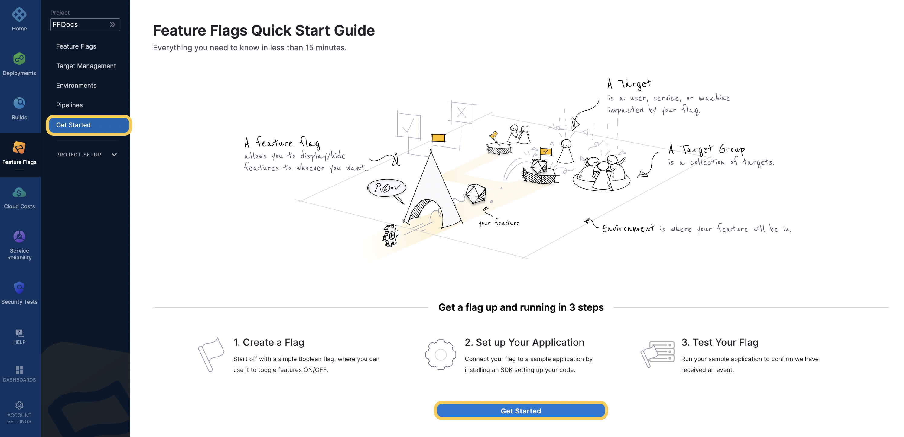

This guide describes the basic steps for getting started with Harness Feature Flags.

## Basic steps for creating a Feature Flag

To create a Flag, you need to complete the following steps:

1. [Create a Project](/docs/feature-flags/ff-creating-flag/create-a-project) to host your Flags in.
2. [Create an Environment](/docs/feature-flags/ff-creating-flag/create-a-project#create-an-environment) within your project. You can have multiple environments in a single project.
3. [Create an SDK Key](/docs/feature-flags/ff-creating-flag/create-a-project#create-an-sdk-key) for your environment. You use this to connect to a Feature Flag SDK.
4. [Create a Feature Flag](/docs/feature-flags/ff-creating-flag/create-a-feature-flag).
5. [Connect your application using one of our SDKs](/docs/feature-flags/ff-sdks/sdk-overview/client-side-and-server-side-sdks).

You can also follow the Get Started tutorial for Feature Flags on the Harness Platform.

## Next steps

Once you have created your flag, you can then:

* [Manage Targets](/docs/feature-flags/ff-target-management/targeting-users-with-flags)
* Modify [Variations](/docs/feature-flags/ff-creating-flag/manage-variations) and [Rules](/docs/feature-flags/ff-target-management/targeting-users-with-flags)
* [Add Prerequisites](/docs/feature-flags/add-prerequisites-to-feature-flag)

