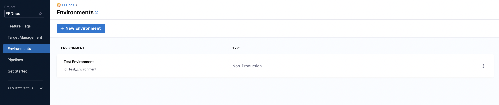

This guide shows you how to create a Feature Flag in Harness and use the Feature Flags Java SDK in your application.

## Objectives

You'll learn how to:

* Create a project in Harness
* Create an environment in Harness
* Create a Feature Flag in Harness
* Add an SDK Key for your environment
* Use Harness Feature Flags SDKs with Java Applications. Your flag is automatically available for use in all environments of your project. However, you need to install the Harness SDK to all environments you wish to initiate your flag in.

## Create a project

As a first step, you need to create a project in Harness. To do this:

1. On the Harness Platform, click **Feature Flags** and click **Create Project**.
2. In **Projects**, click **Project**.
3. In **About the Project**, in **Name**, enter the name for your project. You will create your Feature Flag for this project.
4. (Optional) Select color for your project.
5. Select the Organization from the list. If you need to create a new Organization, go to [Create a Harness Organization](/docs/platform/organizations-and-projects/create-an-organization#step-1-create-a-harness-org) and [Projects and Organizations](/docs/platform/organizations-and-projects/projects-and-organizations).
6. Click **Save and Continue**.
7. (Optional) In **Invite Collaborators**, in **Invite People to Collaborate**, add members to collaborate with you on the project.
8. (Optional) Assign a role to the collaborators and click **Add**. You can select **Project Admin**, **Project Member**, or **Project Viewer**. For more information on permissions, go to [Permissions Reference](/docs/platform/role-based-access-control/permissions-reference).
9. Once you're done adding contributors and adding a role, click **Save and Continue**.
10. Click **GO TO FEATURE FLAGS**.

## Create an environment

Once you've created a project, you need to create an environment. An environment is the representation of your production or non-production infrastructure. You can configure the Target and Rules of your flag in the environment.

1. In **Feature Flags**, select the project that you created. For example, FFDOcs.
2. In your project, in **Environments**, click **Create an** **Environment**.
3. Enter a name for your environment.
4. Select the environment type and click **Create**. You can select **Production** or **Non-Production**.
5. Your environment is created. You can find it listed in **Environments**.

	

## Create an SDK Key

Now you have an environment ready, you need to create an SDK Key for that environment. You need an SDK key to authorize the connection between your application and one of the Feature Flag SDKs.

**Copy the SDK Key when you create it as it is available only after creation, once you leave the page, the key is redacted.**

:::info note 
You must create an SDK Key that matches the type of SDK you want to use. That is, you must create a Client SDK Key if you're using a Client SDK or you must create a Server SDK Key if you're using a Server SDK. For more information about the types of SDKs available, go to [Choose a Client-side or Server-side SDK](/docs/feature-flags/ff-sdks/sdk-overview/client-side-and-server-side-sdks).
:::

To create an SDK Key:

1. Click on the **Environment** that you created in the [previous step](#create-an-environment).
2. In **Environments**, in **Settings**, click **Add Key**.
3. In **Create SDK Key**, in **Name**, enter a name for your SDK key.
4. In **Key Type**, select the Key Type. For this quickstart we'll use the Server Key type.

	:::info note
	You can add multiple keys for the same environment if your organization needs to rotate them.
	:::

5. The SDK Key is created. Copy it and store it securely.

## Create a boolean Flag

Harness Feature Flags support boolean and multivariate flag types. This quickstart uses a boolean Flag, which has only two variations, `true` or `false`.

To create a boolean Flag:

1. In **Feature Flags**, click **Flag**.
2. Select the **Boolean** type.
3. In **About the Flag**, in **Name**, enter a name for your boolean flag and click **Next**.  
When you name a Feature Flag, Harness automatically generates its unique identifier based on the name you give it. You can edit the identifier when you are creating the Flag, but not after it is saved. If you rename the feature flag, the identifier remains the same. For more information, go to [Entity Identifier Reference](/docs/platform/20_References/entity-identifier-reference.md).

	:::info note
	If you need to make the flag a permanent Flag, select the checkbox **This is a permanent flag**.
	:::

4. In **Variation settings**, complete the following:

	1. **Select the flag type**: In **Flag Type**, select **Boolean**.
	2. **Define the variation**: In boolean, you can have only two variations `true` or `false`.
		1. Enter a name for your variations. For example, `Enable_Feature` and `Disable_Feature`.
	3. **Define rules for the flag**: Defines which variation you will go to by default when the flag is ON or OFF. Once you save the variations, a flag is created for the environment with these variations set as ON and OFF.  
	For example:  
	- If the flag is `ON`, serve the variation `Enable_Feature`.  
	- If the flag is `OFF`, serve the variation `Disable_Feature`.
5. Click **Save and Close**. The Feature Flag is created. By default, the flag is set to OFF.

:::info note
Once you have created your flag type, optionally you can [manage targets](/docs/feature-flags/ff-target-management/add-targets) and modify the [variations](/docs/feature-flags/ff-creating-flag/manage-variations), [rules](/docs/feature-flags/ff-target-management/targeting-users-with-flags), and [add prerequisites](/docs/feature-flags/add-prerequisites-to-feature-flag) of your flag.
:::

## Use Harness Feature Flags SDKs with Java applications

In summary, here is how the server-side SDK works:

1. The client authenticates with a server using an API Key.
2. The configuration is fetched and cached in the memory.
	* One call to fetch all Feature Flag configurations for the environment.
	* One call to fetch all Target Group configurations for the environment.
3. The SDK maintains all the Feature Flag details locally in its cache and evaluates Flags based on it. The SDKs use streaming and polling strategy to keep the local cache in sync with the flag configurations.

	| **Streaming Mode** | **Polling Mode** |
	| ------------------ | ---------------- |
	| In the case of streaming mode, a connection is open to the stream endpoint. | Config is polled periodically (default 60 seconds), and the cache is updated. |
	| Anytime the flag configuration updates, a stream event (indicating which Flag/Target Group changed) is pushed to the application on this connection. | |
	|SDK fetches the latest flag configuration for the Flag/Target group specified in the event and updates the cache.| | 

4. All the Evaluations are run against the cached data.

### Set up your application

You need a Java application to test your Feature Flag. If you do not have your Java Application, you can download a sample application from the [Java SDK GitHub repository](https://github.com/harness/ff-java-server-sdk).

1. On the [Java SDK GitHub](https://github.com/drone/ff-java-server-sample) page, click **Code** and then clone the sample application. For more information, go to [Cloning a repository](https://docs.github.com/en/github/creating-cloning-and-archiving-repositories/cloning-a-repository-from-github/cloning-a-repository).
2. Install the FF SDK as a dependency in your application using your application's dependency manager. You can use Maven, Gradle, SBT, etc. Refer to the [Harness Feature Flag Java Server SDK](https://mvnrepository.com/artifact/io.harness/ff-java-server-sdk) to identify the latest version for your build automation tool.
3. This quickstart uses Maven. Add the following Maven dependency in your `pom.xml` file.

	```
	<dependency>  
	  <groupId>io.harness</groupId>  
	  <artifactId>ff-java-server-sdk</artifactId>  
	  <version>1.0.0</version>  
	</dependency>
	```
	:::info note
	 If you are using the Harness Java sample application from the [Java SDK GitHub repository](https://github.com/drone/ff-java-server-sample), then do not add the Maven dependency in the `pom.xml` file. The Maven dependencies are added in the Harness Java sample application.
	:::

4. Authorize your Application to Connect to the FF Client. After installing the SDK, enter the SDK keys that you created for your environment. The SDK keys authorize your application to connect to the FF client.

	```
	CfClient cfClient = new CfClient(apiKey, Config.builder().build());
	```

5. Add a Target. Targets are used to control which user sees the variation of a Feature Flag. You can add Targets and define their attributes in your code directly as well. The Targets added in the application code are discovered automatically and populated in the Harness UI.
* A Target can be any attribute that can be uniquely identified with an entity.
* A Target is identified by a name and an identifier.
	+ Enter a name that will identify this target.
	+ Enter a unique identifier for your target. For example, an application, systems, services, machines, resources uniquely identified by an IP address, email ID, user ID, etc.

	+ For more information about Targets, go to [Target Management](/docs/feature-flags/ff-target-management/add-targets).


#### Add a Target


```
Target target = Target.builder().name("User1").identifier("user1@example.com").build();
```
#### Add a Target with attributes

Attributes are the properties of your Target and used to define rules for your Feature Flags and Target Groups.


```
Target target = Target.builder()  
                    .name("User1")  
                    .attributes(new HashMap<String, Object>())  
                    .identifier("user1@example.com")  
                    .build();
```
Evaluate a Target for your Feature Flag. Once you have added the Target, evaluate it for your Feature Flag.


```
boolean result = cfClient.boolVariation(<feature_identifier>, target, <default_result>);
```
The `<feature_identifier>` is your Feature Flag identifier. When you name a Feature Flag, Harness automatically generates its identifier. For more information, go to [Entity Identifier Reference](/docs/platform/20_References/entity-identifier-reference.md) and [Create a flag type](/docs/feature-flags/ff-creating-flag/create-a-feature-flag#create-a-boolean-flag).

**Sample code for a boolean Flag**

```
boolean result = cfClient.boolVariation("toggle", target, false);
```
### Test your Flag

Verify flag configuration updates in your code. SDK maintains all the Feature Flag details locally in its cache and evaluates Flags based on it. The SDKs use streaming and a polling strategy to keep the local cache in sync with the flag configurations.


