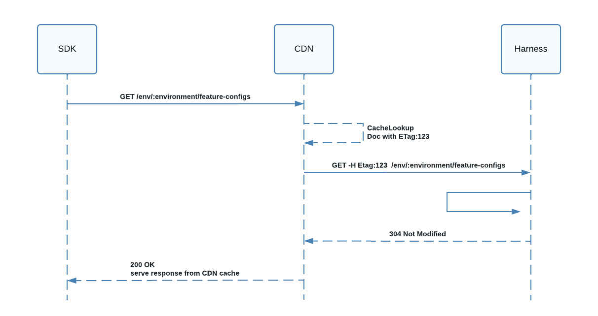

:::info note
This feature is currently behind the feature flag `FF_ENABLE_CDN_CACHE`. Contact [Harness Support](mailto:support@harness.io) to enable the feature.
:::

Harness Feature Flags supports a Content Delivery Network (CDN) for server-side SDKs. When a server-side SDK makes an initial request to fetch either flag or group information, the resulting data is cached in our global CDN until it expires, or a flag is changed.

Due to the dynamic nature of flag data, flag values can often change. To ensure your data is always up-to-date, the CDN always performs a validation check with the feature flag service.

If the feature flag service indicates the document is the most up-to-date, then the CDN serves the data from its own cache, providing the fastest possible latency response time.

If the feature flag service determines the document is stale, it calculates the most up-to-date response and returns it, so that it can be served to the SDK and cached by the CDN.

This diagram illustrates these interactions.

