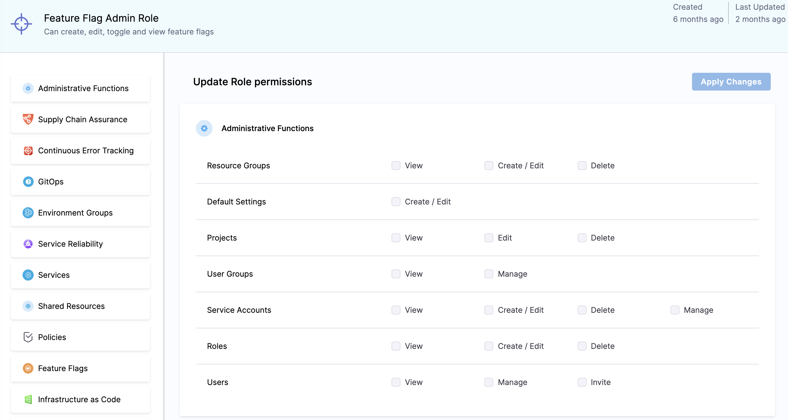
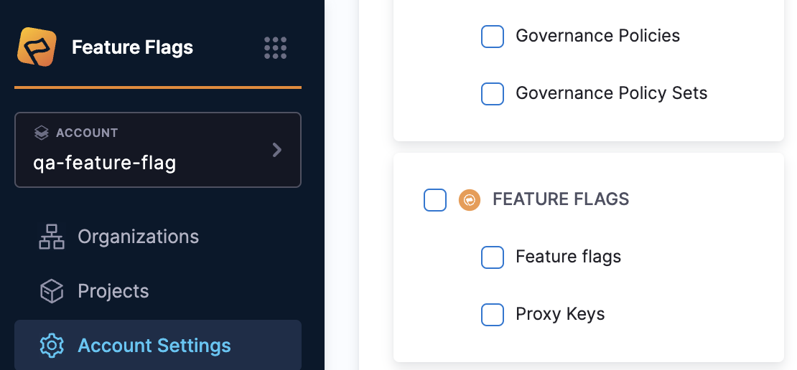

Harness provides Role-Based Access Control (RBAC) that enables you to control user and group access to Harness resources according to the user's role. By using RBAC, you can increase security and improve efficiency.

This topic describes the roles available for Feature Flags. For more information about how RBAC works in Harness and instructions for implementing access control, go to [RBAC in Harness](/docs/platform/role-based-access-control/rbac-in-harness).

## Creating and Managing Roles

The **Feature Flag Admin Role** is a default Role available specifically for Feature Flags. The administrator roles gives you the ability to grant and revoke  permissions at an environment level. This includes:

* Creating, editing and deleting **Resources Groups**,
* Creating and editing **Default Settings**,
* Editing and deleting **Projects**,
* Managing **User Groups**,
* Creating, editing, managing and deleting **Service Accounts**,
* Creating, editing and deleting **Roles**, and
* Managing and inviting **Users**.

 

If you have permissions at the Project level, you can edit Flags within that Project or its Environments. If you have permissions for the Environment, then the role is limited to that Environment only.  

## Creating and Managing Permissions

You can create a role or manage permissions for **Resource Groups**, **Default Settings**, **Projects**, **User Groups**, **Service Accounts**, **Roles** and **Users**. 

Here's a guide to creating a role or managing permissions for the Feature Flags and for Target Management at the account level:

 1. Navigate to **Project Settings**. 
 2. Scroll down, or select  **Access Control** along the menu and select **Roles** within your Harness
 Account.
 3. From here, you can add a new role or select an existing one to modify.
 4. Within the role, select **Feature Flags**. This action will display the Feature flags and Target Management permissions. 

 

Feature flags is governed by the following permissions:

 * **Create**: Enables users to create new feature flags.
 * **Edit Config**: Enables users to edit existing configs.
 * **Edit Rules**: Enables users to edit rules.
 * **Toggle**: Enables users to toggle the feature flags on or off.
 * **Delete**: Allows users to delete any targets.

Target Management is governed by the following permissions:

 * **Create/Edit**: Enables users to create new targets and edit existing ones.
 * **Delete**: Allows users to delete any targets.

For the Organization level, open the same account settings and proceed to **Organizations**. Choose your organization and under **Organization Level Access Control** and **Audit Trail**, select **Access Control**. Here, configure the roles and permissions at the organization level in a manner similar to the account level process.

To set roles and permissions at the Project level, navigate to the **Project** section from the module navigation bar, and select **Access Control**. Follow similar steps as above to establish the roles and permissions for the project level.

## Creating and Managing Resorce Groups

Here's how you can create and manage resource groups for the Feature flags and Target Management at the account level. Additionally, you can refer to [Manage Resource Groups](/docs/platform/role-based-access-control/add-resource-groups.md) document to learn more.

 

 1. Navigate to **Account Settings > Access Control > Resource groups** within your Harness Account.
 2. Add a new resource group or select an existing one to modify.
 3. Set the "Resource Scope" accordingly if you are creating one.
 4. Within the Resources, select **Feature Flags**, **Proxy Keys**, or both if that's what you require.

## See also

The following topics can help you understand how to implement Access Control:

* [Create, Edit And Delete A Feature Flag](../ff-creating-flag/edit-and-delete-a-feature-flag.md)
* [Roles and Permissions in Feature Flags](/docs/feature-flags/ff-security-compliance/roles-and-permissions.md)
* [Manage users](/docs/platform/role-based-access-control/add-users)
* [Manage User Groups](/docs/platform/role-based-access-control/add-user-groups)
* [Manage Resource Groups](/docs/platform/role-based-access-control/add-resource-groups.md)
* [Manage Roles](/docs/platform/role-based-access-control/add-manage-roles.md)

