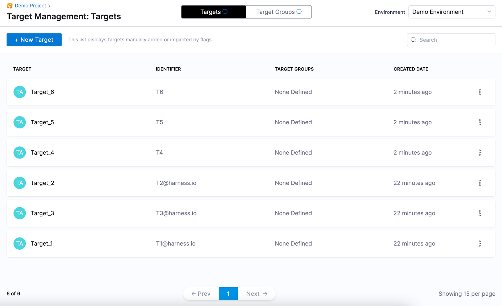

```mdx-code-block
import add_target_1 from './static/1-add-targets-00.png'
import add_target_2 from './static/1-add-targets-01.png'
```

Targets are used to control which users see which variation of a Feature Flag, for example, if you want to do internal testing or a beta program before a broader roll out, you can enable the flag for some users and not others. While we refer to targeting users, when you create a target you give it a name and a unique identifier, so a target can be anything that can be uniquely identified. For example, a target can be a user, an application, a system, a machine, or any resource uniquely identified by an IP address, email ID, user ID, etc.

:::info note
 You can add a target using Harness UI. Alternatively, you can add a target and define its attributes in your application's code directly [using a Feature Flag SDK](https://docs.harness.io/category/rtce97j1wu-ff-sdks). The targets added in your code are discovered automatically and populated in the Harness UI.
:::

This topic describes how to add targets to an Environment in the Harness UI. After you’ve added the target, you can add it to a [Target Group](add-target-groups.md) or to a [Feature Flag](targeting-users-with-flags.md 


## Regex requirements for target names and identifiers


A target is identified by a name and an identifier. The name and identifier you enter must conform to the following regex:


**Name**


Regex: `[\\p{L}\\d .@_-]`


Must consist of only alphabetical characters, numbers, and the following symbols: 


* . (period)
* @ (at sign)
* - (dash)
* \_ (underscore)


The characters can be lowercase or uppercase and can include accented letters, for example `Café_123`.


**Identifier**


Regex: `[A-Za-z0-9.@_-]`


Must consist of only alphabetical characters, numbers, and the following symbols: 


* . (period)
* @ (at sign)
* - (dash)
* \_ (underscore)


The characters can be lowercase or uppercase but cannot include accented letters, for example `CF.789`.

For more information, go to [Entity Identifier Reference](/docs/platform/references/entity-identifier-reference).


## Add a target


A target is identified by a name and an identifier. Make sure your target names and identifiers conform to the regex explained in [Review Regex Requirements for target Names and Identifiers](add-targets.md#review-regex-requirements-for-target-names-and-identifiers).
To add a target:


1. In **Feature Flags**, in **Target Management**, select **Targets**.
2. Click **+ Target**.
3. In **Add Target(s)**, select **Add a Target**.
4. In **Name**, enter the name that will appear in the Target Management page so you can identify this target.
5. In **Identifier**, enter a unique identifier for your target. When [Targeting Users with Flags](targeting-users-with-flags.md) or [Managing Target Groups](add-target-groups.md), the targets are identified by the identifier you give them.
6. You can add multiple targets. Click **+** to add more targets.

    ```mdx-code-block
        
    ```

7. When you’ve added all the targets, Click **Add**.


## Upload a list of targets


This option allows you to import a list of targets in CSV format. To do this:


1. In **Feature Flags**, in **Target Management**, select **Targets**.
2. Click **+ Target**.
3. In **Add Target(s)**, select **Upload a list of Targets**.
4. Upload your CSV file as per the template below. The CSV file must have only the Name and Identifier; do not include any headings, for example:

    | | | 
    | --- | --- |
    | Target\_4 | T4 |
    | Target\_5 | T5 |
    | Target\_6 | T6 |

5. Click **Add**.

    ```mdx-code-block
    
    ``` 

6. The list of targets is added.

    

## How targets expire

Targets are automatically created when an SDK authenticates or pushes metric data to the Feature Flag Service.  A target is updated when it's modified via the API, or is used by an SDK in a request. 

Going forward, all targets that are not updated in 60 days expire, and are removed from the data store, unless either of the following is true:

* The target is named in an explicit target rule in a flag.

* The target is named in a group's included/excluded list.

If an SDK makes a new request with a previously expired target, that target is inserted into the database again.

## Next steps

After your have created a target, you can:

* [Add or Exclude a Target in a Target Group](add-target-groups.md)
* [Target Users with Flags](targeting-users-with-flags.md)


