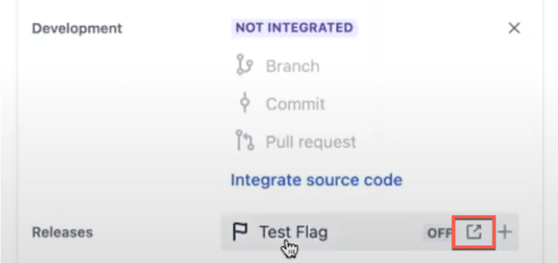

With Harness Feature Flags in Jira, teams can use feature flags more quickly and easily from a single place.

Integrating your feature flags with Jira provides the following benefits:
- Have full visibility for everyone who needs it. Keep Dev, Support, Ops, and Product all in the loop by connecting flags to Jira tickets. See the status, who to ask, and where to find more information without having to use an instant messaging app or email, or comment back and forth.
- Get things done in one place. Bouncing around different tools wastes time. Make a new flag as you create your Jira ticket, or link your ticket from Harness as you create a flag. Get more done in fewer clicks.
- Find and manage flags easily. When work is ready to roll out, let your team members jump directly to the flag they want to control, right from the Jira issue they’re already tracking.

## Configure the integration

Before you can link a feature flag with a Jira issue for the first time, you must install the Harness Feature Flags for Jira app from the Atlassian Marketplace, and then configure the connection between Harness Features Flags and Jira. You only have to do this once. 

1. Log in to your Jira instance. 
2. Select the **Apps** menu, and then select **Explore more apps**.
3. Search for **Harness Feature Flag**.
4. Select the **Harness Feature Flags for Jira** app.
5. Select **Get it now** to start the installation.
6. Go to your instance of Harness Feature Flags.
7. In the left pane, at the bottom, select your user profile. 
8. Under **My API Keys**, select the token for the API key you want to use, and then copy the value. 
9. Go to Jira, and then from the **Apps** menu, select **Harness Feature Flag Addon**.
10. On the **API Key** screen, enter the API key token that you copied in step 8, and then select **Save**.

## Link a Jira issue to a feature flag

 You can link a Jira issue to a feature flag with just a few steps. 
 
1. Go to your Jira project. 
2. Open the issue to which you want to link a feature flag.
3. In the right pane, scroll down to the **Releases** field. 
4. Select **Add feature flag**, and then select **Connect feature flag**.
5. In **Harness Flag URL**, paste the URL for the flag you want to link to this Jira issue, and then select **Save**. 
    To locate the URL for the flag, go to your instance of Harness Feature Flags and select the flag. Copy the entire URL for the flag. Make sure the flag you choose has an environment associated with it. 

# View information about a feature flag from a Jira issue

From within a Jira issue, you can see details about a linked feature flag, including the environment name, status, rollout details, and when it was last updated. 

1. Go to your Jira project.
2. Open the issue that contains the feature flag.
3. In the right pane, scroll down to the **Releases** field.
4. Select the box with the right arrow next to the name of the feature flag. 

