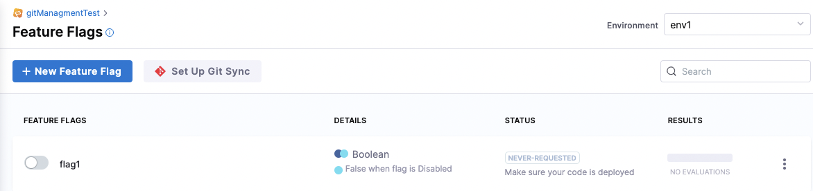
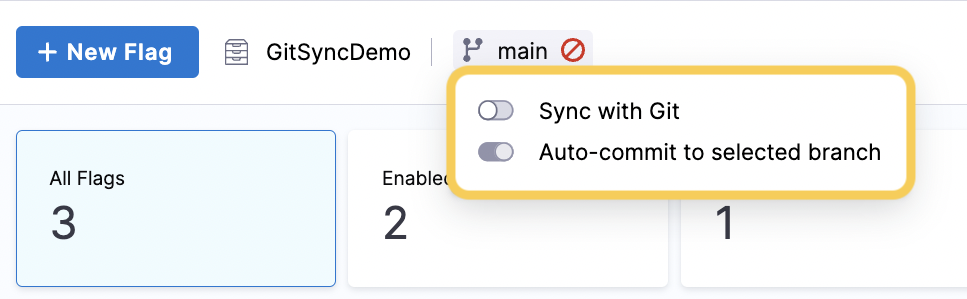

```mdx-code-block
import git_1 from './static/5-manage-featureflags-in-git-repos-04.png'
import git_2 from './static/5-manage-featureflags-in-git-repos-05.png' 
import git_3 from './static/5-manage-featureflags-in-git-repos-06.png' 
import git_4 from './static/5-manage-featureflags-in-git-repos-07.png' 
import git_5 from './static/5-manage-featureflags-in-git-repos-08.png' 
import git_6 from './static/4-git-blue-circle.png'  
import git_7 from './static/5-manage-featureflags-in-git-repos-09.png' 
import git_8 from './static/8-git-off.png' 
```

:::caution
 There is a known issue with this feature. When you turn on a Feature Flag, some target rules may be reordered in your Git repo. This doesn't affect the functionality of your Feature Flag or targets and we are working to fix this issue as soon as possible.
:::

Using Harness Git Experience with Feature Flags allows you to manage your flags from a YAML file in your Git repository. When you enable Git Experience, changes you make to flags on the Harness Platform are committed on Git, and commits you make on Git are reflected in the Harness Platform. This means you can work on flags entirely from Git, the Harness Platform, or both, and your changes will be synchronized in both places. 

## Before you begin

You must set up Git Experience before you can use it in your Feature Flags project. To do this:

<!-- TBD DOC-2410 * [ Add a Source Code Manager to your account. ](https://docs.harness.io/article/p92awqts2x-add-source-code-managers) -->

* Follow the steps in [Harness Git Experience Quickstart](/docs/platform/Git-Experience/configure-git-experience-for-harness-entities) to create a Git repository that contains at least one branch. Then select or create the connector. Note that, currently, branch setup cannot be reconfigured after initial setup.

* To set up Git Sync for Feature Flags, navigate to the top of the flag page and select **Set Up Git Sync**.

  

* Also ensure you read [How Git Experience works with Feature Flags](#how-git-experience-works-with-feature-flags) below.

## How Git Experience works with Feature Flags

When you set up Git Experience and enable it in your Feature Flag Project, Harness automatically creates a file specified by the user during the setup phase, for example, `flags.yaml`. All your flag, environment, and target information is stored in this file. 

The following example YAML file shows:

* A non-permanent boolean flag named `Flag_1.`
* `Flag_1` sits within Environment `Env_1`.
* The variations of `Flag_1` within `Env_1`, and which variations are set as default.
* The current state of `Flag_1`, which is toggled `on`.
* A target with the ID `T_1`.
* The variation served to `T_1`.

<details>
  <summary>Example of a YAML file for Feature Flags</summary>

Here is a sample `flags.yaml` file:

```
featureFlags:  
 flags:  
  - flag:   
     name: Flag_1  
     identifier: Flag_1   
     description: "GitExFlag"   
     permanent: false   
     spec:   
         type: boolean   
         default:  
             onVariation: "true"   
             offVariation: "false"  
         variations:  
            - identifier: "true"  
              value: "true"   
            - identifier: "false"   
              value: "false"     
      environments:   
         - identifier: Env_1   
           default:  
              onVariation: "true"   
              offVariation: "false"  
           state: "on"  
targetRules:  
   - targets:   
          - identifier: T1  
            variation: "false"   
projectIdentifier: FF_Docs_Demo  
orgIdentifier: Docs
```
</details> 

The synchronization between the Harness Platform and the `flags.yaml` file works in both directions:

* When you update the Harness Platform, the changes are committed to Git. Changes are synced to the remote repository immediately.
* When you commit changes to Git, the Harness Platform is periodically updated. The changes will be synced up to 5 min after you commit in Git.


If you don’t see the changes you made in Git reflected on the Harness Platform after approxymately 5 min, refresh the page.

:::caution
 Syncing changes between a remote file and the Harness Platform can take up to 5 mins. During this window the changes are commited to the remote file but not yet pulled and synced by the Harness Platform. Any changes made to the Harness Platform within that window trigger remote file updates, which overwrite the content of the remote file.
:::

## Turn on syncing with Git

You can turn the synchronization between the Harness Platform and Git on or off. The Git Experience icon is displayed on many pages, and you can toggle it on or off from any page where it appears.

:::caution
 Turning sync on triggers an immediate attempt to sync Harness content to the remote file.
 Any changes you made to the remote file before syncing are overwritten. This can result in losing content or configurations that are not yet synced to Harness.
:::

To turn on synchronization between the Harness Platform and Git: 

1. Ensure that Git Experience has been [enabled](/docs/platform/Git-Experience/configure-git-experience-for-harness-entities) for your project.

1. Select **Feature Flags**.

  In the top bar navigation, the Git repository and the branch you connected are displayed.

  

1. Select the branch, and then toggle **Sync with Git** on. 

    (See [Auto-commit to the selected branch](#auto-commit-to-the-selected-branch) for the second toggle.)

    If you enable only **Sync with Git**, each time you make a change to a flag on Harness, you are prompted to confirm which branch you want to commit to, and to add a commit message. For example:

    ```mdx-code-block
    
    ```

1. Optionally, you can select **Always commit to this branch and do not prompt for commit message**. 

  This toggles on the [**Auto-commit to the selected branch**](#auto-commit-to-the-selected-branch) option, described below.

### Auto-commit to the selected branch

When you sync your Feature Flags project with Git, whenever you change a flag, you're prompted for the branch and a commit message, which then updates your flag configurations file in the Git repo.

If you want to always commit to the same branch, and not be prompted for commit messages, follow these steps:

1. In Harness, go to the project you enabled Git Experience for.

1. Select **Feature Flags**.

  In the top bar navigation, the Git repository and the branch you connected are displayed.

    

1. Select the branch, and then turn on **Auto-commit to selected branch**. 

  Now, whenever you change a flag in Harness, an auto-commit is done automatically, and your flag changes are synced to the flag configuration file (for example, `flags.yaml`) in the Git repository. Auto-committed have the prefix `[AUTO-COMMIT]`, for example:

  ```mdx-code-block
  
  ```  

  <details>
  <summary>Possible Auto-commit messages</summary>

  [AUTO-COMMIT] Created feature flag  

  [AUTO-COMMIT] Toggled feature flag  

  [AUTO-COMMIT] Updated feature flag details  

  [AUTO-COMMIT] Updated feature flag rules  

  [AUTO-COMMIT] Updated feature flag targeting  

  [AUTO-COMMIT] Updated feature flag variations  

  [AUTO-COMMIT] Deleted feature flag variations 

  [AUTO-COMMIT] Updated feature flag prerequisites  

  [AUTO-COMMIT] Updated feature flag targets  

  [AUTO-COMMIT] Deleted feature flag  

  [AUTO-COMMIT] Added feature flag to targets

  </details>

## Turn off syncing with Git

To turn off syncing with Git:

1. In Harness, go to the project you enabled Git Experience for.

1. Select **Feature Flags**.

1. In the top bar navigation, next to the Git repository, select the branch, and then toggle **Sync with Git** off. 

  

  When syncing is off, the branch icon is a red warning circle:

  ```mdx-code-block
  
  ``` 

## See also

For more information about using Git Experience, go to [Git Experience How-tos](../../platform/10_Git-Experience/git-experience-overview.md).

