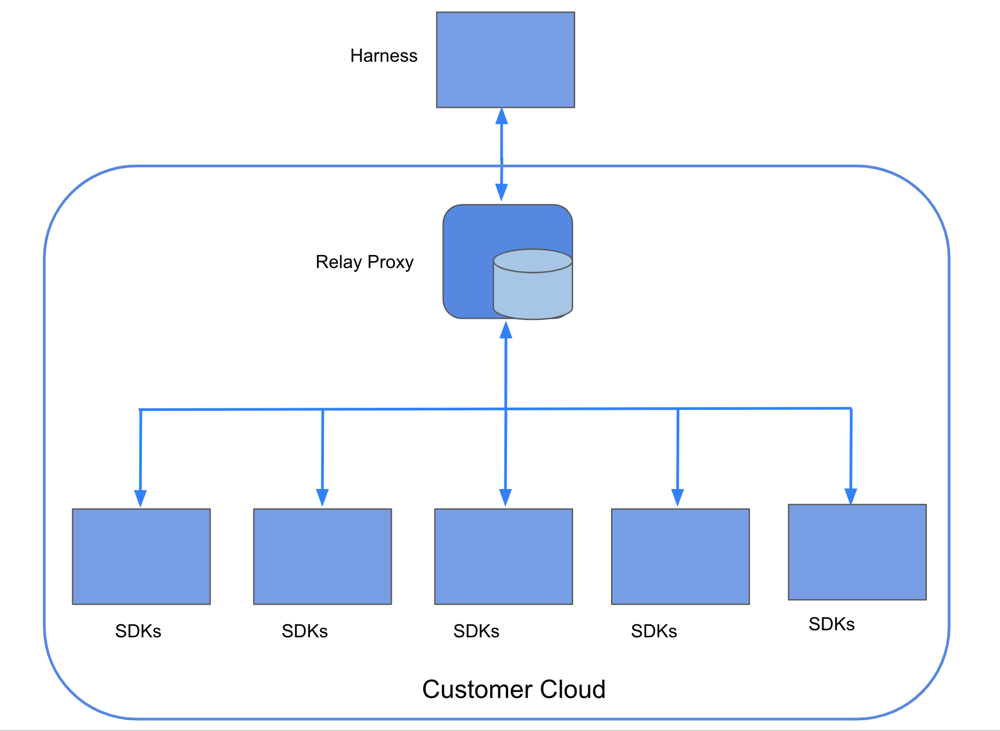

This topic describes Relay Proxy and how to use it with Harness Feature Flags (FF).

The Relay Proxy enables your apps to connect directly to Feature Flag services without having to make a significant number of outbound connections to FF services. The Relay Proxy establishes a connection to the Feature Flags configuration data and relays that connection to clients in an organization's network.

## Why use the Relay Proxy?

In the following cases, you might want to set up Relay Proxy:

* **Air-gap Deployments**: You can deploy the proxy in your network if you don't have or can't allow external access to your apps. Local apps connect directly to the proxy, and the proxy has external access to the remote feature flag service to synchronize configuration.
* **Offline Mode**: This is identical to air-gaped, except that the proxy does not have a connection to the internet. In that scenario, the configuration must be loaded from the outside using configuration files. Configuration files are used to link your programmes to the proxy.
* **High Availability / Reliability**: The feature flag service is extremely reliable. We will fail over to the failover cluster in the event of a major failure. However, in the event of a full network loss, the Relay Proxy ensures that your apps continue to run even after restarts.

If you decide to use the Relay Proxy, make sure it has a good place in your network design. For your app to run, it needs to be able to contact the Relay Proxy, and the architecture differs depending on the type of app. For example, if you want to link the Relay Proxy to any client-side apps, don't put it inside a firewall.

## Relay Proxy architecture

The FF Relay Proxy resides between the SDKs and the hosted Harness Feature Flag services. On startup, proxy loads the necessary data from the FF services to ensure that it is completely functional even if the network connection drops temporarily.

The Proxy creates an instance of the Go SDK for each API key that’s passed to it as a part of the [Proxy Configuration](relay-proxy.md#configuration-variables), and each instance of the SDK uses the Cache implementation. The Go SDK then takes care of populating this cache on startup and keeping it up to current whenever the remote service changes. When the Go SDK starts up, it retrieves all of the Features and Segments and then sends a request to the remote server to listen for any updates. Whenever there is an update in the remote service, it sends out an event, and when the embedded SDK sees one of these events, it sends a request to the remote service to get the most recent flag values and save them to the cache.

The Proxy can also use streaming functionality if it is configured with Redis. To view the variables that you need to configure for Redis, go to [Proxy configuration variables](relay-proxy.md#configuration-variables) .

### Proxy Configuration variables

The configuration variables used in the proxy are listed in the following table:

|  |  |  |  |  |
| --- | --- | --- | --- | --- |
| **Environment Variable** | **Type** | **Flag** | **Example** | **Usage** |
| ACCOUNT\_IDENTIFIER | string | -account-identifier | zAbbD-FLS425IEO7OLzXYz | The Account that you want the Proxy to pull down and load config for |
| ORG\_IDENTIFIER | string | -org-identifier | featureflagsqa | The Organization that you want the Proxy to pull down and load config for |
| ADMIN\_SERVICE | string | -admin-service | https://harness.io/gateway/cf | Used for creating the Client that interacts with the FeatureFlags Admin Service to retrieve Target and AuthConfig |
| SERVICE\_TOKEN | string | -service-token | ZHNvdWZoNjczMjR0aGZiLWk1NC0tMGRzZg== | Token that the Proxy can use to authenticate with the Admin service |
| AUTH\_SECRET | string | -auth-secret | somethingSecret | To authenticate the connection between your SDK and the Proxy, the Proxy generates an authentication token (JWT) that is signed with the AUTH\_SECRET you set in your configuration. When the Proxy receives the authentication token, it verifies that it is signed using the AUTH\_SECRET. If it isn’t, the token is rejected as invalid. |
| SDK\_BASE\_URL | string | -sdkBaseUrl | https://config.ff.harness.io/api/1.0 (default)| The Base URL that the internal Go SDK connects to |
| SDK\_EVENTS\_URL | string | -sdkEventsUrl | https://events.ff.harness.io/api/1.0 (default) | The Event URL that the internal Go SDK connects to |
| API\_KEYS | string | -apiKey | 5ecb5049-e071-4beb-ae43-381aa8f0d3a2, a7cb7fc6-c4fa-4ecb-b01f-068456f3e500 | The API Keys of the environments you want to configure the Proxy to work with.For example, create an SDK key called Proxy Key in your Environment and pass it in via the `API_KEYS` env. Then all the other applications in that Environment would be able to use the Proxy. |
| TARGET\_POLL\_DURATION | int | target-poll-duration | 30 | Time in seconds that determines how frequently the Proxy polls Feature Flags to get the latest Targets |
| REDIS\_ADDRESS | string | redis-address | localhost:6379 | Configures the Proxy to use Redis rather than an in-memory cache.Configuring the Proxy with Redis also enables streaming |
| REDIS\_PASSWORD | string | redis-password | a-secret | (Optional) This is required only if the Redis server is password protected |
| REDIS\_DB | int | redis-db | 1 | (Optional) After connecting to the Redis server, it allows you to select which database to use. In most cases using the default database is desired |
| FLAG\_STREAM\_ENABLED | boolean | flag-stream-enabled | true | Allows the proxy to get flag updates by connecting to Harness in streaming mode.This variable defaults to `true`. While updating Harness flags, if you have networking issues when receiving streaming events, set this to `false`. |
| FLAG\_POLL\_INTERVAL | int | flag-poll-interval | 5 | How often (in minutes) the proxy polls for flag updates. This variable applies only if FLAG\_STREAM\_ENABLED is set to `false`. |
| GENERATE\_OFFLINE\_CONFIG | boolean | generate-offline-config | false | Generates a directory for storing configuration data to use in offline mode.If set to `true` the proxy generates the offline configuration directory, then terminates.Set to `false` as default. |

## What data does the Relay Proxy store?

The Proxy stores authentication, feature, Target, and Target Group configurations in a cache.

* Keys are stored against a map of fields and values in the feature, Target, and Target Group settings.
* The authentication configuration is stored as a key-value pair, with the key being a hashed API key and the value being an environment ID.

When the proxy starts, an embedded Go server SDK retrieves the Feature and Segment config and populates the cache.

## How does the Relay Proxy fetch client and server SDK configuration details?

Client and Server SDKs fetch the evaluation details in the same way as they would if they were interacting with the FF Services on ff-server.

## Blog post

For more information about the Relay Proxy, go to our blog post [In-Depth: Harness Feature Flags Relay Proxy](https://harness.io/blog/in-depth-feature-flags-relay-proxy/).

## Next step

After you understand the basics of the Relay Proxy, you can then [deploy it](deploy-relay-proxy.md).

