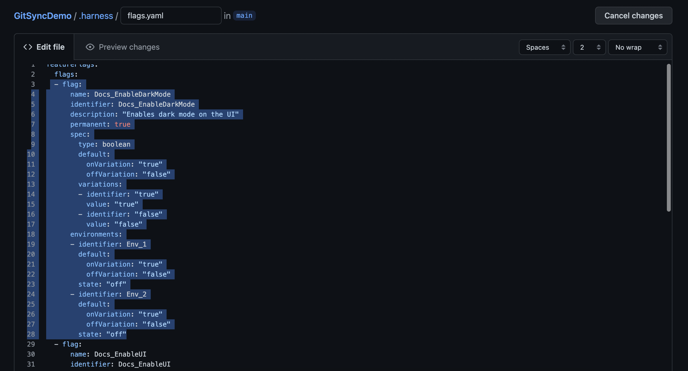

When you are finished with a Feature Flag, it's best practice to remove it to keep your Flags and application organised and tidy. This topic describes how to delete a Feature Flag on the Harness Platform and using [Git](../manage-featureflags-in-git-repos.md).

:::info note
 Make sure you are ready to delete the Flag from all of your Environments. When you delete a Flag on the Harness Platform or on Git, it is removed from all Environments.
:::

## Delete a Flag using the Harness Platform

1. In Harness, go to **Feature Flags**, then to the Flag you want to delete.
2. Click **more options (****︙****)**next to the flag that you want to delete, then click **Delete**.

   
   *Figure 1: Delete a Flag*

3. In **Delete Flag**, click **Delete**.

## Delete a Flag using Git

If you [have set up Git Experience to manage your Flags](../manage-featureflags-in-git-repos.md) via a `.yaml` file on Git, you can delete Flags from there. To do this:

1. Go to the `.yaml` file where you manage your Feature Flags.
2. Find the Flag you want to delete.
3. Delete the `- flag` object. For example, the following highlighted section would be deleted for the Flag called `New_Flag:`

   
   *Figure 2: Sample YAML file with the Flag object highlighted*

