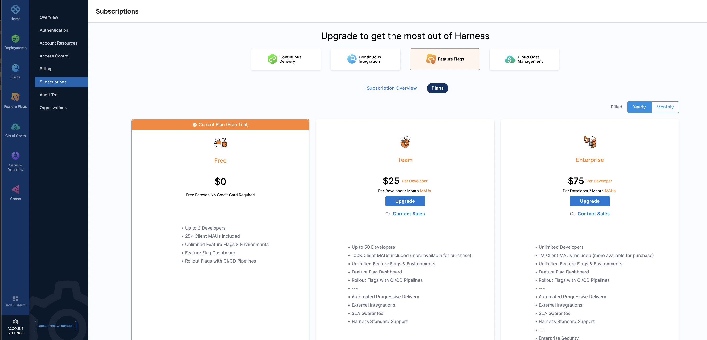
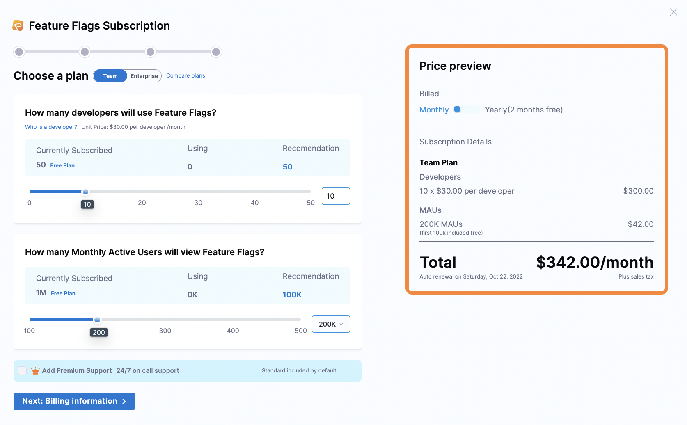

This topic describes how to subscribe to Feature Flags through the Harness Platform. Currently, you can subscribe only to Feature Flags through the Harness Platform if you are a self-serve customer. If you are an enterprise customer, or if you want to add other modules to your account, contact our [Sales team](https://harness.io/company/contact-sales).

If you haven't signed up for a Harness account yet, go to [app.harness.io](https://app.harness.io/) and select **Sign Up**.

## Subscribe to Feature Flags

To add or upgrade your Feature Flag subscription:

1. On the Harness Platform, go to **Account Settings**.
2. Click **Subscriptions**. All the available modules are shown.
3. Click **Feature Flags**, then click **Plans**. You can see an outline of all the available Feature Flag subscription plans.
4. Select the plan you want to subscribe to by clicking **Upgrade**.

   

5. Select how many developers and how many monthly active users (MAUs) you want to use. For both of these, we recommend an amount based on your previous usage and predicted growth, but you can adjust the amount if necessary.
6. Based on the number of developers and MAUs you select, you can view the price preview in either a yearly or monthly format.

   

   This price doesn't include tax. Tax is calculated after you enter your billing details.

7. Select **Next: Billing Information** and enter your billing information.

   Tax is calculated once you enter your billing zip code. This can take up to 10 seconds to calculate.

   You must provide a credit card to proceed with payment. If you enter a new card during checkout, that becomes the new default payment method for your account. You can change your saved credit card by [updating your billing information](./update-your-billing-information.md).

8. Select **Subscribe and Pay** to submit payment. Payments are handled by Stripe.
