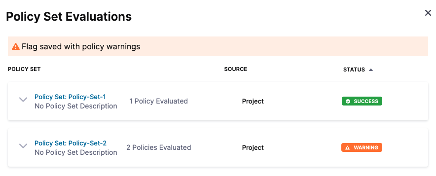

:::info note
For some accounts, this feature may be behind the Feature Flags `OPA_PIPELINE_GOVERNANCE`, `CUSTOM_POLICY_STEP`, and `OPA_FF_GOVERNANCE`. Contact [Harness Support](mailto:support@harness.io) to enable the feature. 
:::

Harness Policy Engine uses [Open Policy Agency (OPA)](https://www.openpolicyagent.org/docs/latest/) to store policies that you can then enforce on your Feature Flags. You can use Harness Policy Engine with the following [Harness entities](../platform/references/harness-entity-reference.md) on the Harness Platform:

* Flag
* Target
* Target group
* Environment
* SDK keys

For example, you can use policies to ensure your Feature Flags: 

* Match the naming convention you set.
* Are created using a specific flag type, for example, only allowing Boolean flags to be created.
* Have the correct default on and off values set.
* Have been turned on in a test environment before being enabled in a production environment.

This topic provides an overview of how Harness Policy Engine works with Feature Flags.

:::info note
 For steps to set up your policies on the Harness Platform, go to [Use Harness Policy Engine for Feature Flags.](/docs/platform/governance/policy-as-code/using-harness-policy-engine-for-feature-flags)
:::

## Before you begin

Before using Harness Policy Engine, you should understand the following:

* [Harness' Key Concepts](/docs/platform/get-started/key-concepts.md)
* [How to Write](https://www.openpolicyagent.org/docs/latest/policy-language/) [Rego for OPA](https://www.openpolicyagent.org/docs/latest/policy-language/)

New to Rego? Use the following resources to learn it:

* Free online course on Rego from Styra founder and OPA co-creator Tim Hendricks: [OPA Policy Authoring](https://academy.styra.com/courses/opa-rego).
* See [Policy Language](https://www.openpolicyagent.org/docs/latest/policy-language/) from OPA. The [Rego Cheat Sheet](https://dboles-opa-docs.netlify.app/docs/v0.10.7/rego-cheatsheet/) is also helpful to have on hand.

## How does the Harness Policy Engine use OPA?

The Harness Policy Engine uses [OPA](https://www.openpolicyagent.org/) as the central service to store and enforce policies for the different entities and processes across the Harness Platform. You can define and store policies directly in the Harness Platform. 

In the Harness Platform, you add policies written in Rego to a Policy Set and select the Harness entities (for example, Feature Flags) for evaluation.


Then, when a Feature Flag is saved, Harness reaches out to the Harness OPA server to evaluate the action using the Policy Set. The Feature Flag is saved successfully, saved with a warning, or not saved and an error is received.

### Example of adding a policy for a Feature Flag

1. Set your policy: The names of all Feature Flags created must match the regex you set. You set the regex as having to be in the format ABC, dash, and three numbers, for example, ABC-123.
2. Insert the Rego code into the Policy Engine on the Harness Platform, for example, the Rego code for the policy above is:

   ```
   package feature_flags  
     
   # Deny flags whose names aren't a valid Jira ticket format for our projects  
   # e.g. "ABC-123" is allowed. "My cool flag" is not allowed  
     
   deny[sprintf("feature flag name '%s' doesn't match regex", [input.flag.name])] {  
      not regex.match("[ABC]+[-][1-9][0-9]?", input.flag.name)  
   }
   ```
3. Run the policy against your Feature Flags.

When you create the policy you can choose whether a Feature Flag receives only a warning message, or receives an error and can’t be saved when the policy isn’t met. For more information about how to do this, go to [Creating a Policy](/docs/platform/governance/policy-as-code/using-harness-policy-engine-for-feature-flags#step-1-creating-a-policy).

* **Success**: You create a Feature Flag and name it `ABC-567`, which matches the naming regex you set. When you save the flag, the policy rule is evaluated, returns `Flag created`, and the flag is saved.
* **Warning**: You create a Feature Flag and name it `Flag2`, which doesn’t match the naming regex you set. The flag is saved but you receive the following warning message:

   

* **Failure**: You create a Feature Flag and name it `Flag2`, which doesn’t match the naming regex you set. The flag doesn’t save and you receive the following error message:


## Next step

To add policies for Feature Flags, go to [Use Harness Policy Engine for Feature Flags](/docs/platform/governance/policy-as-code/using-harness-policy-engine-for-feature-flags).

