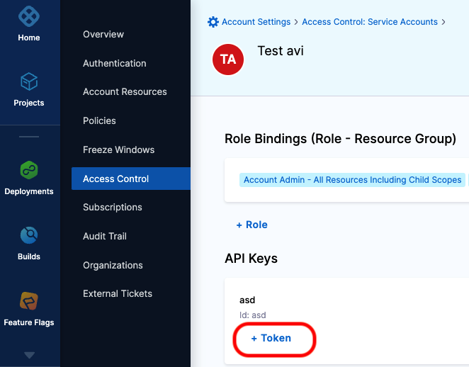
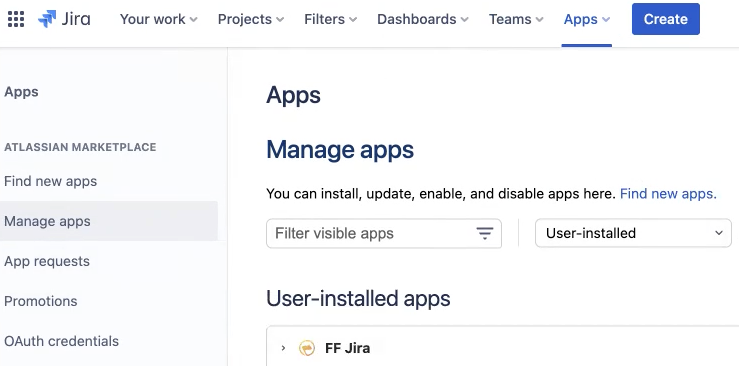
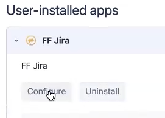
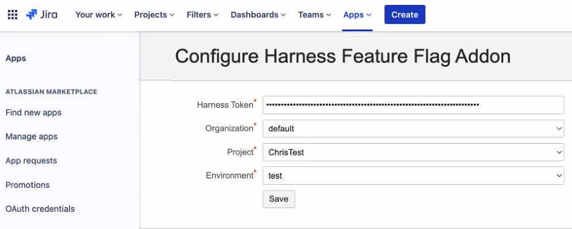
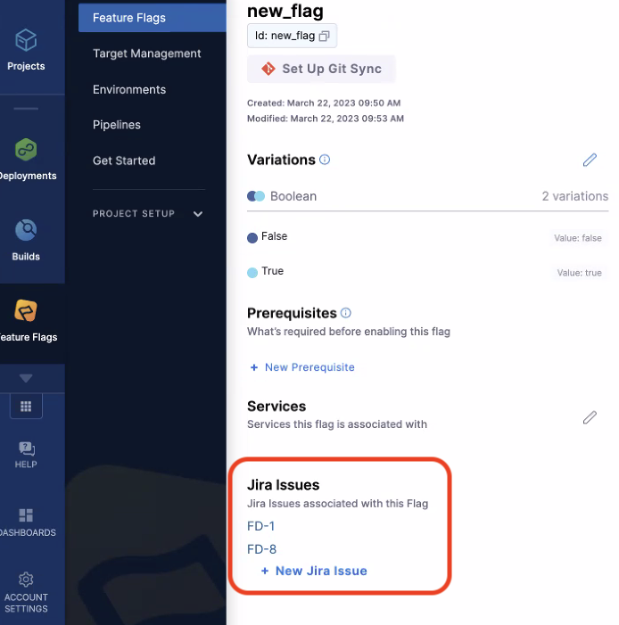
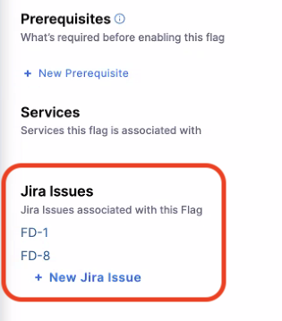

With **Harness Feature Flags for Jira**, teams can use feature flags more quickly and easily from a single place.

Integrating your flags with Jira provides these benefits:

- Have full visibility for everyone who needs it. Keep Dev, Support, Ops, and Product all in the loop by connecting flags to Jira tickets. 

- See the ticket status, who to ask, and where to find more information without having to use an instant messaging app or email, or comment back and forth in a Jira ticket.

- Make a new flag as you create your Jira ticket, or link your Jira ticket from Harness as you create a flag. 

- Find and manage flags easily in Jira tickets. When work is ready to roll out, let your team members jump directly from a Jira ticket to the flag they want to control.

- See all the Jira tickets linked to a flag in Harness.

## Configure the integration

Before you can link a feature flag with a Jira issue for the first time, you must install the Harness Feature Flags for Jira app from the Atlassian Marketplace, and then configure the connection between Harness Features Flags and Jira. You only have to do this once. 

:::info note
When you configure a Jira integration, it applies only to a specific combination of: Harness **project**, **organization**, and **environment**.
:::

### Step 1: Get a token from Harness

You must get an access token from a service account API key in Harness.

To get a token from Harness:

1. Go to Harness **Feature Flags**, and ensure you're in the project you want to integrate with Jira.
1. In the left pane, select **Account Settings > Access Control > Service Accounts**.
1. Select a service account, or [create one](/docs/platform/User-Management/add-and-manage-service-account) if needed. 
1. In the service account page, under **API Keys**, select **+ Token** for the API key you want to use.

     

1. Fill out the **New Token** form, and then select **Generate Token**.

1. Copy the value of the token and then select **Close**.

    You need this token to provide it in Jira in [Step 2](#step-2-add-the-feature-flags-app-in-jira) below.

### Step 2: Add the Feature Flags app and token in Jira

In this step, you install the Feature Flags for Jira app, and then provide the token you generated in [Step 1](#step-1-get-a-token-from-harness) above.

To add the Feature Flags app and token in Jira:

1. Log in to your Jira instance. 
1. On the **Apps** menu,  choose **Explore more apps**.
1. Find and select the **Harness Feature Flags for Jira**, or go directly to this [Atlassian Marketplace link](https://marketplace.atlassian.com/apps/1227514/harness-feature-flags-for-jira?tab=overview&hosting=cloud).
1. Select **Get it now** to install the app.
1. Once the app is installed, go to **Apps > Manage apps**, and then find the app.

    

1. Expand the Feature Flags for Jira app and then select **Configure**.

    

1. In the configuration page, paste the **Harness Token** you copied from Harness, and then provide the **Organization**, **Project**, and **Environment** this integration applies to.

     

    :::info note
    This Jira integration applies only to the project, organization, and environment you select here.
    :::

1. Select **Save**.

## Link a Jira issue to a feature flag

After you configure a Jira integration, you can link issues to flags in either Jira or in Harness.

### Link an existing flag to an issue from Jira

To link a flag while in a Jira issue: 
 
1. Go to your Jira project, and then open the issue you want to link a flag to.
1. In the right pane, scroll down to the **Releases** field. 
1. Select **Add feature flag**, and then select **Connect feature flag**.

    

1. In **Connect Harness Feature Flag to Issue**, select the flag you want to link to this Jira issue, and then select **Save**. 
    
    

    Make sure the flag you choose has an environment associated with it. Here's an example in Harness: 

    

### Create and link a new flag to an issue from Jira

To add a flag and link it to an issue from Jira:

1. Go to your Jira project, and then open the issue you want to link a flag to.
1. In the right pane, scroll down to the **Releases** field. 
1. Select **Add feature flag**, and then select **Create feature flag**.

    You are redirected to Harness, where you can [add a flag](/docs/feature-flags/ff-creating-flag/create-a-feature-flag) as normal.

### Link a flag to an existing issue from Harness

To link a Jira issue while in a flag in Harness:

1. In Harness, go to **Feature Flags** and then select the flag you want to link issues to.
1. In the flag's **Jira Issues** section, select **+ New Jira Issue**.

    

1. In **Add Jira Issue**, enter the **exact** Jira issue number/ID, and then select **Add**.

    Note that search results do not find partial issue numbers or IDs.

    Once you link this issue, it appears in the **Jira Issues** section of the flag, and the flag is added to the issue in Jira. The flag and its current status (`On` or `Off`) are displayed in the **Releases** field in Jira.

    

## View flags and linked issues in Harness and Jira

### View flag details in a Jira issue

From a Jira issue, you can see details about any linked flags, including the environment name, status, rollout details, and when it was last updated.

To view flag details in a Jira issue:

1. Go to your Jira project, and then open the issue that contains the flag.
3. In the right pane, scroll down to the **Releases** field.

    

    You may have more than one flag linked to this issue. 

4. Select the status shown.

    A details page appears, listing connected flags. You can select a flag's name to be redirected to that flag in Harness.

### View linked Jira issues in a flag

You can see any Jira issues connected to a flag by selecting the flag in Harness and looking at its **Jira Issues** section.

