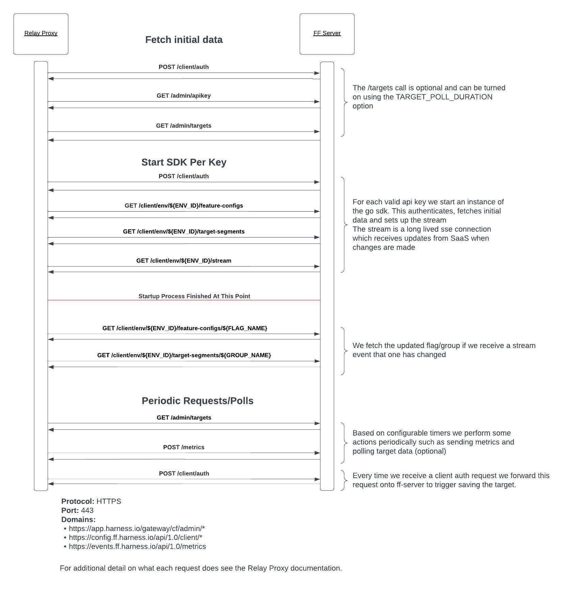

# Endpoints
These are the endpoints requested by the Relay Proxy. These are listed in the order they're used:
- Startup
- Start SDK per key
- Periodic requests/polls

The base url of these endpoints are configurable if you need to pass them through a filter or another proxy. See [configuration](./configuration.md) for details.

## Basic startup
This is the basic data fetched on startup. It fetches account project and environment info required for the Relay Proxy to initialise. This will page through all projects and environments in an account so may make multiple requests.

GET https://app.harness.io/gateway/cf/admin/projects - fetches account projects

GET https://app.harness.io/gateway/cf/admin/environments - fetches account environments

GET https://app.harness.io/gateway/cf/admin/targets - fetches environment target data (optional - see TARGET_POLL_DURATION config option). This pages through the targets so may make multiple requests.

## Start SDKs
These requests all run per each valid api key configured. This authenticates, fetches flag/target group data and sets up the stream. These are required to startup correctly.

POST https://config.ff.harness.io/api/1.0/client/auth - authenticates api key

GET https://config.ff.harness.io/api/1.0/client/env/${ENV_ID}/feature-configs - fetches flag data

GET https://config.ff.harness.io/api/1.0/client/env/${ENV_ID}/target-segments - fetches target group data

GET https://config.ff.harness.io/api/1.0/client/env/${ENV_ID}/stream - initialises long lived stream to listen for events

GET https://config.ff.harness.io/api/1.0/client/env/${ENV_ID}/feature-configs/${FLAG_NAME} - fetches updated flag data after a flag stream event comes in

https://config.ff.harness.io/api/1.0/client/env/${ENV_ID}/target-segments/${GROUP_NAME} - fetches updated target group data after a target group stream event comes in

## Periodic requests/polls
These requests happen either on demand or by various timers while the Relay Proxy is running.

GET https://app.harness.io/gateway/cf/admin/targets - poll the latest environment target data (optional - see TARGET_POLL_DURATION config option). This pages through the targets so may make multiple requests.

POST https://events.ff.harness.io/api/1.0/metrics - send metrics (optional - see METRIC_POST_DURATION config option).

POST https://config.ff.harness.io/api/1.0/client/auth - when a client authenticates with the Relay Proxy we forward this request onto the remote server to register the target

