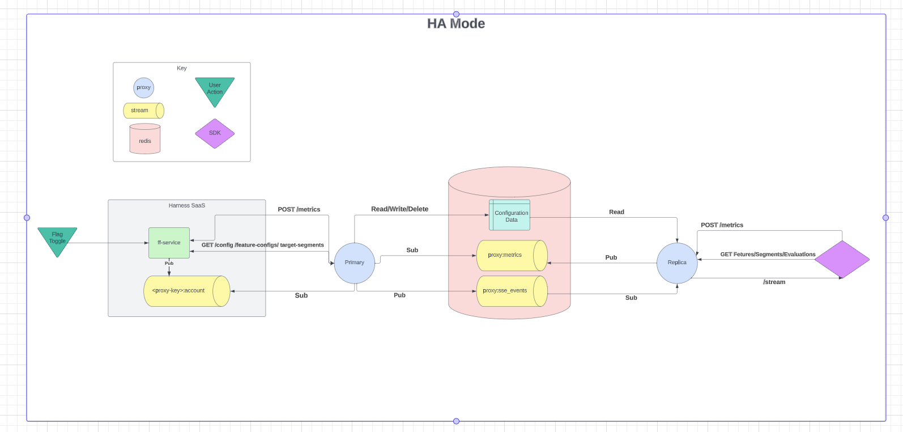
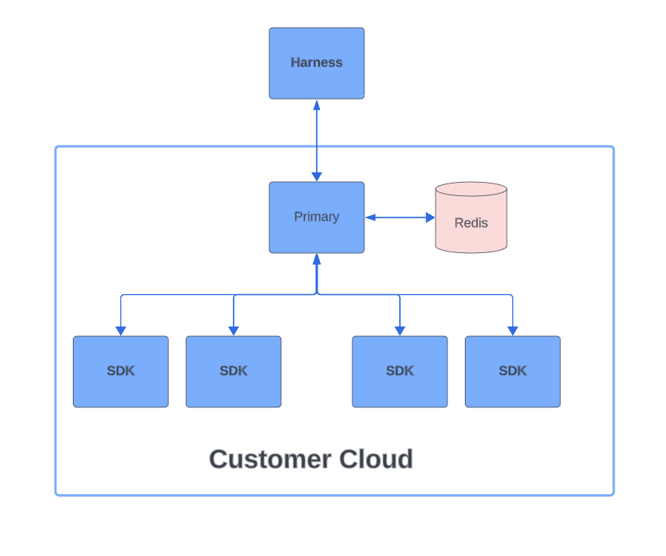
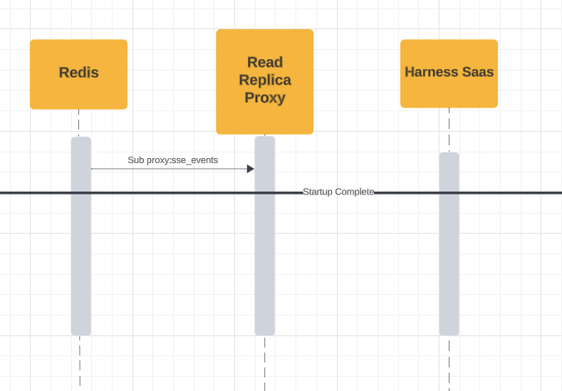
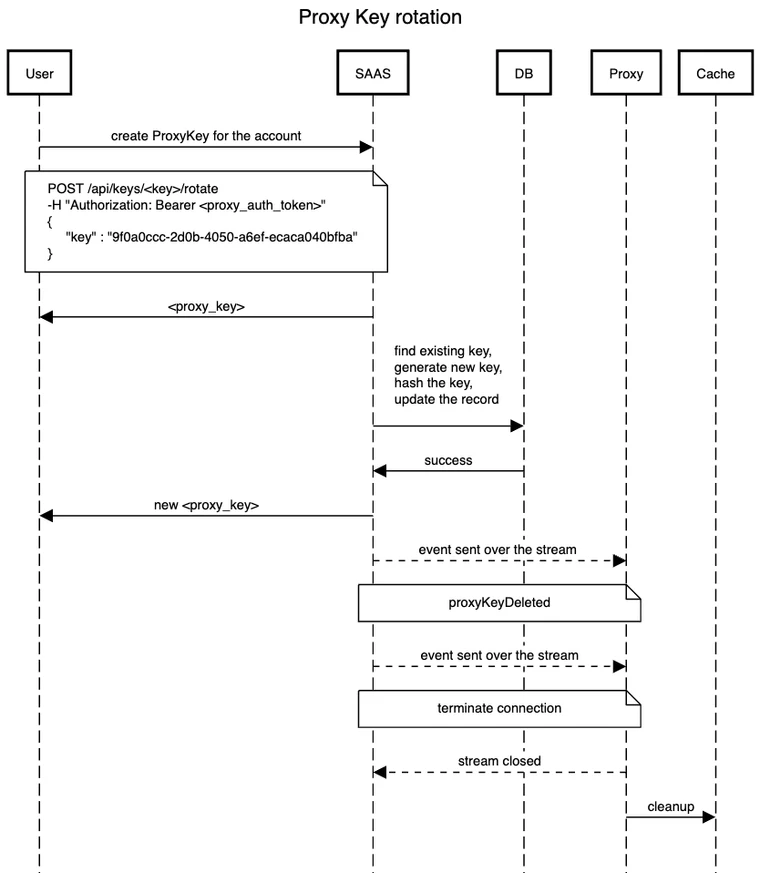

title: Relay Proxy V2 Overview
description: This topic focuses on version 2 of the Relay Proxy, how to use it and common FAQs on how it's used with Harness Feature Flags (FF). 
sidebar_position: 10
---

This topic describes the Harness Relay Proxy V2 and how to use it with Feature Flags (FF).

:::info note
If **Relay Proxy Version 1** is what you're looking for, please go to the [Relay Proxy V1](./relay-proxy.md) page.
:::

## Relay Proxy V2 Overview

### What is the Relay Proxy? 

The Relay Proxy enables your apps to connect directly to Feature Flag services without having to make a significant number of outbound connections to FF services. The Relay Proxy establishes a connection to the Feature Flags configuration data and relays that connection to clients in an organization's network.

### Why use Relay Proxy V2?​

In the following cases, you might want to set up Relay Proxy:

 - **Air-Gap Deployments**: You can deploy the proxy in your network if you don't have or can't allow external access to your apps. Local apps connect directly to the proxy, and the proxy has external access to the remote feature flag service to synchronize configuration.
 - **Offline Mode**: This is identical to air-gapped, except that the proxy does not have a connection to the internet. In that scenario, the configuration must be loaded from the outside using configuration files. Configuration files are used to link your programmes to the proxy.
- **High Availability / Reliability**: The feature flag service is extremely reliable. We will fail over to the failover cluster in the event of a major failure. However, in the event of a full network loss, the Relay Proxy ensures that your apps continue to run even after restarts.

If you decide to use the Relay Proxy, make sure it has a good place in your network design. For your app to run, it needs to be able to contact the Relay Proxy, and the architecture differs depending on the type of app. For example, if you want to link the Relay Proxy to any client-side apps, don't put it inside a firewall.

<!-- Should I include set up instructions here? Not mentioned in V1 Docs but unsure if it's necessary -->

### Relay Proxy V2 Architecture 

#### HA Mode

Feature Flag's Relay Proxy resides between the SDKs and the hosted Harness Feature Flag services. Upon startup, proxy loads the necessary data from the Feature Flag services to ensure that it is completely functional even if the network connection drops temporarily. The diagram below shows the Relay Proxy V2 in HA Mode:


</br>



#### HA Mode Example using Docker

In order to run the Proxy in HA mode, you will need to follow these steps:

 1. Configure a ‘Primary’ Proxy.
 2. Configure at least one ‘Replica’ Proxy.
 3. Have a Redis instance running that both your Primary and Replica Proxy can hit. 
 4. In HA mode, both the Primary and Replica Proxy use Redis to communicate. 

Below is an example `docker-compose` file that you can use for running the Proxy in HA Mode locally:

```
version: "3.9"
services:
  primary:
    image: "harness/ff-proxy:v2-rc0.4"
    environment:
      - PROXY_KEY=<proxy key>
      - REDIS_ADDRESS=redis:6379
      - READ_REPLICA=false
      - AUTH_SECRET=foobar
    ports:
      - "7001:7000"

  replica-1:
    image: "harness/ff-proxy:v2-rc0.4"
    environment:
      - LOG_LEVEL=INFO
      - REDIS_ADDRESS=redis:6379
      - READ_REPLICA=true
      - AUTH_SECRET=foobar
    ports:
      - "7002:7000"
      
  replica-2:
    image: "harness/ff-proxy:v2-rc0.4"
    environment:
      - LOG_LEVEL=INFO
      - REDIS_ADDRESS=redis:6379
      - READ_REPLICA=true
      - AUTH_SECRET=foobar
    ports:
      - "7002:7000"

  redis:
    image: "redis:latest"
    ports:
      - "6379:6379"
```

#### Single Mode

When running the Relay Proxy V2 in HA mode, the Primary Proxy starts up and retrieves the configuration from Harness SaaS. It, then, stores it in the cache and opens up a stream with Harness SaaS to listen for changes. Whenever there is an update in Harness SaaS, an event is sent to the Primary Proxy and when the Proxy receives this event, it reaches out to Harness SaaS to fetch the change. The diagram below shows trhe Relay Proxy V2 in Single Proxy Mode:



#### Creating A Proxy Key

<!-- In order to create a Proxy Key, you'll need to update this once the UI has been implemented but for now we can do this using the /admin/proxy/keys API. -->

#### Example Request

<!-- Need to add paragraph with explanation of the below -->

 - `organizations` is a dictionary where the key is orgIdentifiers
 - `projects` is a dictionary where the key is projectIdentifiers
 - environments is an array of environmentIdentifiers, this only needs to be provided if scope=selected

```
curl --location 'https://jcox.pr2.harness.io/gateway/cf/admin/proxy/keys?accountIdentifier=kQ92d_0eRFWV2-klmXS3zA' 
--data '
{
  "name": "James Proxy Key",
  "identifier": "JamesProxyKey",
  "description": "A description",
  "organizations": {
      "org123": { 
          "projects": {
              "TestProject": { "scope": "selected", "environments": ["foo"] }
              "AnotherProject": { "scope": "all" }
          }
      },
      "org456": { 
          "projects": {
              "TestProject": { "scope": "selected", "environments": ["foo", "bar"] }
          }
      }
  }
}    
```

#### Required Configuration

<!-- Need to add paragraph with explanation of the below -->

**Primary Proxy**

| Environment Variable      | Example | Description | Default Value |
| ----------- | ----------- | ----------- | ----------- |
| `PROXY_KEY`      | `b73d22cb-2deb-4f4e-90c3-2a8f82e8da5e` | - | "" |
| `REDIS_ADDRESS`   | `localhost:6379`| The host and port of the Redis server you want your proxy to connect to. | "" |
| `READ_REPLICA`   | `false` | Determines whether the Proxy runs as a Primasry or Read Replica. | false |
| `AUTH_SECRET`   | `somethingSecret` | Used to sign JWT tokens that the proxy generates during /auth requests. | "" |

**Replica Proxy**

| Environment Variable      | Example | Description | Default Value |
| ----------- | ----------- | ----------- | ----------- |
| `REDIS_ADDRESS`   | `localhost:6379`| The host and port of the Redis server you want your proxy to connect to. | "" |
| `READ_REPLICA`   | `true` | Determines whether the Proxy runs as a Primasry or Read Replica. | false |
| `AUTH_SECRET`   | `somethingSecret` | Used to sign JWT tokens that the proxy generates during /auth requests. | "" |

#### Startup Sequence

<!-- Need to add paragraph with explanation of the below? -->


<!-- Need to add paragraph with explanation of the below? -->



#### Cached Data

<!-- Need to add paragraph with explanation of the below? -->

<!-- Need to fix -->

| Key      | Type | Use Case | Example Data |
| ----------- | ----------- | ----------- | ----------- |
| `env-<envID>-feature-configs`   | `Key/Value`| Stores all of the `FeatureConfigs` in an environment. The Proxy returns this object to SDKs when they make a request to `/<environmentID>/feature-configs`. | `[  
  {
    "feature": "flagOne",
    ... // other properties
  },
  {
    "feature": "flagTwo",     
    ... // other properties
  }
]` |
| `env-<envID>-feature-configs-<identifier>`   | `Key/Value` | Stores a single flag config<br>- The Proxy returns this object to SDKs when they make a request to `/<environmentID>/feature-configs/<identifier>`. | ```{
  "feature": "flagOne",
  ... // other properties
}``` |
| `env-<envID>-segments`   | `Key/Value` | Stores all of the TargetSegments in an environment<br>- The Proxy returns this object to SDKs when they make a request to `/<environmentID>/target-segments`. | ```[
  {
    "identifier": "SegmentOne",
    ... // other properties
  },
  {
    "identifier": "SegmentTwo",
     ... // other properties
  }
]``` |
| `env-<envID>-segments-<identifier>`   | `Key/Value` | Stores a single TargetSegment config<br>- The Proxy returns this object to SDKs when they make a request to `/environmnetID/target-segments/<identifier>`. | ```{
  "identifier": "SegmentOne",
  ... // other properties
}``` |
| `auth-key-<hash>`   | `Key/Value` | Used by the Proxy authentication flow to validate SDK keys<br>- Stores the environmentID as the value so the Proxy can return the SDKs environmentID in the JWT claims. | ```71716f30-aea0-4271-89b5-cb1c82be4567\``` |
| `env-<envID>-api-configs`   | `Key/Value` | Binds the `auth-key-<hash>` with the environment it belongs to. This is used so we can invalidate SDK keys<br> that have been deleted in Harness SaaS. | ```[
  "auth-key-5e19dff88fb63a8afb76232f8a9b0b8c72c487314e1e497a45614be3c15ea424",
  "auth-key-8c60733910bb449b5395b7d445cb7562fae5f6a2ec2b83d6bdceca67a115e243",
  "auth-key-ddd268c12db0ee71c133774239ffa424f9abada5d47d075033eb3940f678c095"
]``` |
| `proxy:sse_events`   | `Stream` | Used by the Primary Proxy to forward SSE events to the Read Replica Proxy. | ```{"event":"patch","domain":"flag","identifier":"f1","version":20,"environment":"71716f30-aea0-4271-89b5-cb1c82be4567","apiKey":""``` |
| `stream:sdk_metrics`   | `Stream` | Used to forward Metrics from Read Replica Proxy's to Primary Proxy.<br>- Primary proxy listens on this stream and forwards metrics data to Harness Saas. | ```{"environment_id":"71716f30-aea0-4271-89b5-cb1c82be4567","metricsData":[{"attributes":[{"key":"featureIdentifier","value":"f1"},{"key":"featureName","value":"f1"},{"key":"variationIdentifier","value":"true"},{"key":"featureValue","value":"true"},{"key":"SDK_TYPE","value":"server"},{"key":"SDK_LANGUAGE","value":"go"},{"key":"SDK_VERSION","value":"1.0.0"},{"key":"target","value":"global"}],"count":2,"metricsType":"FFMETRICS","timestamp":1698669998778}],"targetData":[{"attributes":[],"identifier":"james","name":"james"}]}``` |
| `ffproxy_saas_stream_health`   | `Stream` | Used to store the health status of the Harness Saas through to the Primary Proxy stream. | ```"{\"state\":\"CONNECTED\",\"since\":1700216614438}"``` |

<!-- Need to fix the above for accessibility -->

### Outbound Endpoints

Below, you will find the endpoints requested by the Primary Relay Proxy when it communicates with Harness SaaS. Remember, 'Read Replica Proxy' only communicates with the Redis cache. 

| **Basic Startup** |
| Methods      | Link | Purpose |
| ----------- | ----------- | ----------- |
| GET      | https://config.ff.harness.io/api/1.0/stream | Authenticates the Proxy Key. | 
| GET   | https://config.ff.harness.io/api/1.0/proxy/config | Retrieves the configuration associated with the Proxy Key. |
| POST   | https://config.ff.harness.io/api/1.0/proxy/auth | Opens a stream with Harness SaaS to listen for changes. |

</br>

| **Periodic Requests** |
| Methods      | Link | Purpose |
| ----------- | ----------- | ----------- |
| GET      | https://config.ff.harness.io/api/1.0/client/env/<envID>/feature-configs | Retrieves the feature config changes that happen in Harness SaaS. | 
| GET      | https://config.ff.harness.io/api/1.0/client/env/<envID>/target-segments | Retrieves the target group changes that happen in Harness SaaS. | 
| GET      | https://config.ff.harness.io/api/1.0/proxy/config?environment=<envID> | Retrieves the environment specific changes that happen in Harness SaaS e.g. a new environment was associated with the Proxy Key. | 
| GET   | https://config.ff.harness.io/api/1.0/proxy/config | Retrieves the latest config associated with the Proxy Key. This request is made periodically if the stream between the Primary Proxy and Harness SaaS goes down to make sure the Proxy doesn’t get out of sync.  |
| POST   | https://config.ff.harness.io/api/1.0/metrics/<envID> | Forwards metrics from the SDKs on to the Harness SaaS. |

### Account Stream

When the Proxy starts assuming that the configuration is correct, it will first attempt to authenticate with the SAAS using the Proxy key configured. If the authentication is successful, the Proxy will receive and store the `proxyAuth` token to use later to:
 - start the acc level stream,
 - request configs for proxy/environment/features/segments.


If the Proxy key is deleted by the user, the event will be sent to the proxy with information to close the stream channel.

#### Stream Reconnect

If the stream were to disconnect unexpectedly, it will stop itself from connecting and will resume attempting to reconnect after a period of time.

##### Stream Terminations

#### SAAS - Proxy

The Proxy is configured to a specific key. Here is a breakdown of what happens when the Stream disconnects.:

 1. If the key was to be deleted by the project admin in the SAAS, a `proxyKeyDeleted` event is sent by the Account Stream to the proxy followed by a `stream close` message. 
 2. Proxy will then close the stream to the Saas. 
 3. Once this happens, the proxy will attempt to clear all the assets assigned to the key in the cache to prevent `false positive` reading values by the downstream SDKs.
 4. In this case, the SDK should no longer be able to read the actual value of the asset and will go with the default value used by client.

#### Proxy - SDKs

The termination of the connection between the Proxy and the SDK occurs when `Environment` or the `APIKey` are deleted. If that were to happen:

 1. The appropriate event type is sent to the proxy by SAAS. 
 2. Similarly, the proxy will update the list of assets in the cache. This will result in either deleting the key or deleting all the assets for delete environment. This will render all existing auth tokens using deleted environment/key invalid.  All SDKs subscribed to the environment, or those using deleted APIKey will be sent “end of stream” message and should subsequently close the connection. 
Normally they would fall back to the pooling mode but because in both cases APIKey no longer exists, SDK will not be able to authenticate using its auth token. 

### Cache cleanup 
When proxy starts, first it will attempt to fetch the proxy config from the SAAS and populate the cache with inventory of assets for each environment associated with the key - including APIKeys, Features and Segments.  Smart cleanup has been implemented to cover a scenario in which assets in cache are off sync with the current state of SAAS. This could be the case if proxy is off for period of time or it cannot establish connection with SAAS. When the connection is reestablished, or when proxy starts and the cache instance is not empty, Proxy will pull the latest config and scan the existing cache entries. It will then delete all the entries which are not in the latest config to ensure the state is matching.

### Cache refresh

To minimise api request between Proxy and SAAS, proxy will fetch new config when flag/segment is created or patched. When asset is deleted we will handle cache update without any additional request to the SAAS.

### Key Rotation

User will be able to easily rotate the key by making request to the admin api. 

New key will be returned and old key will be rendered invalid. All auth tokens will also be invalidated.



### E2E Journey

<!-- Need to add paragraph with explanation of the below? -->


### Inbound Endpoints

This hasn’t changed from Proxy v1 so these docs still apply Inbound endpoints | Harness Developer Hub 

### Monitoring the Proxy

Example that users can run locally that will bring up a Primary Proxy, Read Replica, Prometheus and Grafana using docker. They can then log in to Grafana and view the Harness FF Proxy Dashboard

https://github.com/harness/ff-proxy/tree/v2/examples/ha_mode_with_monitoringConnect your Github account 


Grafana Dashboard that users can import to monitor the Proxy Harness FF Proxy | Grafana Labs 

### Constraints 

Currently due to the way we implement authentication token user has a had limit of 1000 environments per key

### Rotating a Proxy Key

There are two ways that you can rotate your Proxy Key

Immediate rotation

Buffered rotation

It’s worth noting that if you use immediate rotation, the old Proxy Key will become invalid and any Proxy’s using that key will be cut off from Harness Saas and unable to receive any updates until you reconfigure it to use the new key value. For this reason you’ll probably only want to use immediate key rotation if you’re concerned that your Proxy Key has been leaked.

If you just want to rotate your Proxy Key as a part of security practices then you’ll want to use the buffered rotation. With buffered rotation we allow the old key value to stay valid for a specified number of hours to give you time to reconfigure and redeploy your Proxy with the new key value. This means that there’s no down time for your Proxy where it loses connection with Harness Saas in between the time you rotate the key in the UI and redeploy your Proxy with the update key value. For example, if I set the buffer time to two hours when I rotate my key, that means my Proxy will be able to use the old key for up to two hours before it’s cut off from Harness Saas.

## FAQs About Relay Proxy V2

### Relay Proxy Version 2 vs Relay Proxy Version 1: What's the difference?

Relay Proxy V2 was developed to fix some of the limitations that came with Relay Proxy V1. The key differences were:
 - that we were unable to configure new environments without restarting the Proxy.
 - Proxy V1 required a restart any time you added new SDK keys to an environment in Harness SaaS and wanted the Proxy to pick them up.
 - Proxy V1 required a config update and restart if you wanted to configure it to use new environments.
 - Proxy V1 embedded the Harness Golang SDK and spun up an instance of this for each environmnet. This meant that there was a stream per environment open between the Relay Proxy and Harness SaaS.
 - No real HA ability.

### How does Proxy V2 address these issues?

 - Stream Per Environment
 -- Instead of embedding the Golang SDK in Proxy V2 and relying on the existing SDK streaming functionality Proxy V2 relies on a new type of Account level stream that’s associated with a Proxy Key. This means that there will only ever be one stream open between your Primary Proxy and Harness SaaS and events for all environments associated with the Proxy key will be sent down this one stream.

 - Unable to configure new environments without restarts
 -- With the new Account level stream, whenever a new environment is created or assigned to a Proxy Key we now send events down this stream to let the Proxy know that a new environment has been assigned to it. The Proxy will then reach out to Harness SaaS to retrieve this new config and store it in the cache without having to restart.

 - Unable to configure new SDK keys without restarts
 -- Like with new environments, when a new SDK key is created in an environment that the Proxy is configured to use we send the Proxy an event to let it know an SDK key has been added. The Proxy will then store the hashed SDK key in its cache so that any new SDKs spun up with this SDK key can authenticate with the Proxy.

 - No real HA ability
 -- With Proxy V2 we’ve made it possible to. configure Proxy’s to run specifically as read replicas or a Primary that communicates with Harness SaaS. This was something that isn’t available with Proxy V1 and if you want to run multiple Proxy’s in V1 they all run as Primary’s.


## Why use the Relay Proxy?

In the following cases, you might want to set up Relay Proxy:

* **Air-gap Deployments**: You can deploy the proxy in your network if you don't have or can't allow external access to your apps. Local apps connect directly to the proxy, and the proxy has external access to the remote feature flag service to synchronize configuration.
* **Offline Mode**: This is identical to air-gapped, except that the proxy does not have a connection to the internet. In that scenario, the configuration must be loaded from the outside using configuration files. Configuration files are used to link your programmes to the proxy.
* **High Availability / Reliability**: The feature flag service is extremely reliable. We will fail over to the failover cluster in the event of a major failure. However, in the event of a full network loss, the Relay Proxy ensures that your apps continue to run even after restarts.

If you decide to use the Relay Proxy, make sure it has a good place in your network design. For your app to run, it needs to be able to contact the Relay Proxy, and the architecture differs depending on the type of app. For example, if you want to link the Relay Proxy to any client-side apps, don't put it inside a firewall.

### Related Content

<!-- Adding related content about Relay Proxy V1 and V2 that may be relevant to this -->