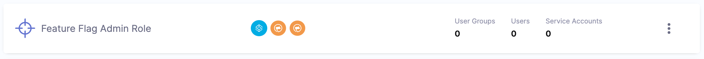
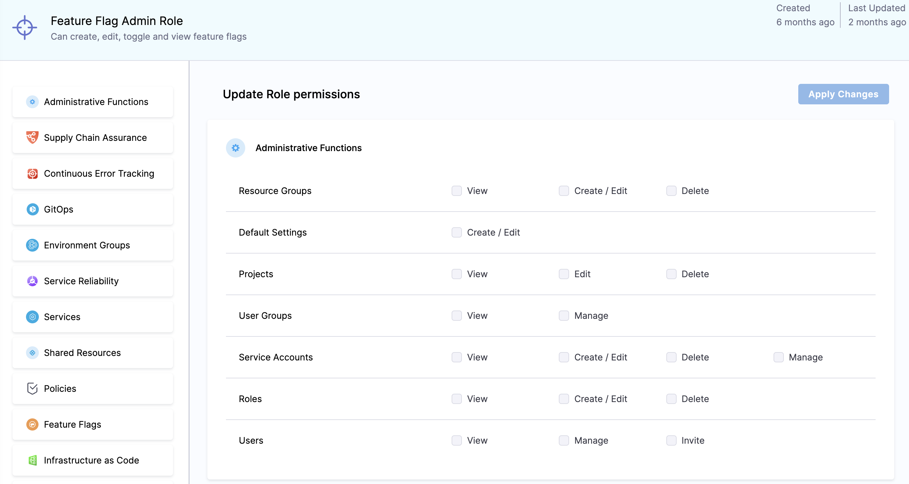

## Overview

This topic explains the roles and permissions within Harness Feature Flags. 

Custom roles and permissions with Harness Feature flags offer precise methods of access control to every module on the Harness Platform including Feature Flags. Using custom roles and permissions provides you with a way to outline access policies that meet the requirements of your workflow. 

Some examples of what you can do with custom roles and permissions include: 

 - Limiting the number of users that can create a flag
 - creating rules that allow users to edit the rules of a flag in certain environments
 - assigning create permissions while removing editing permissions for users
 - editing permissions within resource groups.

With Harness Feature Flags, each

:::info
In line with the custom roles and permissions, Role Based Access Control (RBAC) is a useful tool you can set to have more control over your workflow. For more information, go to [RBAC within the Harness Platform](../../../platform/role-based-access-control/rbac-in-harness.md).

:::

## Roles

Harness Feature Flags includes built-in roles for you to manage RBAC within the module. To examine the permissions assigned to these roles:

 1. At the account level scope, you can view the roles by selecting **Account Settings**, and then selecting **Access Control** along the top of the page, or by scrolling down.
 2. To view a role at the organization scope, go to **Organizations** and select the relevant organization. On the left hand side, select **Organization Settings**, and then select Access Control.
 3. Lastly, to view a role at the project scope, go to **Projects** and select the relevant project.  On the left hand panel, select **Project Settings** and then select **Access Control** in the header or by scrolling down the page.

 

 
 

## Permissions 

With **Create Permissions** and **Edit Permissions**, you have the ability to both create and edit all aspects of a flag including within tagging and resource groups. 

Prior to this update, the permission of users were limited to: 

 - **Toggle**: User is able to toggle a flag
 - **Create/Edit**: Users can create a flag, and edit the flag
 - **Delete**: Users can delete a flag

The permissions have now be split further. This gives administrators more choices to apply more defined rules on what users are able to do within their environments in Harness. Some examples include:

 - Users can have permissions to create flags but not be able to edit them in certain environments. 
 - Users can have permissions to edit flags but are restricted to certain environments. 

Administrators are able to control what the users can configure within various environments and helps to provide further alignment with security compliance around your products. 

<!--This is a comment. Will link pages on hot to edit config, edit permissions and create permission in a separate PR here. -->
