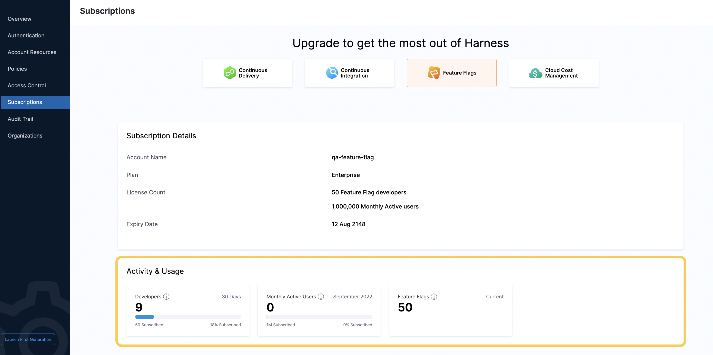

When you subscribe to a Harness module, you select a number of licenses for developers and monthly active users (MAUs) to include in your subscription. You can check how many of these licenses you’re currently using on the Harness Platform. To do this:

1. Go to the Harness Platform.
2. Click **Account Settings**, then **Subscriptions**.
3. Select the module you want to view the usage details for by clicking its tile.
4. Under **Activity & Usage**, you can view the number of:
	* Developers in the last 30 days
	* MAUs for the current month
	* Current Feature Flags in your account

	

