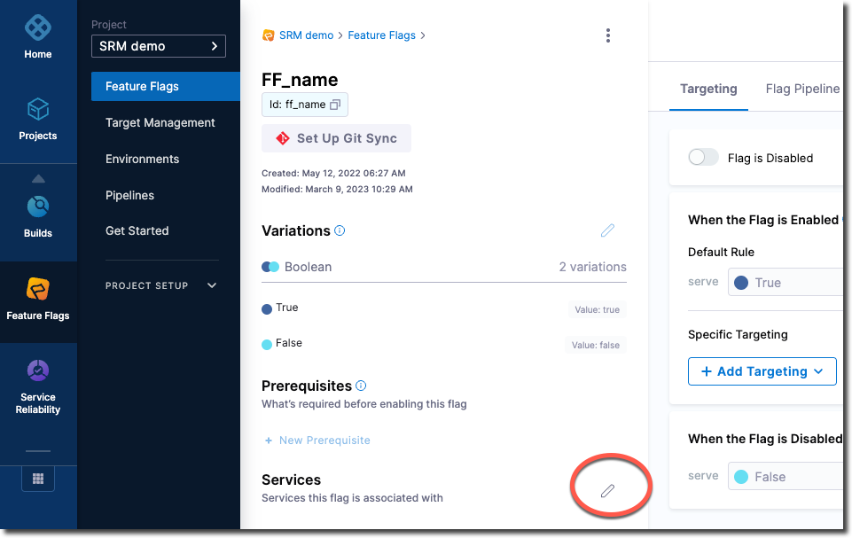
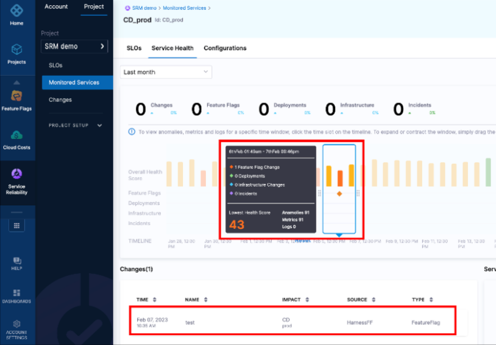

You may want to monitor your services to be notified when there are issues related to Feature Flag changes. To do this, you can connect a Feature Flag to a monitored service. A monitored service is a combination of a Service and Environment that Harness [Service Reliability Management (SRM)](/docs/service-reliability-management) monitors for changes, events, and health trends. Connecting a Feature Flag to the service lets you analyze how service health is impacted by a feature. 

For example, let's say you use SRM to monitor some services and to correlate change events to service health.
Now you want to see how a new feature impacts some services. You can put the new feature behind a Feature Flag, and connect that flag to one or more monitored services. You can then use SRM to see the impact on the connected service(s) when you turn the flag on or off.

For more information on monitored services, go to the [SRM documentation](/docs/service-reliability-management).

## Connect a Feature Flag to a monitored service

To connect a Feature Flag to a monitored service:

1. In your Harness project, go to **Feature Flags > Feature Flags**, and then select the flag you want to connect to a monitored service.

   

1. In the selected flag's settings page, select the edit icon on **Services**. 

   

1. Select the monitored service(s) you want to connect, and then **Save**.

## Check the impact of a flag on a monitored service

Once you connect a flag to a monitored service, whenever you turn the flag on or off, an event is generated for that service. To see the impact of the flag change event, go to **Service Reliability > Monitored Services > *ServiceName* > Service Health**. 

Here's an example of the Service Health page for a selected service:

For more information on monitored services, go to these topics to:

* [Create a monitored service](/docs/service-reliability-management/monitored-service/create-monitored-service)
* [Use the **Service Health** dashboard](/docs/service-reliability-management/change-impact-analysis/change-impact-analysis-service-health-dashboard)
* [Use the **Changes** dashboard](/docs/service-reliability-management/change-impact-analysis/change-impact-analysis-changes-dash-board)

