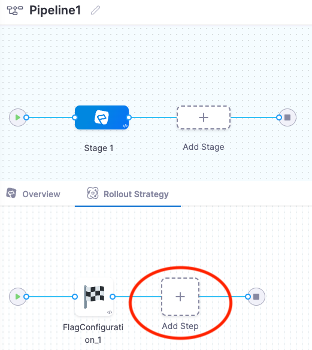

import ff_pipeline from './static/1-build-feature-flag-pipeline-07.png'

A Feature Flag (FF) pipeline enables you to combine a flag with other actions such as adding Jira issues, creating notifications, adding approvals, etc. You can:

- Use Jira issues to approve or reject a pipeline or stage at any point in its execution
- Create notification rules to send notifications about the events on your FF pipeline
- Schedule pipeline executions using Cron-based Triggers, etc.

This topic explains how to build an FF pipeline. Watch this video for an introduction:

<!-- Video:
https://www.loom.com/share/f9bfceb163454af89c7baf50c66ae916-->
<DocVideo src="https://www.loom.com/share/f9bfceb163454af89c7baf50c66ae916" />

## Before you begin

You should be familiar with the [Harness' Key Concepts](/docs/platform/get-started/key-concepts.md) and how to [Create Organizations and Projects](/docs/platform/organizations-and-projects/create-an-organization).

## Create a pipeline

This topic assumes you have already set up a [project](/docs/feature-flags/use-ff/ff-creating-flag/create-a-project#create-a-project).

To create an FF pipeline:

1. In Harness, select **Feature Flags**, and then select an existing project or [create a new one](/docs/feature-flags/use-ff/ff-creating-flag/create-a-project#create-a-project).
2. Navigate to **Pipelines > Create a Pipeline**.
3. In **Name**, enter a name for your pipeline. An ID is generated automatically.
4. Enter **Description** and **Tags** for your pipeline.
5. Click **Start**.

Now you're ready to add a stage.

## Add a stage

An FF pipeline is organized into stages. Each stage contains the logic to perform one major segment of the pipeline process. You must have a minimum of one stage to run the pipeline.

1. Click **Add Stage**, and then select one of the available stage types.

   Two common options are: **Feature Flags** and **Approval**.

   An approval stage approves or rejects a pipeline at any point in its execution. Approvals are added between stages to prevent pipeline execution from proceeding without an approval. You can use Harness UI, Jira, Custom Shell Script, or ServiceNow Approval mechanisms. For more information, go to [Using manual approval stages](/docs/platform/approvals/adding-harness-approval-stages/).

1. In **About your Stage**, in **Name**, enter a name for your stage. Click **Set up Stage**.

   You can edit the name in the **Overview** tab of the stage anytime.

   Changing the stage name doesn't change the stage identifier (ID). The stage identifier is created when you first name the stage and it cannot be changed. For more information, go to [Entity Identifier Reference](/docs/platform/references/entity-identifier-reference.md).

Once you've created a stage, you can see the name and ID in the **Overview** tab.

You can add multiple stages, and insert new stages between the existing stages. To add another stage to the pipeline, in **Pipeline Stages**, click **+** and then follow the same steps.

## Add a step

Each stage has a rollout strategy that consists of a series of steps, or tasks, to be carried out in sequence. A stage can have one or many steps. With your rollout strategy, you can deploy multiple managed workloads. When a rollout strategy is applied, it's possible to make changes to only a limited set of users as a risk mitigation strategy. By releasing production changes gradually, error rates or performance degradation can be tracked.

To add a step:

1. In Harness, select **Feature Flags > Pipelines**, and then select a pipeline, or create a new one.
1. Go to your pipeline, select the stage you want to add a step to.

   The Rollout Strategy view for this stage appears below the stages.

1. Select **Add Step**.

   

   The **Step Library** panel appears, where you can choose what type of step to add.

   

## Add flag configurations

To add details to a Flag Configuration step:

1. In your pipeline, select a stage, and then select a Flag Configuration step.

   The Step Parameters form appears

   

1. Add a **Step Name**.
1. In **Select Environment** and **Select Flag**, select an environment and a flag.

   Choose one of these options:

	* **Fixed value** - A value you enter manually as part of the pipeline cofniguration and does not change at runtime.
	* **Runtime Input** - A runtime variable that lets you select the input at runtime (for example if _environment_ is set to a runtime input, you can choose a different environment for the flag change every time you run the pipeline)
	* **Expression** - Expressions allow you to reference runtime inputs from other steps in the pipeline from any step or script.

	[More information on fixed values, runtime inputs nd expressions](https://developer.harness.io/docs/platform/variables-and-expressions/runtime-inputs/).

1. In **Flag Changes**, select an action to take when this flag changes, and then configure the variation to serve based on that action.

   

   Here are the available options:

	| Flag change actions | Configuration |
	|---------------------|---------------|
	| **Set default ON rule** | Update the flag variation served when the flag is enabled. |
	| **Set default ON rule**   | Update the flag variation served when the flag is disabled. |
	| **Serve variation to targets** | Serve a flag variation to a single or multiple targets. |
	| **Serve variation to target groups** | Serve a flag variation to a single or multiple target groups. |
	| **Serve percentage rollout to target group** | Serve a flag variation in a %-rollout distribution across a single target group. For more information, go to [Target users with flags](/docs/feature-flags/use-ff/ff-target-management/targeting-users-with-flags#target-specific-users-or-target-groups-when-a-flag-is-enabled). |
  
	For information on managing variations, go to [**Change the variations of your flags**](/docs/feature-flags/use-ff/ff-creating-flag/manage-variations).

1. Select **Apply Changes**, and then select **Save**.

## Run the pipeline

1. In the pipeline view, click **Run**.
2. The pipeline runs and a success message is generated.

## View the results

Click each stage's steps to see the logs in real-time. Click **Console View** to see more details.

## Pipeline notification strategy

You can create notification rules to send notifications about the events on your FF pipeline that are important to you. You can notify your User Group members using Slack, Microsoft Teams, Email, or PagerDuty as one of the notification channels. Event notifications are set up using **Notification Rules.**

### Slack notification

You can notify your User Group members using Slack as one of the notification channels. You can add your User Group to a Notification Strategy and receive alert info in Slack.

For more information, go to [Send Notifications using Slack](/docs/platform/notifications/send-notifications-using-slack).

### Email notification

For email notifications, simply type in the email addresses that you want to notify.

For more information, go to [Email notifications](/docs/continuous-delivery/x-platform-cd-features/cd-steps/notify-users-of-pipeline-events#email-notifications).

### PagerDuty notification

For PagerDuty notifications, enter the key for a PagerDuty Account/Service to which Harness can send notifications.

For more information, go to [Send Notifications using PagerDuty](/docs/continuous-delivery/x-platform-cd-features/cd-steps/notify-users-of-pipeline-events#pagerduty-notifications).

### Microsoft Teams notification

Harness notifies your User Groups of events in pipelines and general alerts.

You can integrate your Harness User Group with Microsoft Teams and receive notifications in Teams channels.

For more information, go to [Send Notifications using Microsoft Teams](/docs/platform/notifications/send-notifications-to-microsoft-teams).

## View a pipeline using YAML

The entire pipeline is available as YAML, also.

1. In **Feature Flag**, in **Pipelines**, click **YAML**.
2. You can see the entire pipeline as YAML. You can edit anything in the pipeline and run it again.

## Schedule pipelines using triggers

You can trigger an FF pipeline on a time schedule. You can select how often to execute the trigger by minute, hour, days, etc.

All the cron jobs are executed in Universal Time Coordinated (UTC). Cron triggers allow you to create pipelines that start on a specific time schedule.

For more information, go to [Schedule pipeline using triggers](/docs/platform/triggers/schedule-pipelines-using-cron-triggers).

## Add chaos experiments to your FF pipeline

You can use Harness Chaos Engineering (CE) to run chaos experiments, which are intentionally designed to disrupt systems to test their resilience and vulnerability to faults. Adding chaos steps that run CE experiments as part of your FF pipeline is a useful way to test the resilience of new software behind a feature flag before releasing that software to users.

For more information, go to [Use CE with Feature Flags](/docs/chaos-engineering/integrations/chaos-ff).

## More information

For more information on Harness pipelines, go to [Pipelines](/docs/category/pipelines).
