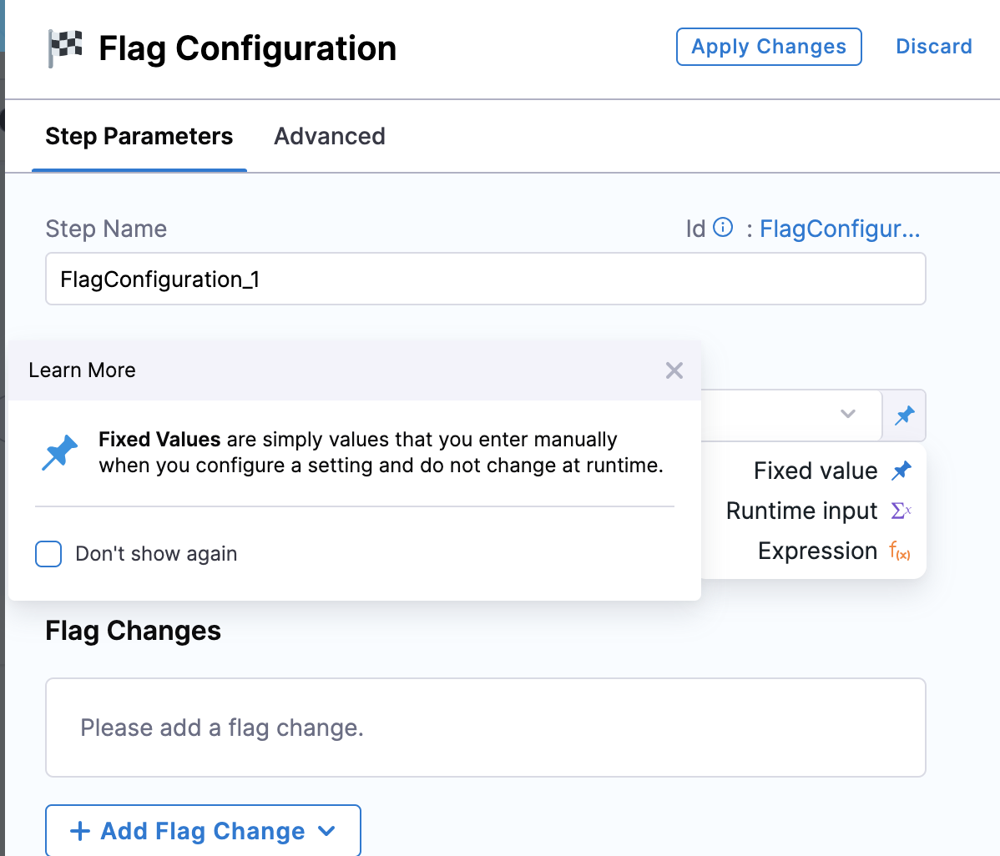
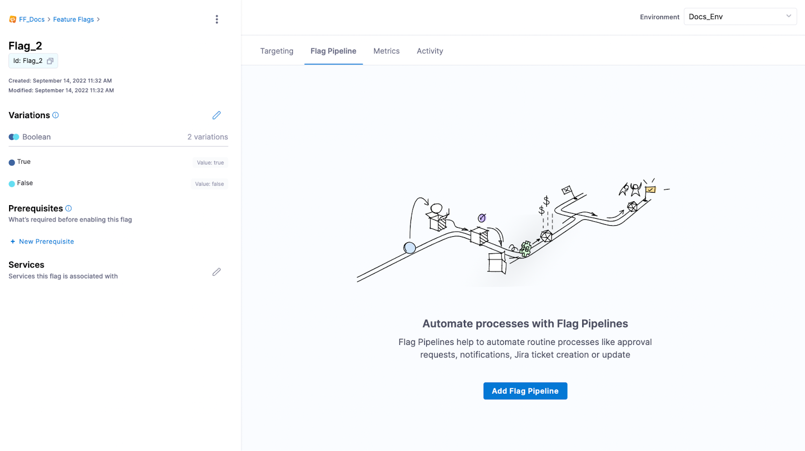
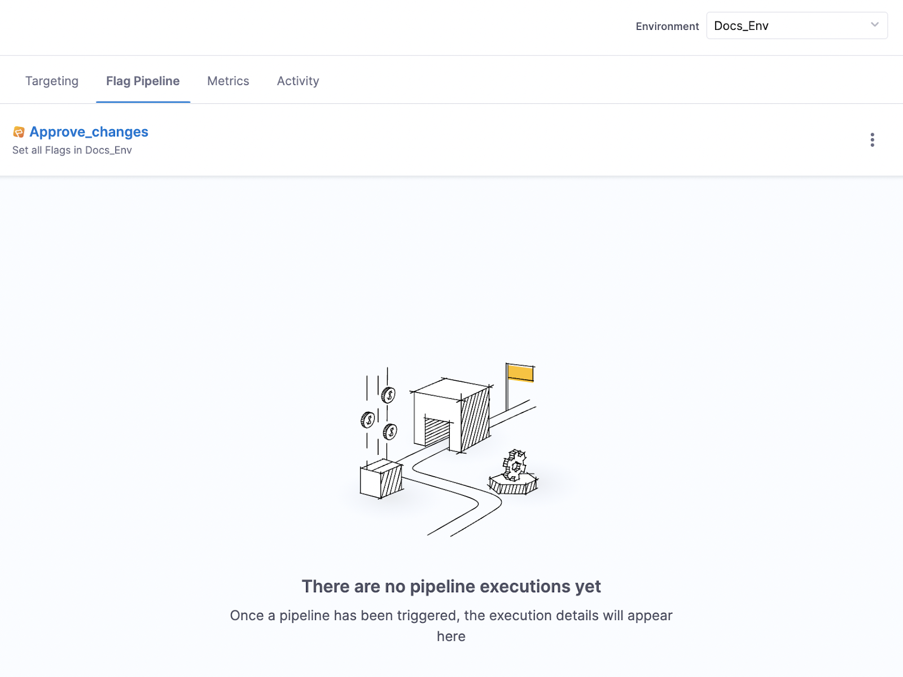
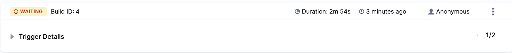
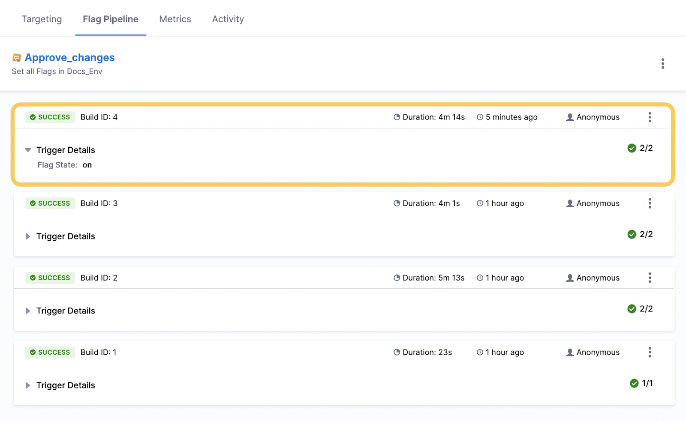

:::info note
 This feature is available to use only by Project Admins.
:::

You can add a Pipeline to your Flags that will be applied when you or your team make the following changes:

* Enable or disable a Flag
* Add Targeting rules to a Flag

Using a default Pipeline means that you can ensure your Flag changes can go through the process you want it to, allowing for better security and more consistent operations. For example, you can add an approval step so all your production Flag changes must be approved before they are executed, or you can send a Slack notification every time a Flag changes. 

## Before you begin

* You should understand how to create a Pipeline. For more information about Pipelines, go to [Pipelines and Stages](/docs/category/pipelines).
* You should have a Project set up with Feature Flags added to it.

## Important things to consider

* Removing Targeting rules won’t execute the Pipeline. Currently, the Pipeline is only executed for the following changes:
	+ Enable or disable a Flag.
	+ Add Targeting rules to a Flag.
* You must include a Flag step and add the Flag Configuration.
* Currently, you can’t add Pipelines that include a build or deploy stage.

## Add a default Pipeline

To add a default Pipeline: 

1. Go to Feature Flags, then select **Pipelines**.
2. Click **+ Create a Pipeline** and enter the name and description for the Pipeline, then click **Start**.
3. Add a stage and select **Feature Flag**, name the Flag, then click **Set Up Stage**.
4. Click **Add Step**, then click **Flag Configuration**. Add the following for your Flag Configuration:
* In **Step Name**, add the name for the Pipeline step.
* In **Environment**, add the environment you want to use.
* In **Select Flag**, click the pin icon and change to **Runtime input**.

	

5. Click **Apply Changes**. After you have added the Flag Step, you can then add any other Pipeline stages or steps you want to include in your Pipeline, for example, a Jira approval stage.

:::info note
 Currently, you can’t include build or deploy stages.
:::

## Apply the default Pipeline to a Flag

After you have created the Pipeline, you need to apply it to your Feature Flag. To do this:

1. Go to **Feature Flags**.
2. Select the Flag you want to add the Pipeline to.
3. Click the **Flag Pipeline** tab, then click **Add Flag Pipeline**.  

4. Select the Pipeline you created and click **Set as Flag Pipeline**.
5. The Pipeline is now displayed under the Flag Pipeline tab.  

## Trigger your Pipeline

Test your Pipeline is triggered and runs correctly by making a change to the Flag you applied it to. To do this:

1. Go to the Flag you applied the Pipeline to and toggle it on or off.
2. Go to the **Flag Pipeline** tab. Under the Pipeline, you can see the Pipeline running and the number of stages it needs to complete. If the Pipeline is waiting for a stage to be completed, for example, an approval, a WAITING tag is added.  

3. Once complete, a SUCCESS tag is added and you can view the details by clicking on Trigger Details.  

 

 

 

