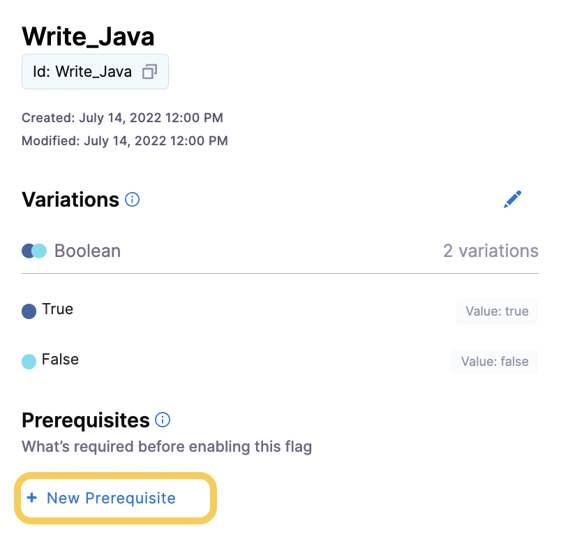
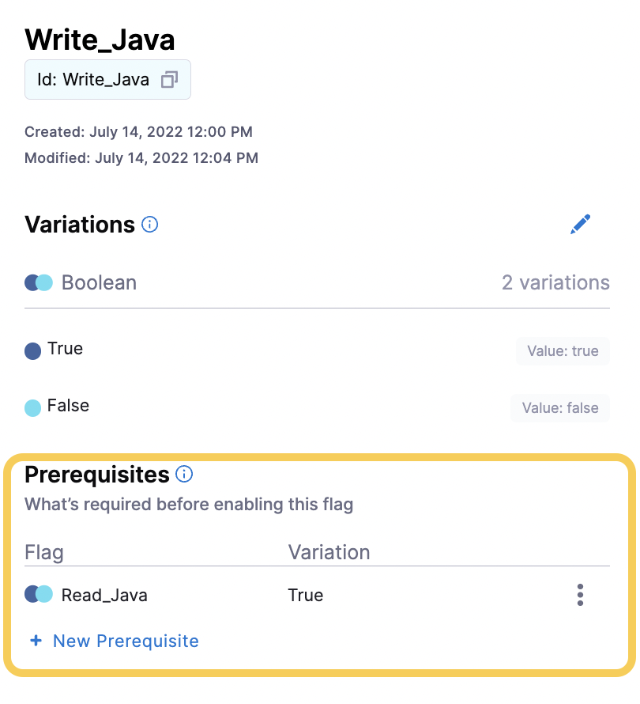

import pre_req_1 from './static/3-add-prerequisites-to-feature-flag-02.png'
import pre_req_2 from './static/3-add-prerequisites-to-feature-flag-03.png'

A Prerequisite is a Feature Flag that you add as a dependency to another Feature Flag. That dependency must be met before that second Feature Flag can be toggled `ON` or `OFF`. For example, if you have a flag that allows users to write Java, the user must be able to read the Java first. Therefore, you add a Prerequisite to the `Write_Java` flag that says the `Read_Java` flag must be enabled before the `Write_Java` flag can be toggled on. 

:::info
At present, Harness currently *does not* support nested prerequities as this functionality is not currently supported.
::: 

### Add a Prerequisite

1. Go to the Feature Flag you want to add the Prerequisite to.
1. Select **+ New Prerequisite**.

   

   

1. In **Add Prerequisites**, click **+ Prerequisites**.
1. In the first drop-down menu, select the flag you want to use as a Prerequisite.
1. In the second drop-down, select which Variation of the Prerequisite flag must be served before the Feature Flag can be turned on. 

   For the example below, the `Read_Java` flag must be set to `True` before this flag can be enabled.
1. Select **Save**. The Prerequisite flag is listed on the Feature Flag page and must be met before you can turn on the Feature Flag.

   
   
   
