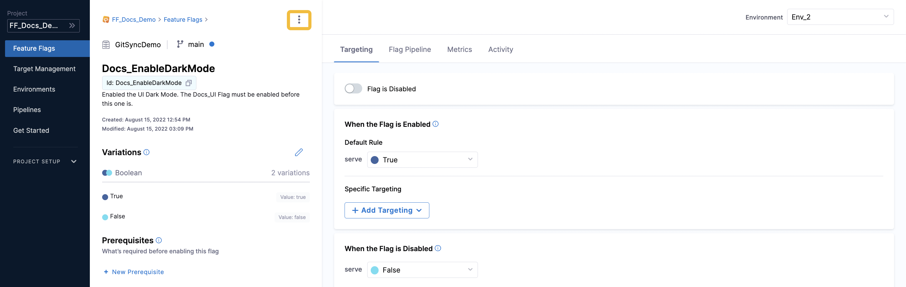
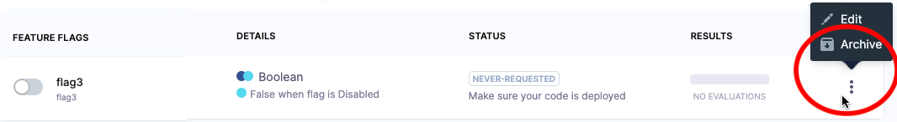
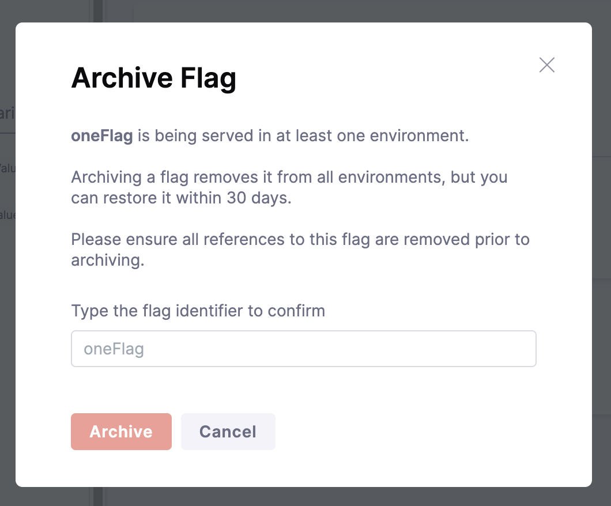
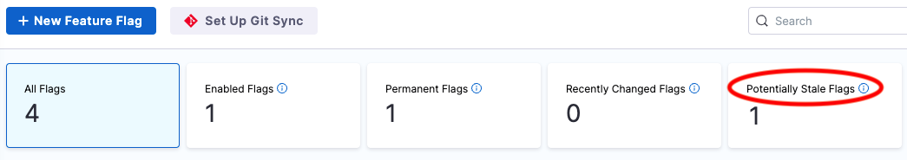

## Editing a Feature flag

After you have created a flag, you can edit the following details:

* Flag name
* Description
* Whether or not it is marked as permanent

Here are the steps to editing your flag:

 1. Select the Harness project containing the flag you'd like to edit. Navigate to **Feature Flags** which will display the active and inactive flags in your project. 
 2. Next to the flag you want to edit, select (**︙**), and then select **Edit**. You can also select the flag and select (**︙**) on the top right of the project name. 

   

 3. Edit the relevant details, and then select **Save**.

For more information, go to:

* [Change your flag variations](manage-variations.md)
* [Add prerequisite flags](/docs/feature-flags/use-ff/ff-creating-flag/add-prerequisites-to-feature-flag)
* [Manage your targets](/docs/feature-flags/use-ff/ff-target-management/add-targets)

### Archive and deleting a flag

To remove a flag from Harness you must archive it first. This gives you the option of restoring the flag within 30 days. After 30 days, an archived flag is permanently deleted. You can [check for stale flags](#check-for-stale-flags) to identify which flags you might want to archive.

You can archive a flag if it's not a prerequisite to other flags. If it is, remove it as a prerequisite, and then archive it.

:::info notes
1. When you archive a flag, it is removed from all environments **but** you can restore it within 30 days.
2. You cannot archive a flag if it is a prerequisite to other flags. Remove the flag as a prerequisite, and then you can archive it.
:::

Here are the steps to archive a flag:

 1. Select the Harness project containing the flag you'd like to archive. Navigate to **Feature Flags** which will display the active and inactive flags in your project. 
 2. Next to the flag you want to archive, select (**︙**), and then select **Archive**. You can also select the flag and select (**︙**) on the top right of the project name. 

   

 3. The Archive Flag confirmation screen appears next. If the flag you're archiving is a prerequisite to another flag, you can select the flag from this screen to remove the dependency, and then try archiving again. 
   
   
   
 4. If you're sure you want to archive the flag, type the ID of the flag in the field provided, and then select **Archive**. Be aware you can restore the archived flag within 30 days.

### Restore a flag

Restoring a flag makes it available again for evaluation if the flag is referenced in your code. That is, you haven't removed the references to it when you archived the flag, or you've reinstated those references.

When you restore a flag, it's restored to all environments. All of the flag's configurations in an environment (including whether it's enabled or disabled) will be restored to the state they were in, in that environment, when the flag was archived. If you created new environments since the flag was archived, the flag will be disabled in those.

Here are the steps to restore an archived flag:

 1. Select the Harness project containing the flag you'd like to restore. Navigate to **Feature Flags** which will display all of your flags in your project. 
 2. Next to the flag you want to restore, select **more options** (**︙**), and then select **Restore**.
 3. On the confirmation screen, select **Restore**.

## Check for stale flags

You might want to check if you have stale flags so that you can decide whether to archive them. In Harness, flags are counted as potentially stale if in the past 60 days:

* They haven't been changed or evaluated.
* Their default rules or target rules haven't been added to, or updated.
* They haven't been toggled on or off.

If a flag gets stale, and then any of the above occurs, the flag is no longer considered stale.

To view a list of potentially stale flags:

* Go to **Feature Flags > Feature Flags**, and then select **Potentially Stale Flags**.

   

### Delete an archived flag

Archived flags are automatically deleted 30 days after you archive them. But if you're sure you want to delete the flag immediately, you can delete an archived flag before that 30-day period ends.

:::info note
When you delete a flag, it is permanently removed from all environments.
:::

To delete an archived flag:

1. In your Harness project, navigate to **Feature Flags > Feature Flags**, and then select the **Archived** filter at the top of the page.
2. Next to the flag you want to delete, select **more options** (**︙**), and then select **Delete**.
3. On the confirmation screen, select **Delete**.

