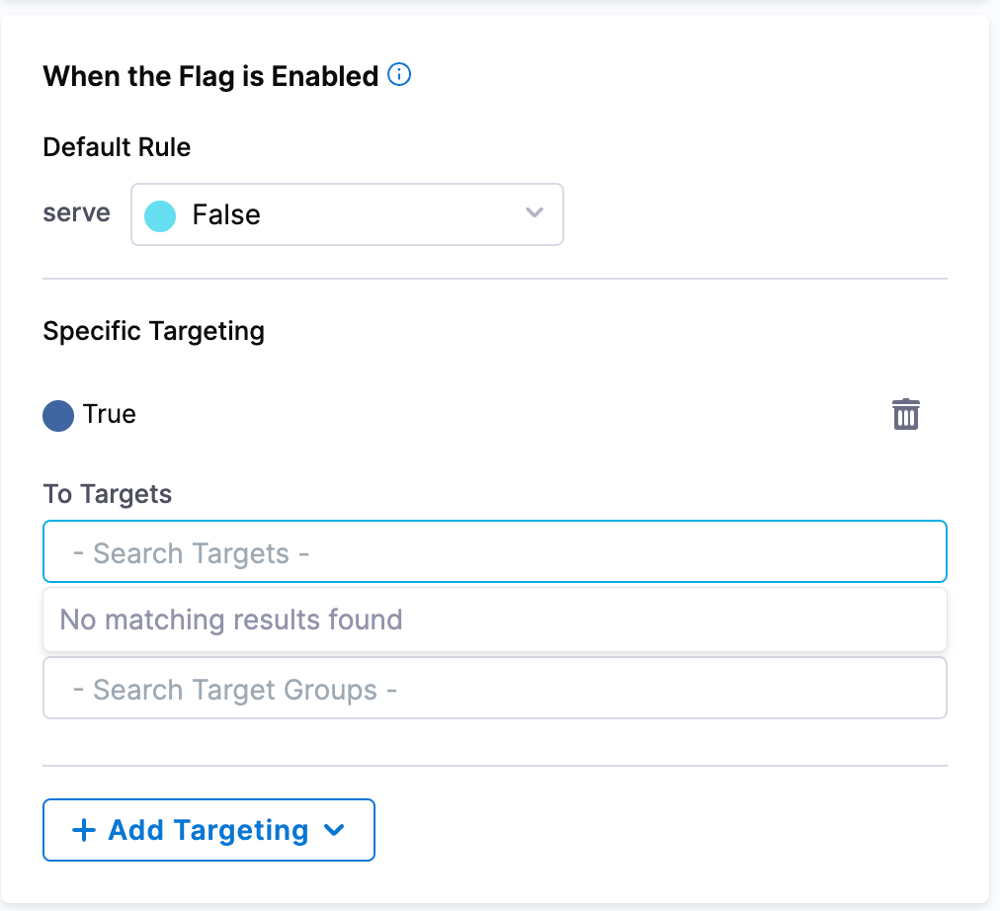

## Manage rules of your flags

### Edit rules

Within Harness Feature Flags, rules contain the targeting logic within your flags. The rules help describe what variation the flag should present to the user when the flag is enabled or disabled. 

When you create a Feature Flag within your project, you have the option to specify a specific variation using **Default Rules**. 

 

To do this, you would need to:

 1. Go to your **Project** and select **Feature Flags** on the left hand menu panel. 
 2. If editing the rule of an existing flag, double-click on your chosen flag. Otherwise, go through the steps to create a new one and you may continue with the next step below.
 3. On the right hand side of the page, the **Targeting** option should already be selected and you can proceed to edit your rules for when the flag is enabled or when the flag is disabled. 
 4. Once you have made the changes you need, select **Save** at the bottom of the screen.  

Ensure the flag is turned on for your selected environment for your changes to run successfully. 

When editing your rules, you may have noticed the option to add **Targets** and, or, **Target Groups**. To learn more on how to create **Targets** and **Target Groups**, go to:

 * [Add Targets](/docs/feature-flags/use-ff/ff-target-management/add-targets.md)
 * [Add Target Groups](/docs/feature-flags/use-ff/ff-target-management/add-target-groups.md)
 * [Targeting Users with Flags](/docs/feature-flags/use-ff/ff-target-management/targeting-users-with-flags.md)

## Edit configuration

When setting the rules of your flag, you have the options to add additional configurations to further monitor the performance of the Feature Flags as a user or for your team. 

Here are the steps to do so: 

 1. Go into your **Project** and select **Feature Flags** on the left hand menu panel. 
 2. If editing the rule of an existing flag, double click on your chosen flag. Otherwise, go through the steps to create a new one and you may continue with the next step below.
 3. On the left-hand panel underneath the name of your Feature Flag, you will find options to add **Cloud Cost Monitoring**, **Monitored Services**, and **Jira Issues**. 

To learn more about each of these configuration options, check out the following Harness documentation with further detailed steps for what you need. 

 * [Adding Cloud Cost Management to Feature Flags](/docs/feature-flags/use-ff/ff-creating-flag/using-ff-ccm.md)
 * [Connecting a Feature Flag to a Monitored Service](/docs/feature-flags/use-ff/connect-monitored-service.md)
 * [Integrate Feature Flags with Jira](/docs/feature-flags/use-ff/ff-creating-flag/integrate-feature-flag-with-jira.md)

