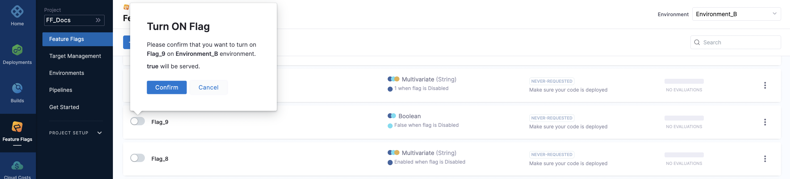
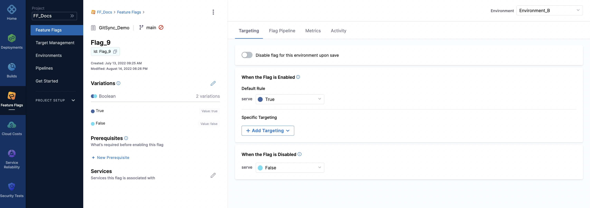

This topic describes how to turn a Feature Flag `on` or `off`. Flags you create are available in all environments, but the state of the flag is independent, which means the same flag can be turned on in `Environment_A` and turned off in `Environment_B`.

Before enabling or disabling a flag, consider the following:

* Remember to check which environment you are in before toggling any flags to ensure you are enabling or disabling the feature in the correct environment.
* By default, flags are disabled on creation, so you need to enable them when you are ready to use them in your application.
* When a flag is disabled, the off Variation (which is the default variation) is served to all users. The flag does not evaluate any Targets or Target Rules until you enable it.

## Enable or disable flags from the Feature Flags page

To enable or disable a flag from the Feature Flags page:

1. In your Harness Project, go to **Feature Flags**. A list of all your flags is displayed.
2. Toggle the button next to the flag name to turn the flag on or off.
3. Check the details are correct, then click **Confirm**.

   

## Enable or disable flags from the Targeting tab

To enable or disable a flag from the Targeting tab:

1. In your Harness Project, go to **Feature Flags**. A list of all your flags is displayed.
2. Click the flag you want to enable or disable, then click Targeting.
3. Depending on the action you want to take, toggle **Flag Enabled** or **Flag Disabled**.
4. Click **Save.**

   

