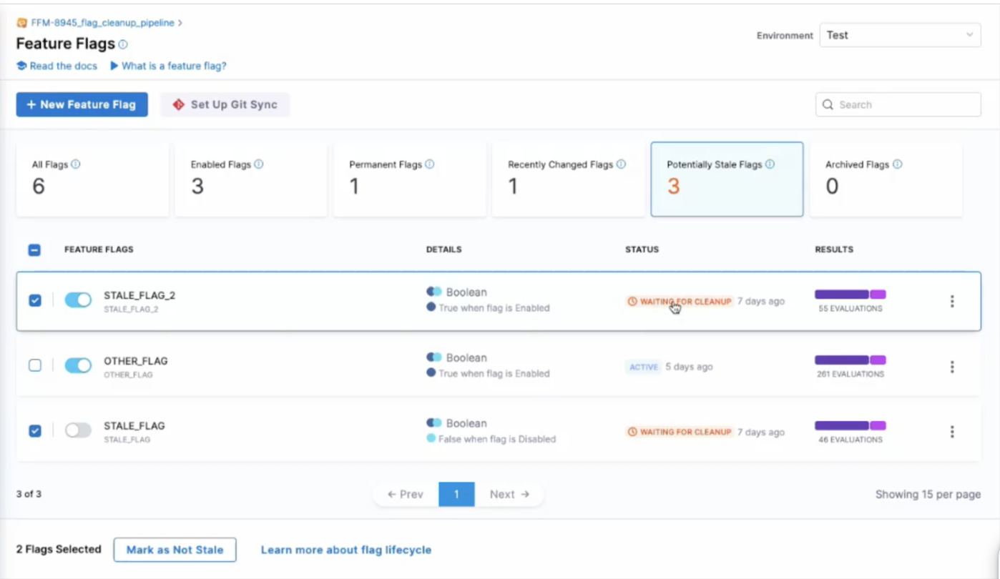
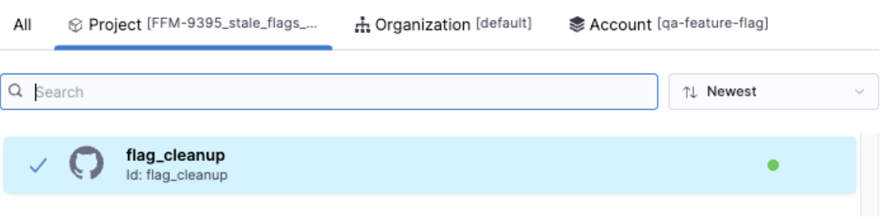
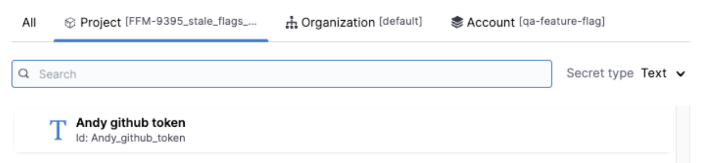
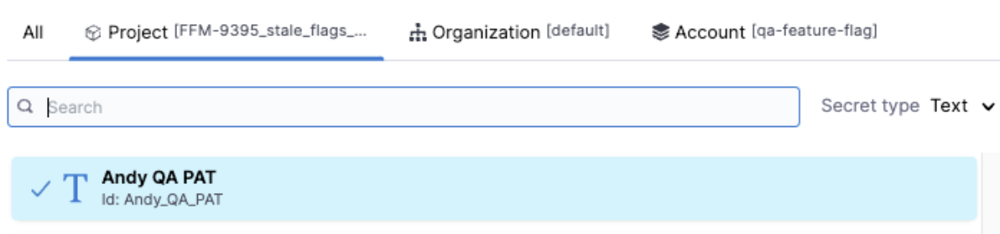
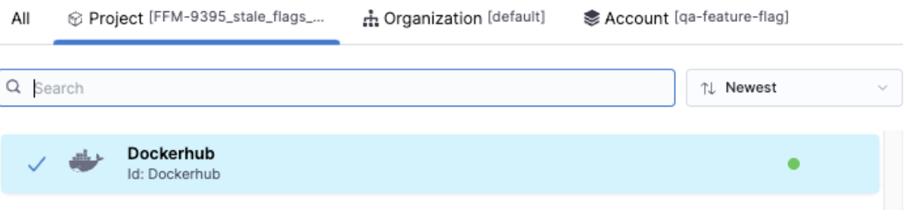
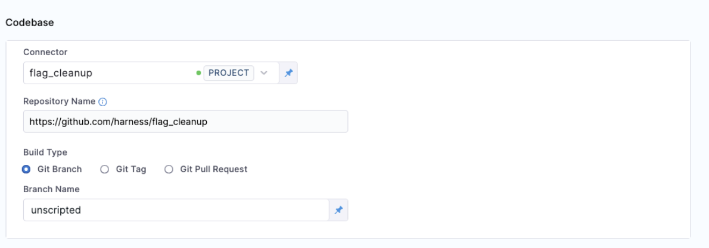
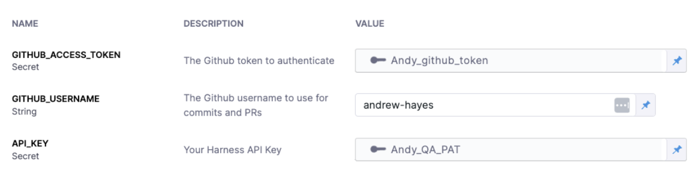
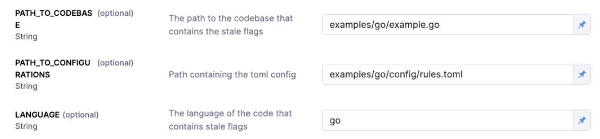
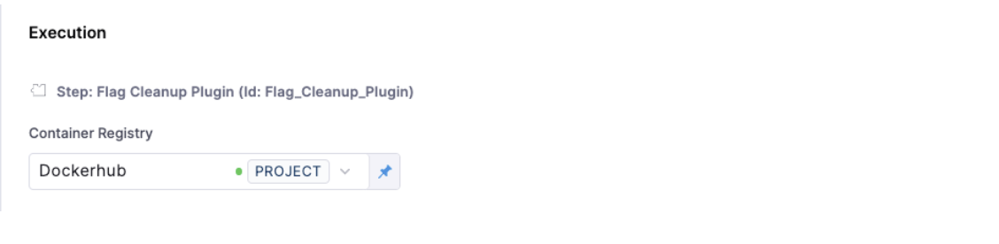
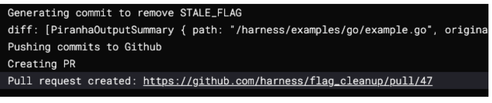

## Manage stale flags

Harness Feature Flags helps to identify stale flags and automates the process of removing them from your code.

Stale flags are flags that are no longer needed as the change behind them has been widely rolled out and no longer needs any control in production.

### Identifying potentially stale flags

#### Definition of potentially stale flags

Harness defines _potentially stale_ flags based on the following criteria:

- Flag has not had evaluations in the last 60 days.

Or

- Flags that have not had any modification to their targeting rules in longer than 60 days.

Or

- Flags that have been globally set to a single value for longer than 30 days.

#### Finding potentially stale flags

To see the flags identified by Harness as potentially stale, go to the top of the **Feature Flags Overview** and select the **Potentially Stale Flags** filter.

By seeing which flags are potentially stale, your team can choose to either manually clean them up, mark them for automated cleanup via Harness, or mark them as not being stale.

### Actions for Potentially Stale Flags

When viewing all flags marked as potentially stale, you have two options within Harness

- **Mark as not stale** - this will remove the flag from the _potentially stale_ list for a period of 60 days. If the same criteria are met after 60 days, the flag will appear in the _potentially stale_ list again

- **Mark as Ready for Cleanup** - this will change the flag’s status to _ready for cleanup_ , which will appear in the UI and be used as a list for the flag cleanup pipeline.

Note that once a flag has been marked as _ready for cleanup_, you can still undo this decision by marking the flag as not stale.



## Automating Flag cleanup

### What’s needed

In order to leverage Harness’ flag cleanup automation pipeline, you will need the following:

- A valid cleanup [toml configuration file](https://www.google.com/url?q=https://github.com/harness/flag_cleanup/blob/unscripted/docs/1_understanding_rules.md&sa=D&source=docs&ust=1695064949403882&usg=AOvVaw19GoyueRvzdkIJXRnwLyhx)
- A Harness API key (so we can get the list of stale flags)
- A Dockerhub connector to download the cleanup plugin
- [A git connector on Harness](https://developer.harness.io/docs/platform/connectors/code-repositories/ref-source-repo-provider/git-hub-connector-settings-reference/) - to connect to your code
- A Github token to create the PR

### Languages supported for flag cleanup

At this time, the following languages are supported for flag cleanup automation:

- Java
- Kotlin
- Go
- Javascript 

There are some slight differences when using Javascript for flag cleanup automation compared to the other languages listed. Have a read to learn more about the differences in the implementation of flag cleanup automation in Javascript. 

### Set up a flag cleanup pipeline

 1. To use flag cleanup automation,  you must [import a pipeline template](https://developer.harness.io/docs/platform/git-experience/import-a-template-from-git/). The GitHub repo to import from is [here](https://github.com/harness/flag_cleanup/blob/unscripted/docs/pipelines/flag_cleanup_pipeline.yaml). 
- Note that the identifier and the name must match.

 2. To configure secrets:

 - A Github connector to connect to the repo to clone the code to clean up. The [demo repo is here](https://github.com/harness/flag_cleanup) and the branch to use is “unscripted”.
 
 
 
 - A Github token to allow the creation of PRs.
 
 
 
 - A Harness API key to get the list of flags marked for cleanup.
 
 
 
 - A Docker connector to pull down the plugin image.
 
 

 ### Running the Flag Cleanup Pipeline

 1. Select the repository and branch for the codebase.
  
    

 2. Provide the GitHub token, GitHub username, and Harness API key.

    

 3. Specify the paths to the code (e.g., JavaScript paths).

    

 4. Select the DockerHub connector and run the pipeline.

    

As the pipeline runs, logs from the plugin show it getting the flags and performing the code changes.



You can then navigate to the PR and see the changes it made.

<DocVideo src="https://www.youtube.com/embed/sSP1nxrBwxo?si=dGI7vBmio6pfhWnX" />

### Understanding the JavaScript Flag Cleanup Tool

This section describes the `properties.json` file structure, its role, and how to write custom flag cleanup rules for JavaScript.

In the JavaScript demo folder, you will find two files:
 - `examples.js`: Contains the code. In a real repository, there might be hundreds of files, only some of which contain references to the feature flag.
 - `config/properties.json`: Defines how to find feature flag references in the codebase.

```

{
  "methodProperties": [
    {
      "methodName": "isEnabled",
      "flagType": "treated",
      "argumentIndex": 0
    },
    {
      "methodName": "doSomething",
      "flagType": "treated",
      "argumentIndex": 0
    },
    {
      "methodName": "isToggleDisabled",
      "flagType": "treated",
      "argumentIndex": 0
    }
  ]
}

```

 - `methodProperties`: An array of methods used to check flag values.
 - `methodName` : Name of the method to be checked.
 - `flagType`: Label as "treated" (specific to Piranha).
 - `argumentIndex`: Position of the flag name in the argument list (e.g., doSomething("STALE_FLAG") has an index of 0).

### Running the flag cleanup pipeline for JavaScript

Here are some points to consider when using Javascript for the feature flag cleanup:
 1. Ensure your `properties.json` is configured correctly to identify feature flag references in your codebase.
 2. Import the pipeline template and configure the required connectors and tokens as described.
 3. Run the pipeline and review the logs to see the flags identified and cleaned up.

By incorporating these steps, you can effectively manage stale flags in your JavaScript codebase using Harness’s automated flag cleanup tool.

:::info
You can find the GitHub repo for the Feature Flag cleanup in Javascript [here](https://github.com/harness/flag_cleanup/blob/main/docs/1.1_understanding_js_rules.md).
:::

### Training your cleanup configuration file

You will need update the rules file with the correct tree-sitter query.

<DocVideo src="https://www.youtube.com/embed/Y22vmMNwPYU?si=W-SHEQlHV-3cNYOg" />
