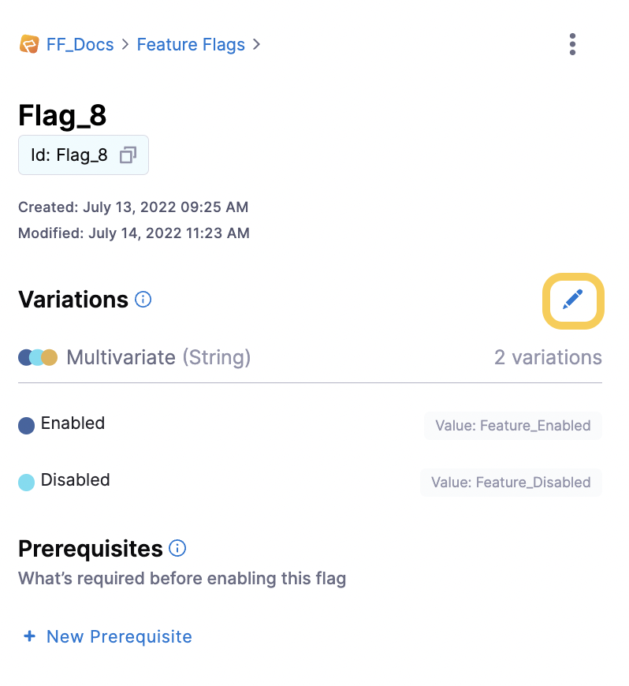
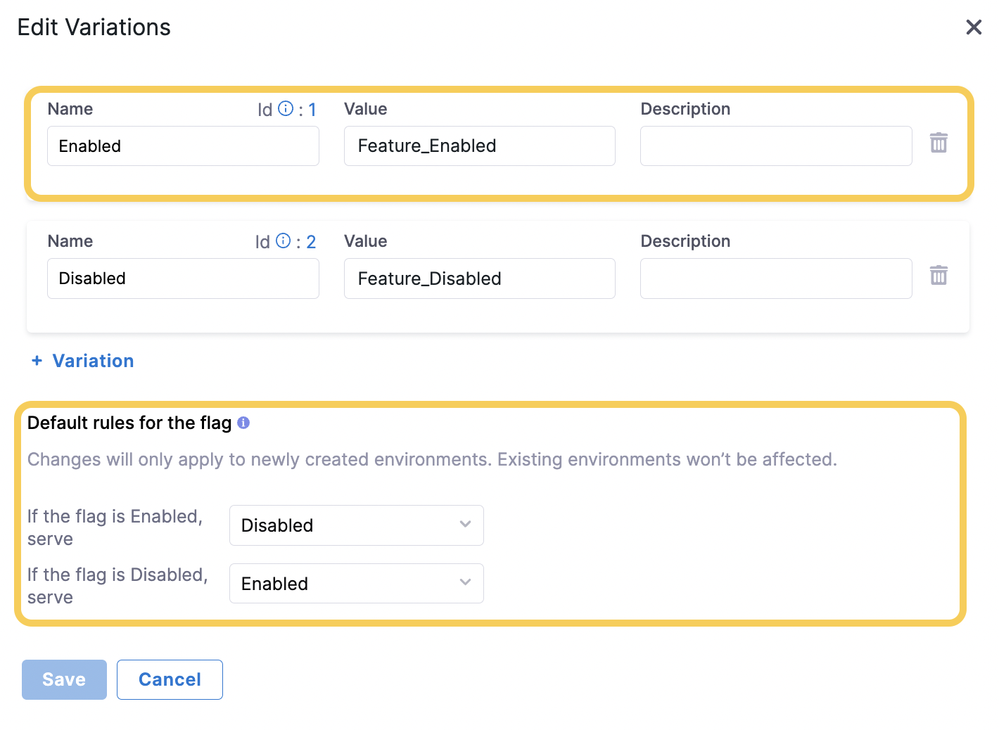
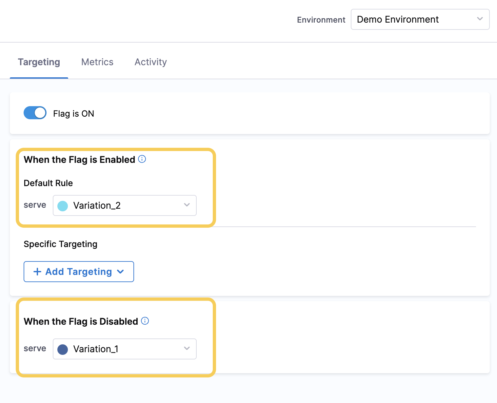

When you create a Feature Flag, it has default Variations that are served when the Flag is toggled `ON` or `OFF`. You can accept these default Variations or you can change them. 

For example:

* A Boolean Flag could have `false` set as its default `OFF` Variation and `true` set as its default `ON` Variation. You could change the `ON` Variation to `feature_enabled` and the `OFF` Variation to `feature_disabled`.
* A Multivariate Flag could have `Variation_1` set as its default `OFF` variation and `Variation_2` set as its default `ON` variation, with `Variation_3` configured to be served only when a user has a certain email address.

You can edit the Variations of your Flags on the Harness Platform even after using the Harness Feature Flag SDKs in your application.This topic describes how to edit the default Variations of your Feature Flag and how to edit the Variations that are served for your current Environment.

## Edit the default Flag Variations

:::info note
 When you change the default Variation of a Flag, the change is applied to **only** the current Environment you are in and any new Environments you create. To change the Variations in other pre-existing Environments, follow the steps in Option 1: Edit the Variations for a Specific Environment.
:::

1. Go to the Feature Flag you want to edit the Variations for.
2. In **Variations**, click the edit icon.

   
        
    

3. In **Edit Variations**, you can add or delete a Variation and also edit the following:
   * **Name**: The name of the Variation, for example `Enabled`. The identifier is not changed if you change the name.
   * **Value**: The value of the Variation, for example `Feature_Enabled`.
   * **Description**: An optional description for the Variation.
   * **Default rules for the flag**: The rules that are served by default for this Flag, for example, when the Flag is enabled, serve the `Enabled` Variation.

      
       
       

## Edit the Variations served for your current Environment

1. Go to the Feature Flag you want to edit the Variations for.
2. In the **Targeting** tab, under **When the Default Flag is Enabled** and **When the Default Flag is Disabled**, select the Variations you want to set as the default.

    
    

   :::info note
    For information about Specific Targeting, go to [Targeting Users with Flags](/docs/feature-flags/use-ff/ff-target-management/targeting-users-with-flags)
   :::
   
3. Click **Save** to save your changes.

