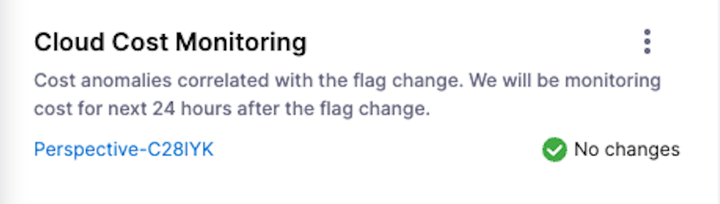
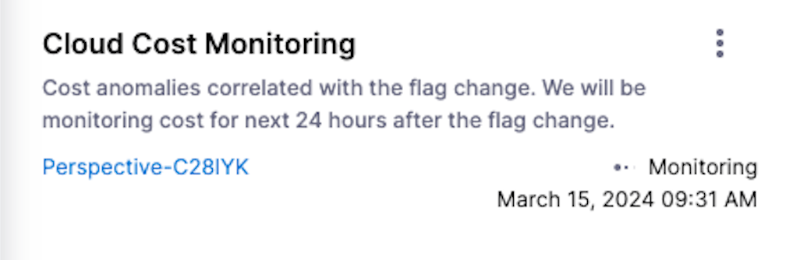
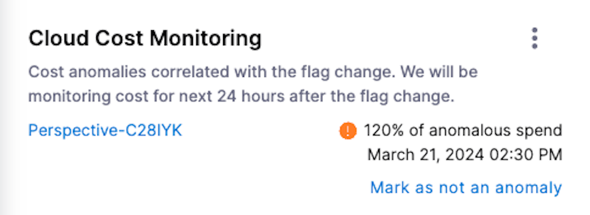
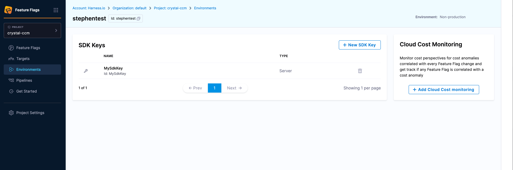
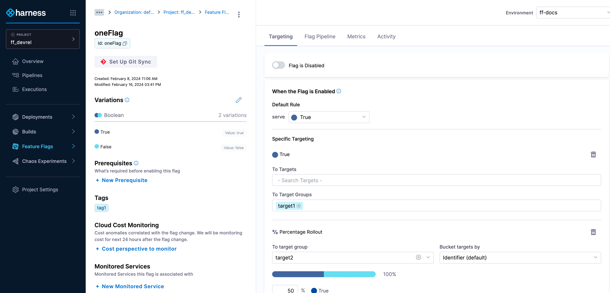
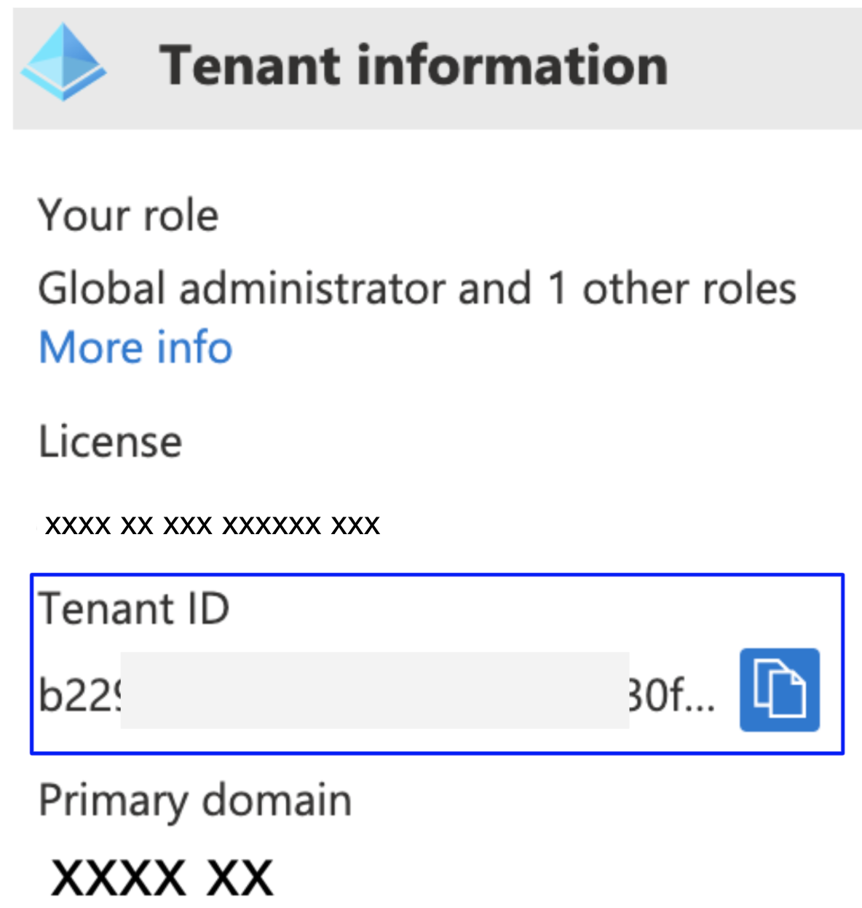
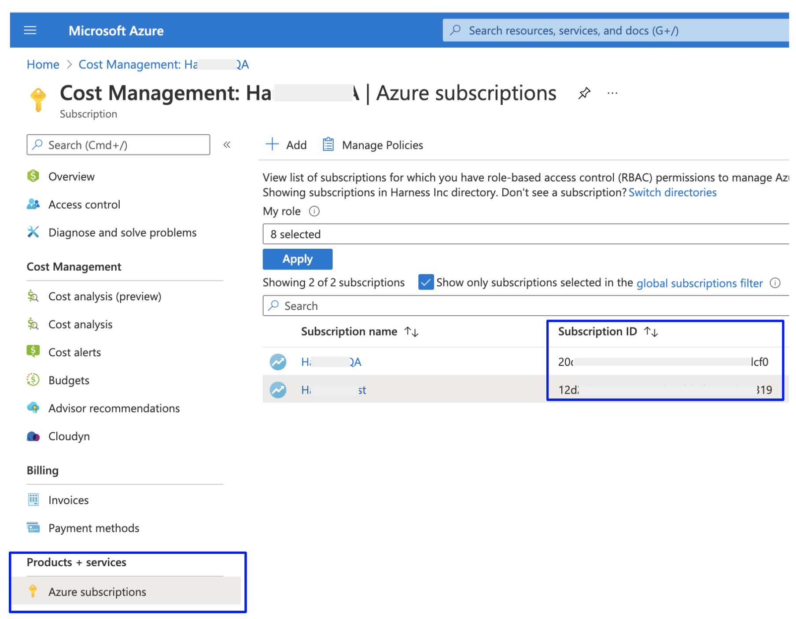

# Feature Flags with Cloud Cost Module Overview

Feature Flag with Cloud Cost Management tool is a new feature that will enable you to easily identify cost anomalies when enabling a feature. The Feature Flags module integrates with the Harness Cloud Cost Management (CCM) and is able to identify potential correlations between flag change events and cost anomalies.
 
From the UI within the Harness Application, you'll be able to report the presence of anomalies which will make it easier for you to find which flags may be related to the reported anomalies.

There are pre-requisites in order to use this feature which you can below in the *Setting Up Cloud Cost Management in Feature Flags*.

:::info note
If you'd like to learn more about the various types of costs within Cloud Cost Management, have a look at [Harness' Cloud Cost Management Key Concepts](../../../cloud-cost-management/get-started/key-concepts.md) page. 
:::

## Why use the Cloud Cost Management tool within Feature Flags?​

Using Cloud Cost Management within Feature Flags will help you to: 

1. *Increase Visibility*: You're able to gain insights into the cost of your Feature Flags.

2. *Have an Improved Proactive Cost Management Experience*: You can now have real-time insights into the impact of your Feature Flag changes and optimize your cloud spending into a less manual and time-consuming process.

3. *Adopt Higher Level Troubleshooting*: The hope we have at Harness is that this will help you to reduce time to finding solutions around any cost disparaties as well as help to improve your operational effiency of your products.

We've also added an additional feature to the Cloud Cost Monitoring tool. There are three status modes which helps us to categorise anomalies under *Monitoring*, *Anomaly Found* and *No Changes*. 










# Setting Up Cloud Cost Management in Feature Flags

## How To Set Up The CCM Feature For Your Environments

 1. On the Home Page of the Harness Application, select *Environmentss*.
 2. On the *Environments* page, you should see the option to open *Add Cloud Cost Monitoring*.
 3. If you are yet to set up your CCM with your Cloud Provider, check the instructions below.

 

## How To Set Up The CCM Feature For Your Flags

 1. On the Home Page of the Harness Application, select your Project and click on *Feature Flags*.
 2. Under the dropdown menu that appears, click *Feature Flags*. This should take you to the dashboard of the Feature Flags page of your project.
 3. Click on one of your pre-existing Feature Flags on your dashboard. 
 4. On the left hand side, the option to toggle *Cloud Cost Monitoring* should appear. 

 

If you haven't set up your Harness account to your Cloud Provider before, the option to do so will appear. 

:::info note
If you haven't already created any Feature Flags, do follow the [Harness 'Create a Feature Flag'](../ff-creating-flag/create-a-feature-flag.md) documentation. 
:::

To set up your Cloud Provider with your account, follow the instructions which aligns with your Cloud Provider: 

## Setting Up Cloud Cost Management With Your Cloud Providers

### Connect CCM For AWS

#### AWS Connector requirements

- The same connector cannot be used in NextGen and FirstGen.
- For CCM, AWS connectors are available only at the Account level in Harness.
- If you have multiple AWS accounts, you may need to create multiple AWS connectors depending on desired functionality:
  - **Cost Visibility**: You may need to create one or multiple AWS connectors depending on the availability of consolidated billing. Go to **Cost and Usage Reports (CUR)** for more information.
  - **Resource Inventory Management**: You need to create an AWS connector for each account.
  - **Optimization by AutoStopping**: You need to create an AWS connector for each account.

#### Cost and Usage Reports (CUR)

import Tabs from '@theme/Tabs';
import TabItem from '@theme/TabItem';

<Tabs queryString="tab-number">
<TabItem value="1" label="Multiple Accounts with Consolidated Billing">

- If you have [consolidated billing process](https://docs.aws.amazon.com/awsaccountbilling/latest/aboutv2/useconsolidatedbilling-procedure.html) enabled, then you need to create only a single CUR for the management account. This provides cost data for all member accounts in the organization.

- For the Cost Visibility feature alone, you will only need a single AWS connector configured with the management account CUR.

- In order to take advantage of other features such as Inventory Management and AutoStopping, you need to create a connector for each member account:
  - If you are using the UI to create the additional connectors, configure all connectors with the same management account CUR.
  - If you are using the API to create the additional connectors, you can omit billing information altogether.

</TabItem>

<TabItem value="2" label="Multiple Accounts">

- If you do not have [consolidated billing process](https://docs.aws.amazon.com/awsaccountbilling/latest/aboutv2/useconsolidatedbilling-procedure.html) enabled, then you need to create a CUR for each linked account.

- Create an AWS connector for each AWS account, configured with the CUR for that account.

</TabItem>
<TabItem value="3" label="Single Account">

- Create a single CUR for your AWS account.

- Create a single AWS connector configured with the CUR for your account.

</TabItem>
</Tabs>

#### Set Up CCM for AWS

To enable CCM for your AWS services (such as EC2, S3, RDS, Lambda, and so on), you simply need to connect Harness to your AWS accounts.

Perform the following steps to connect CCM to the AWS account.

1. Create a new AWS connector using one of the two options below:

<Tabs queryString="tab-number">
<TabItem value="4" label="From Account Settings">

2. Go to **Account Resources** > **Connectors**.
3. Select **+ New Connector**.
4. Under **Cloud Costs**, select **AWS**.

</TabItem>
<TabItem value="5" label="From Cloud Costs">

2. Go to **Setup** > **Cloud Integration**.
3. Select **New Cluster/Cloud account**.
4. Select **AWS**.

</TabItem>
</Tabs>

5. Perform the following tasks in the **AWS Connector** wizard.

#### Overview

1. Enter the following details and select **Continue**.

| **Field**                            | **Description**                                                                                                                                                                                                |
| ------------------------------------ | -------------------------------------------------------------------------------------------------------------------------------------------------------------------------------------------------------------- |
| **Connector Name**                   | Enter any name for the connector. This name will appear throughout the product to identify this AWS account.                                                                                                   |
| **Specify the AWS account ID**       | The Account ID of the AWS account to connect to. To find your AWS account ID, see [Finding your AWS account ID](https://docs.aws.amazon.com/IAM/latest/UserGuide/console_account-alias.html#FindingYourAWSId). |
| **Is this an AWS GovCloud account?** | Select **Yes** if connecting to a GovCloud account.                                                                                                                                                            |

:::info note
If you'd like further information about setting up your Cloud Provider, have a read of the [Harness 'Set up CCM for AWS'](../../../cloud-cost-management/get-started/onboarding-guide/set-up-cost-visibility-for-aws.md) documentation. 
:::

### Connect CCM For Azure 

#### Set up CCM for Azure

Harness Cloud Cost Management (CCM) monitors the cloud costs of your Azure services. Connect your Azure account and set up Billing Export to get insights into your cloud infrastructure and Azure services such as Storage accounts, Virtual machines, Containers, and so on. CCM also allows you to optimize your instances and AKS clusters using intelligent cloud [AutoStopping rules](../../../cloud-cost-management/4-use-ccm-cost-optimization/1-optimize-cloud-costs-with-intelligent-cloud-auto-stopping-rules/4-create-auto-stopping-rules/create-auto-stopping-rules-for-azure.md).

:::info

After enabling CCM, it takes about 24 hours for the data to be available for viewing and analysis.

:::

#### Prerequisites

* Make sure that you have the **Application Administrator** role assigned to your Azure AD. Users in this role can create and manage all aspects of enterprise applications, application registrations, and application proxy settings. See [Application Administrator](https://docs.microsoft.com/en-us/azure/active-directory/roles/permissions-reference#application-administrator).
* Many Azure CLI commands act within a subscription. Make sure that you have selected the right subscription before executing the commands.
   If you need to switch subscription, run: ```az account set -s <'*'subs id/name'*'>```
   For more information, see [Manage Subscriptions](https://docs.microsoft.com/en-us/cli/azure/manage-azure-subscriptions-azure-cli).

#### Azure Connector requirements

* The same connector cannot be used in NextGen and FirstGen. For information on creating an Azure connector in the FirstGen see [Set Up Cost Visibility for Azure](../../../../docs/first-gen/cloud-cost-management/setup-cost-visibility/set-up-cost-visibility-for-azure.md).
* For CCM, Azure connectors are available only at the Account level in Harness.
* You can create multiple Azure connectors for each Harness Account.
* You can create multiple Azure connectors per Azure Tenant with unique subscription IDs. 
* If you have separate billing exports for each of your subscriptions in your Azure account, set up separate connectors in Harness to view the cloud cost of all the subscriptions in CCM.

#### Connect CCM to your Azure Account

Perform the following steps to connect to your Azure account:
1. Create a new Kubernetes connector using one of the two options below:

import Tabs2 from '@theme/Tabs';
import TabItem2 from '@theme/TabItem';

<Tabs2>
<TabItem2 value="4" label="From Account Settings">

1. Go to **Account Resources** > **Connectors**.
2. Select **+ New Connector**.
3. Under **Cloud Costs**, select **Azure**.

</TabItem2>
<TabItem2 value="5" label="From Cloud Costs">

1. Go to **Setup** > **Cloud Integration**.
2. Select on **New Cluster/Cloud account**.
3. Select **Azure**.

</TabItem2>
</Tabs2>

2. Perform the following tasks in the **Azure Connector** wizard.

#### Overview

1. In the **Azure Connector** wizard, in the **Overview** section, enter the following details:
   1. **Connector name**: Enter a name for the connector.
   2. **Azure Tenant ID**: Enter the Tenant ID of your Azure AD account. A tenant represents an organization. It's a dedicated instance of Azure AD that an organization or app developer receives at the beginning of a relationship with Microsoft. Each Azure AD tenant is distinct and separate from other Azure AD tenants. To find your tenant ID, do the following:
      1. Launch Microsoft Entra ID (formerly Active Directory).
      2. Copy the tenant ID from the Tenant information.

      

      If you don't find the tenant ID in the Azure console, run the `az account show` command using the Azure CLI.

   3. **Azure Subscription ID**: Enter the Azure subscription ID. To find your Subscription ID, do the following:
      1. Launch Azure **Cost Management** page.
      2. Under **Product + services**, select **Azure subscriptions**.
      3. Copy the **Subscription ID** for your subscription.

      

      If you don't find the Subscription ID in the Azure console, you can use Azure CLI. See [List your Azure subscriptions with CLI](https://docs.microsoft.com/en-us/azure/media-services/latest/setup-azure-subscription-how-to?tabs=cli).
   4. **Description** (optional): Enter a brief description that conveys the purpose of this connector.
   5. **Tag** (optional): Enter text to create a tag for this connector.
5. Select **Continue**.

:::info note
If you'd like further information about setting up your Cloud Provider, have a read of the [Harness 'Set up CCM for Azure'](../../../cloud-cost-management/get-started/onboarding-guide/set-up-cost-visibility-for-azure.md) documentation. 
:::

### Set Up CCM For GCP

Harness Cloud Cost Management (CCM) monitors the cloud costs of your GCP products, projects, SKUs, and location. As a first step, you need to connect Harness to your GCP account to get insights into your cloud infrastructure, and GCP services, Compute Engine, Cloud Storage, BigQuery, etc. CCM offers a wide range of features to track and control costs associated with your cloud resources.

> **☆ NOTE —** After enabling CCM, it takes about 24 hours for the data to be available for viewing and analysis.

#### Before you begin

* You can't use the same connector in NextGen and FirstGen. For information on creating a GCP connector in the FirstGen, go to [Set Up Cost Visibility for GCP](../../../first-gen/cloud-cost-management/setup-cost-visibility/enable-cloud-efficiency-for-google-cloud-platform-gcp.md).
* Review [Required permissions and roles](https://cloud.google.com/iam/docs/understanding-custom-roles#required_permissions_and_roles) to create an IAM role at the organization level
* Ensure that you have the following permissions to enable and configure the export of Google Cloud billing data to a BigQuery dataset:
	+ **Billing Account Administrator** role for the target Cloud Billing account
	+ [BigQuery User role for the Cloud project](https://cloud.google.com/bigquery/docs/dataset-access-controls) that contains the BigQuery dataset that will be used to store the Cloud Billing data

#### Connect Harness to Google Cloud Platform (GCP) Account

> **☆ NOTE —** Time periods in the GCP Cloud Billing report use the Pacific Time Zone (PST) and observe daylight saving time shifts. However, Harness CCM explorer uses the UTC time zone. You may notice some cloud cost differences between Harness CCM explorer and the GCP Cloud Billing report due to the time zone difference.

1. Create a new Kubernetes connector using one of the two options below:

import Tabs3 from '@theme/Tabs';
import TabItem3 from '@theme/TabItem';


<Tabs3 queryString="tab-number">
<TabItem3 value="4" label="From Account Settings">

1. Go to **Account Resources** > **Connectors**.
2. Select **+ New Connector**.
3. Under **Cloud Costs**, select **GCP**.

</TabItem3>
<TabItem3 value="5" label="From Cloud Costs">

1. Go to **Setup** > **Cloud Integration**.  
2. Select **New Cluster/Cloud account**.
3. Select **GCP**.

</TabItem3>
</Tabs3>

2. Perform the following tasks in the **GCP Connector** wizard.

#### Overview

1. In **Overview**, in **Connector Name**, enter a name that describes this account.
2. In **Specify Project ID**, enter the project ID and select **Continue**. For more information on how to get a project ID, go to [Create a BigQuery dataset](https://cloud.google.com/billing/docs/how-to/export-data-bigquery-setup#create-bq-dataset).

:::info note
If you'd like further information about setting up your Cloud Provider, have a read of the [Harness 'Set up CCM for GCP'](../../../cloud-cost-management/get-started/onboarding-guide/set-up-cost-visibility-for-gcp.md) documentation. 
:::

### Set Up CCM For Kubernetes

#### Prerequisites

Make sure you have the following set up before you create a Kubernetes connector for CCM:

- **Kubernetes cluster**:
You need a target Kubernetes cluster for the Harness Delegate and deployment. Make sure your cluster meets the following requirements:
  * **Number of nodes**: 2
  * **vCPUs, Memory, Disk Size**: 4vCPUs, 16GB memory, 100GB disk. In GKE, the **e2-standard-4** machine type is enough for this quickstart.
  * **Networking**: outbound HTTPS for the Harness connection to **app.harness.io**, **github.com**, and **hub.docker.com**. Allow TCP port 22 for SSH.
  * **Kubernetes service account** with permission to create entities in the target namespace is required. The set of permissions should include `list`, `get`, `create`, and `delete` permissions. In general, the cluster-admin permission or namespace admin permission is enough.  
	For more information, see [User-Facing Roles](https://kubernetes.io/docs/reference/access-authn-authz/rbac/#user-facing-roles) from Kubernetes.
	
	
:::note
You must not rename the cluster. If you're setting up a new connector with this cluster, it is identified by the `clustername`. Renaming the cluster results in duplicate entries in the dashboard.
:::
 
	
- **Delegate size**: 
Your Kubernetes cluster must have unallocated resources required to run the Harness Delegate workload:

  - Laptop - 2GB memory, 0.5CPU
  - Small - 4GB memory, 1CPU
  - Medium - 8GB memory, 2CPU
  - Large - 16GB memory, 4CPU

:::warning
- These sizing requirements are for the Delegate only. Your cluster will require more memory for Kubernetes, the operating system, and other services. Ensure that the cluster has enough memory, storage, and CPU for all of its resource consumers. 
- We recommend using one delegate per cluster and Large size delegates for production clusters for optimal performance.
:::

- **Delegate permissions**: You can choose one of the following permissions for CCM:

 **Install Delegate with cluster-wide read/write access**

	Creates a new namespace called "harness-delegate-ng" with the service account bound to Cluster Admin role. This Delegate will be able to read tasks (capture change events etc., needed for Harness Cloud Cost Management) anywhere on the K8s cluster where the Delegate is installed.

 **Install Delegate with cluster-wide read access**

	(Requires read-only Cluster Admin role) Creates a new namespace called "harness-delegate-ng" with the service account bound to Cluster Admin role. This Delegate will be able to perform read-only tasks (capture change events etc., needed for Harness Cloud Cost Management) anywhere on the K8s cluster where the Delegate is installed.

- **Metrics Server**: Metrics Server must be running on the Kubernetes cluster where your Harness Kubernetes Delegate is installed. Before enabling CCM for Kubernetes, you must make sure the utilization data for pods and nodes is available.


:::info
Metrics Server is installed by default on GKE and AKS clusters; however, you need to install it on the AWS EKS cluster.
:::

The Metrics Server is a cluster-wide aggregator of resource usage data. It collects resource metrics from kubelets and exposes them in the Kubernetes API server through Metrics API. CCM polls the utilization data every minute on the Delegate. The metrics are aggregated for 20 minutes and then CCM keeps one data point per 20 minutes. For more information, see [Installing the Kubernetes Metrics Server](https://docs.aws.amazon.com/eks/latest/userguide/metrics-server.html) from AWS.  
To install the metrics server on your EKS clusters, run the following command:
```
kubectl apply -f https://github.com/kubernetes-sigs/metrics-server/releases/download/v0.5.0/components.yaml  

```
Resources can be adjusted proportionally based on number of nodes in the cluster. For clusters exceeding 100 nodes, allocate the following additional resources:

  * 1m core per node
  * 2MiB memory per node

#### Connect Your Kubernetes Cluster to CCM

Perform the following steps to connect your Kubernetes cluster to CCM.

1. Create a new Kubernetes connector using one of the two options below:

import Tabs4 from '@theme/Tabs';
import TabItem4 from '@theme/TabItem';

<Tabs4 queryString="tab-number">
<TabItem4 value="4" label="From Account Settings">

1. Go to **Account Resources** > **Connectors**.
2. Select **+ New Connector**.
3. Under **Cloud Costs**, select **Kubernetes**.

</TabItem4>
<TabItem4 value="5" label="From Cloud Costs">

1. Go to **Setup** > **Cloud Integration**.  
2. Select **New Cluster/Cloud account**.
3. Select **Kubernetes**.
4. Select **Advanced**.

:::note
   For the Quick Create option, go to [Kubernetes Quick Create](../../../cloud-cost-management/get-started/onboarding-guide/use-quick-create-k8s.md).
:::

</TabItem4>
</Tabs4>

:::info note
If you'd like further information about setting up your Cloud Provider, have a read of the [Harness 'Set up CCM for Kubernetes'](../../../cloud-cost-management/get-started/onboarding-guide/set-up-cost-visibility-for-kubernetes.md) documentation. 
:::
