Feature Flags comes with an out-of-the-box dashboard that provides various aggregated views of data about your flags at an organization level. This includes flags across all projects and environments in an organization. 

With Harness dashboards, you can:

* Edit, customize, and create your own custom dashboards. 
* Download data in multiple formats to use in other tools. 
* Schedule delivery and set up alerts on dashboard data.  

For more information, go to [Harness dashboards](/docs/category/harness-dashboards).

This topic provides some highlights and useful information about the Feature Flags dashboard.

## Feature Flags dashboard highlights

### View the dashboard

To view the Feature Flags dashboard: 

1. In Harness, select **Dashboards** in the left navigation pane.
1. In the Dashboards page, select **Feature Flags**, and then choose **Feature Flag Analytics**.

	The dashboard is displayed, showing the total number of flags, targets, and environments in this Harness organization.

	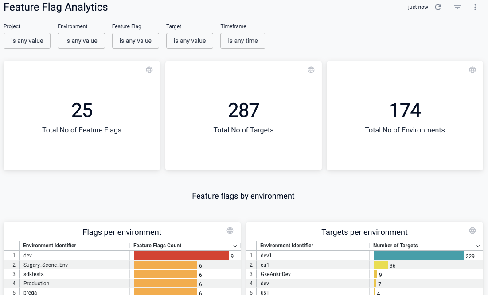

On the dashboard, you can: 

* Hover over elements of a chart with your mouse to view details.
* Select different areas of the charts to view information in tabular form, and download it to use in other tools.
* Schedule delivery of the dashboard data to email addresses.
* Set up alerts to be notified when specific data changes.
* Clone a dashboard to customize it for different needs and audiences.

### Narrow down your data set

Chances are you'll have many flags across projects, environments, and targets, so it's important to filter the timeframe and other factors to zero in on the data set you want.

Use the filters at the top of the dashboard to narrow down some or all of these values:

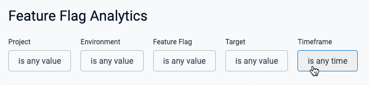

### View flags by environment

These two charts are helpful to understand the number of flags or targets in each environment.

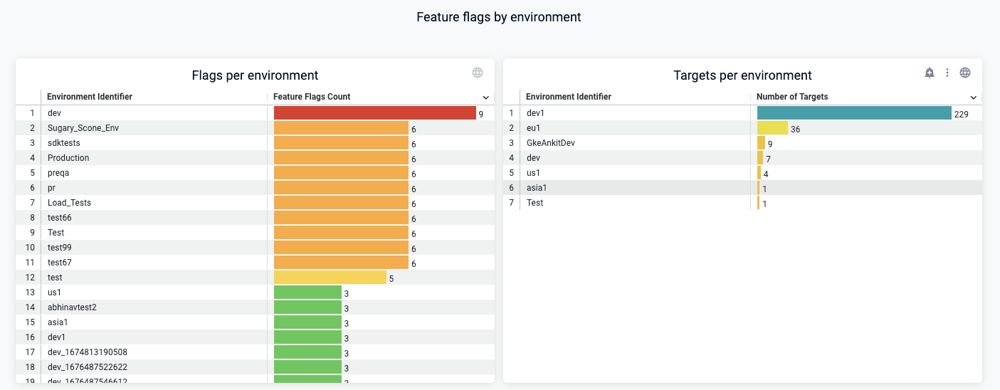

### View flags by type and status

These two charts show you a breakdown of your flags by type, and whether flags are on or off in each environment.

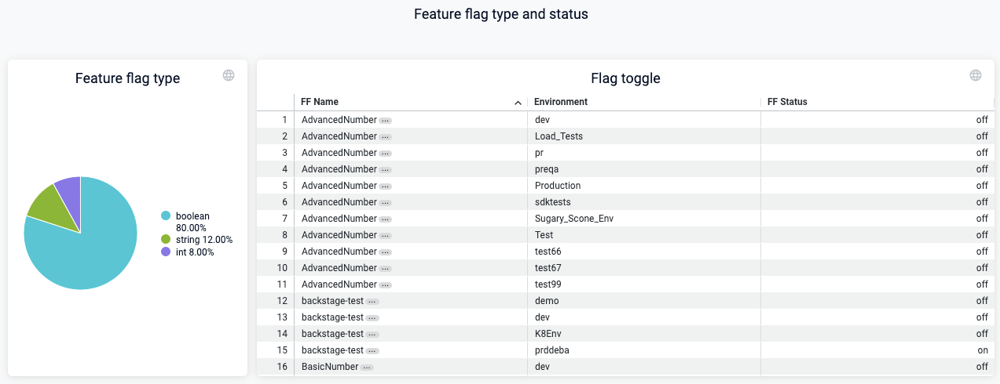

### View flags created by users

This chart is helpful to see who in your organization is creating flags, and how many. One way to use this is to help adoption of feature flag usage by having the people who create a lot of flags help others to use them.

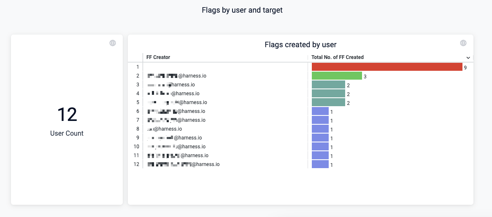

### View flags and targets created over time

You should see an increase in flags and targets created over time. The targets created gives an idea of how many users are potentially affected by your flags. As your organization's use of flags increases, the number of targets should increase. These charts help you visualize this.

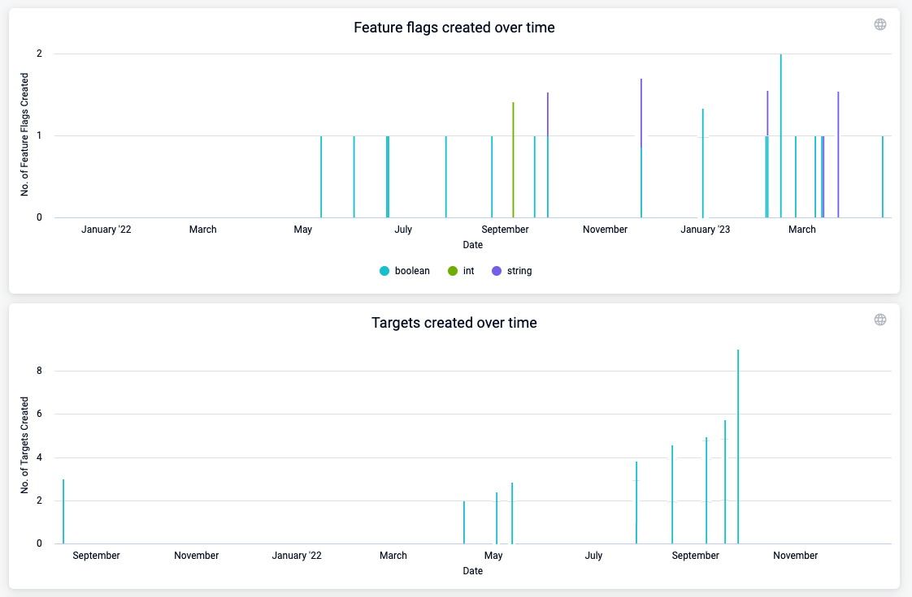 

## Download, schedule, and share dashboard data

You can download data in many formats to use in other tools, and you can schedule delivery of data to share with others in email.

### Download data

You can download the entire dashboard or individual charts.

#### To download the entire dashboard:

Select the **Dashboard actions** icon at the top of the dashboard, select **Download**, and then modify the settings as needed.

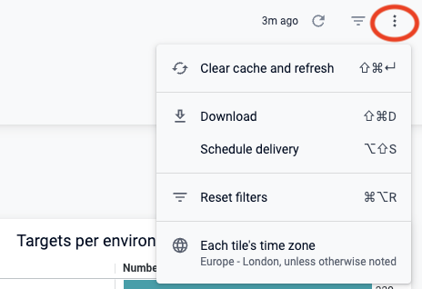

#### To download a chart:

Select the **Tile actions** icon at the top of the chart, select **Download data**, and then modify the settings as needed.

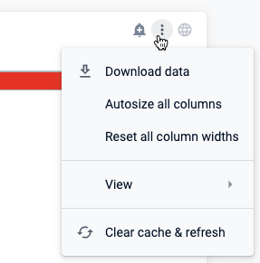

### Schedule and share data

You can schedule delivery of the dashboard data to share with one or more email addresses.

To schedule delivery of dashboard data:

1. On your dashboard, select the **Dashboard actions** icon at the top, and then choose **Schedule delivery**.

	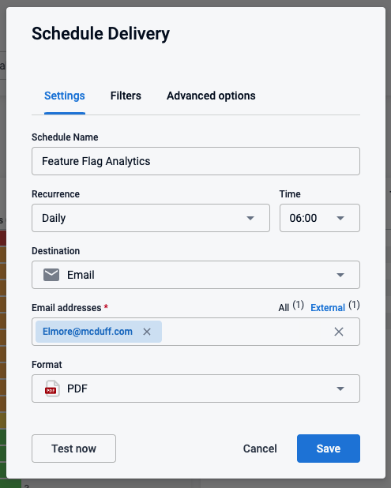

1. Adjust the **Settings**, **Filters**, and other options as needed.
1. (Optional) Select **Test now** to test these settings.
1. Select **Save**.

## Alert on dashboard data

You can set up alerts on any chart by selecting the alert icon, and then modifying the alert settings for that chart.

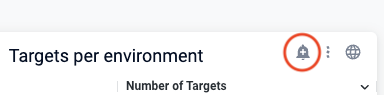

## Create a custom dashboard

You can clone and modify existing dashboards or create new ones. 

### Clone and modify an existing dashboard

To clone a dashboard:

1. Find the dashboard, select the actions icon, and then select **Clone**.

	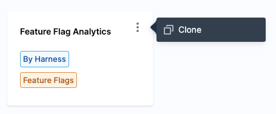

1. Select a **Folder**, provide a dashboard **Name** and optional **Tags**, and then select **Continue**.

	The new dashboard appears on the **Dashboards** page.

1. To customize it, select your new dashboard, then select the **Dashboard actions** icon at the top, and then choose **Edit dashboard**.

	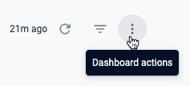

1. In the edit view, click the **Tile actions** icon on any chart to customize, hide, delete, or duplicate it.

	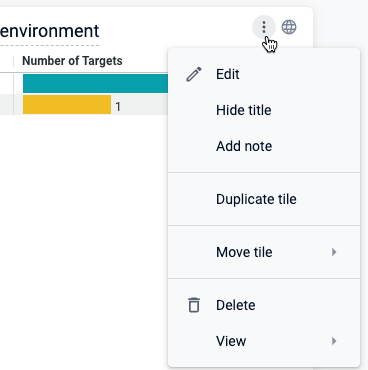

### Create a new dashboard

For detailed instructions for creating dashboards, go to these topics:

* [Best practices for building dashboards](/docs/platform/dashboards/dashboard-best-practices)
* [Create dashboards](/docs/platform/dashboards/create-dashboards)
* [Add custom fields](/docs/platform/dashboards/add-custom-fields)
* [Create visualizations and graphs](/docs/platform/dashboards/create-visualizations-and-graphs)

