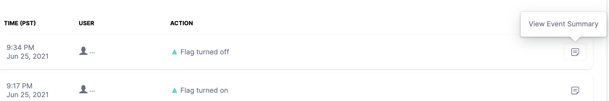

import ff_metrics from './static/2-view-activities-of-a-feature-flag-01.png'

The **Activity** tab allows you to view the actions performed on the selected Feature Flag. The following details are available on the Activity page:

* **Time**: The time at which the Flag was turned `on` or `off`
* **User**: Email ID of the user who performed the action on the selected Flag
* **Action**: The action that was performed on the Flag. For example, turned `on` or `off`
* **Event Summary**: The summary of all the events of the Flag. For example, the Project name, Environment details, etc. The event summary also displays the YAML difference with the flag details and the state of the events

## View activities

To view the actions performed on a Feature Flag:

1. In **Feature Flags** select the Feature Flag for which you want to view the activity.
2. Select the date range for the Feature Flag you want to view.  
The **Time**, **User**, and **Action** details are displayed.

## View an event summary

To view a summary of an event:

1. In **Feature Flags** select the Feature Flag for which you want to view the event summary.
2. Select the date range for the Feature Flag you want to view.
3. Click **View Event Summary**.

	
	
4. The **Event Summary** is displayed.
5. Click **YAML DIFFERENCE** to view the details of the Flag. The YAML file also highlights the different states of the events.

