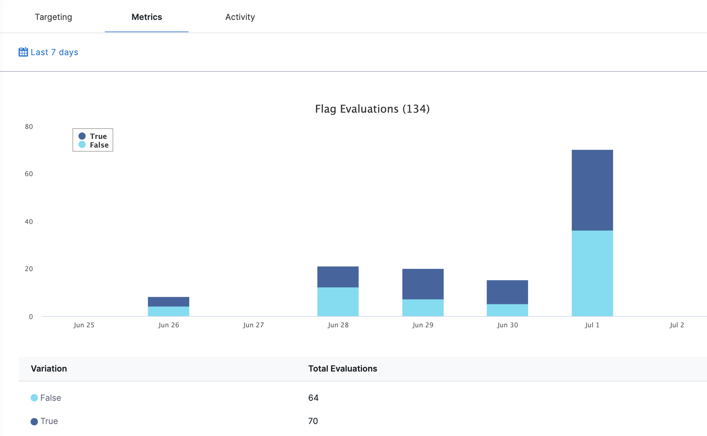

Metrics allow you to view the following details of a feature flag for the selected time period:

* Variations
* Number of flag evaluations for each variation
* Total number of evaluations

## View Feature Flag metrics

1. In **Feature Flags** select the feature flag for which you want to view the metrics.
2. Select the **date range** for the feature flag you want to view.
3. Feature Flag details are displayed. The Y-axis denotes the number of evaluations.

