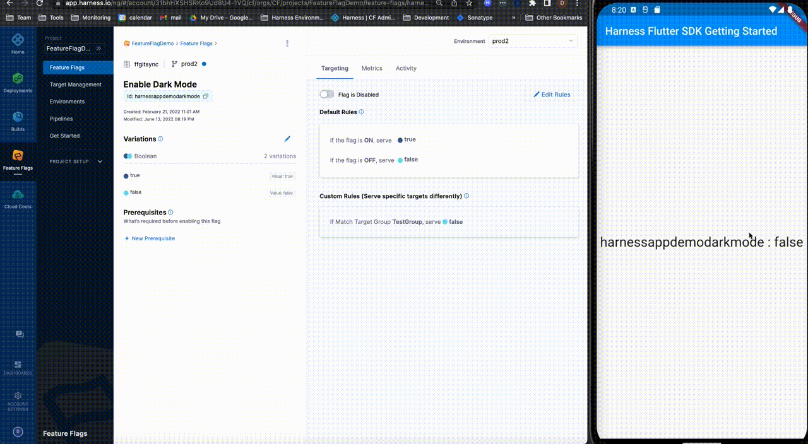

import Sixty from '/docs/feature-flags/shared/p-sdk-run60seconds.md'

import Smpno from '../shared/note-smp-not-compatible.md'

import Closeclient from '../shared/close-sdk-client.md'


<Smpno />

This topic describes how to use the Harness Feature Flags SDK for your Flutter application. 

For getting started quickly, you can use our [sample code from the SDK README](https://github.com/harness/ff-flutter-client-sdk/blob/main/README.md). You can also [clone](https://docs.github.com/en/repositories/creating-and-managing-repositories/cloning-a-repository) and run a sample application from the [Flutter SDK GitHub Repository.](https://github.com/harness/ff-flutter-client-sdk)

## Before you begin

You should read and understand the following:

* [Feature Flags Overview](/docs/feature-flags/get-started/overview.md)
* [Getting Started with Feature Flags](/docs/feature-flags/get-started/onboarding-guide)
* [Client-Side and Server-Side SDKs](../sdk-overview/client-side-and-server-side-sdks.md)
* [Communication Strategy Between SDKs and Harness Feature Flags](../sdk-overview/communication-sdks-harness-feature-flags.md)

## Version

Latest SDK version can be found on [GitHub Release Page](https://github.com/harness/ff-flutter-client-sdk/releases)

## Flutter and Dart requirements

To use version 2 and greater of this SDK, make sure you:

* Install the [Flutter SDK, version 2.10.4 or higher](https://docs.flutter.dev/get-started/install).
* Use Dart SDK 2.12 and later.

To use version 1 and earlier versions of this SDK, make sure you:

* Install the [Flutter SDK, version 2.10.4](https://docs.flutter.dev/get-started/install).
* Use Dart SDK 2.7 to 2.10

## General requirements

* (For iOS apps) Install [Xcode](https://docs.flutter.dev/get-started/install/macos#install-xcode).
* (For Android apps) Install [Android Studio](https://developer.android.com/studio?gclid=CjwKCAjwp7eUBhBeEiwAZbHwkRqdhQkk6wroJeWGu0uGWjW9Ue3hFXc4SuB6lwYU4LOZiZ-MQ4p57BoCvF0QAvD_BwE&gclsrc=aw.ds), or install the Android SDK for Command-Line Interface (CLI) only.
* [Download the SDK from our GitHub repository](https://github.com/harness/ff-flutter-client-sdk)
* Create a Flutter application, or [clone](https://docs.github.com/en/repositories/creating-and-managing-repositories/cloning-a-repository) our [sample application](https://github.com/harness/ff-flutter-client-sdk).
* [Create a Feature Flag on the Harness Platform](/docs/feature-flags/use-ff/ff-creating-flag/create-a-feature-flag). If you are following along with the SDK README sample code, make sure your flag is called `harnessappdemodarkmode`.
* [Create an SDK key and make a copy of it](/docs/feature-flags/use-ff/ff-creating-flag/create-a-project#create-an-sdk-key).

:::info note
To check if you have installed the prerequisites, run the `flutter doctor` command. 
:::

## Install the SDK for Flutter Web

To install the SDK, you must add the dependency, import the required packages, and then embed the JavaScript SDK.

### Add the dependency

Begin by adding the Feature Flag Flutter SDK dependency to your pubspec.yaml file:

```
ff_flutter_client_sdk: ^2.1.0
```

### Import required packages

Once you've added the dependency, import the necessary packages into your Dart files:

```
import 'package:ff_flutter_client_sdk/CfClient.dart';  
import 'package:ff_flutter_client_sdk/CfConfiguration.dart';  
import 'package:ff_flutter_client_sdk/CfTarget.dart';
```

### Embed the JavaScript SDK

Be sure that you have added the dependency and imported the required packages before you begin this step. 

1. Embed our JavaScript SDK by adding the following script tag to the `<head>` section of your web page:
```html
  <script src="https://sdk.ff.harness.io/1.19.2/sdk.client-iife.js"></script>
```

This installs the Feature Flags JavaScript SDK and makes it available to your application. Please ensure you regularly upgrade the
JavaScript SDK version to get the latest updates. For the newest JavaScript SDK updates, monitor:

* [JavaScript SDK GitHub Repo](https://github.com/harness/ff-javascript-client-sdk/releases)
* [official Feature Flags Releases Page](https://developer.harness.io/release-notes/feature-flags)

## Release mode for Android applications
In release mode, Flutter applies optimizations that can affect the behavior of native Android code, including code used by our Flutter Android plugin.

Please add the following rule to your ProGuard configuration to ensure proper functionality when running your Android app in release mode

`-keep class io.harness.cfsdk.** { *; }`

## Initialize the SDK

To initialize the Flutter SDK, you need to:

1. Add a Target that you want to Evaluate against a Feature Flag.
2. (Optional) Configure the SDK options.
3. Add your Client SDK key to connect to your Harness Environment.
4. Complete the initialization with the SDK using the Client SDK Key, Target, and Configuration parameters you set.

### Add a Target to Evaluate

<details>
<summary>What is a Target?</summary> 
Targets are used to control which users see which Variation of a Feature Flag, for example, if you want to do internal testing, you can enable the Flag for some users and not others. When creating a Target, you give it a name and a unique identifier. Often Targets are users but you can create a Target from anything that can be uniquely identified, such as an app or a machine.
</details>

For more information about Targets, go to [Targeting Users With Flags](/docs/feature-flags/use-ff/ff-target-management/targeting-users-with-flags).

To add a Target, build it and pass in arguments for the following:

|  |  |  |  |
| --- | --- | --- | --- |
| **Parameter** | **Description** | **Required?** | **Example** |
| identifier | Unique ID for the Target.Read **Regex requirements for Target names and identifiers** below for accepted characters. | Required | `.setIdentifier("HT_1")` |
| name | Name for this Target. This does not have to be unique. **Note**: If you don’t provide a value, the name will be the same as the identifier.Read **Regex requirements for Target names and identifiers** below for accepted characters. | Optional**Note**: If you don't want to send a name, don't send the parameter. Sending an empty argument will cause an error. | `.setName("Harness_Target_1")` |

<details>
<summary> Regex requirements for Target names and identifiers </summary>

**Identifier** 

Regex: `^[A-Za-z0-9.@_-]*$`  
Must consist of only alphabetical characters, numbers, and the following symbols:  
. (period)  
@ (at sign)  
-(dash)  
\_ (underscore)  
  
The characters can be lowercase or uppercase but cannot include accented letters, for example `Cafe_789`.  
  
**Name**
Regex: `^[\\p{L}\\d .@_-]*$`  
  
Must consist of only alphabetical characters, numbers, and the following symbols:  
. (period)  
@ (at sign)  
-(dash)  
\_ (underscore)  
 (space)  
  
The characters can be lowercase or uppercase and can include accented letters, for example `Café_123`.

</details>

For example:


```
var target = CfTargetBuilder().setIdentifier("HT_1").setName("Harness_Target_1").build();
```
### Configure the SDK

You can configure the following options for the SDK:


|  |  |  |  |
| --- | --- | --- | --- |
| **Name** | **Configuration Option** | **Description** | **Default Value** |
| baseUrl | `setConfigUri("https://config.ff.harness.io/api/1.0")` | The URL used to fetch Feature Flag Evaluations. When using the Relay Proxy, change this to: `http://localhost:7000` | `https://config.ff.harness.io/api/1.0` |
| eventsUrl | `setEventUrl("https://events.ff.harness.io/api/1.0")` | The URL for posting metrics data to the Feature Flag service. When using the Relay Proxy, change this to: `http://localhost:7000` | `https://events.ff.harness.io/api/1.0` |
| pollInterval | `setPollingInterval(60)` | The interval **in seconds** that we poll for changes when you are using stream mode. | `60` (seconds) |
| enableStream | `setStreamEnabled(True)` | Set to `true` to enable streaming mode.Set to `false` to disable streaming mode. | `true` |
| enableAnalytics | `setAnalyticsEnabled(True)` | Set to `true` to enable analytics.Set to `false` to disable analytics.**Note**: When enabled, analytics data is posted every 60 seconds. | `true` |

For example:


```
// Flutter SDK Config  
var conf = CfConfigurationBuilder()  
        .setConfigUri("https://config.ff.harness.io/api/1.0")  
        .setEventUrl("https://events.ff.harness.io/api/1.0")  
        .setPollingInterval(60)  
        .setStreamEnabled(true)  
        .setAnalyticsEnabled(true)  
        .build();
```
### Complete the initialization

`CfClient`  is a base class that provides all the features of the SDK, which can be accessed with `CfClient.initialize`.

To initialize the SDK, you must pass in the following:

* `apiKey` - The Client SDK Key you created when creating the Feature Flag.
* Any configuration options you want to use.
* The Target you want to evaluate.

### Sample of initializing the SDK


```
final conf = CfConfigurationBuilder()  
    .setStreamEnabled(false)  
    .setPollingInterval(60)  
    .build();  
  
final target = CfTargetBuilder().setIdentifier(name).build();  
  
final res = await CfClient.initialize(apiKey, conf, target);
```
## Evaluate a Flag

Evaluating a Flag is when the SDK processes all Flag rules and returns the correct Variation of that Flag for the Target you provide. 

If a matching Flag can’t be found, or the SDK can’t remotely fetch flags, the default value is returned. 

There are different methods for the different Variation types and for each method you need to pass in:

* Identifier of the Flag you want to evaluate
* The default Variation

The Flag is evaluated against the Target you pass in when initializing the SDK.

### Evaluate a boolean Variation


```
//get boolean evaluation  
final evaluation = await CfClient.boolVariation("demo_bool_evaluation", false);  

```
### Evaluate a number Variation


```
//get number evaluation  
final numberEvaluation = await CfClient.numberVariation("demo_number_evaluation", 0);  

```
### Evaluate a string Variation


```
//get string evaluation  
final stringEvaluation = await CfClient.stringVariation("demo_string_evaluation", "default");  

```
### Evaluate a JSON Variation


```
//get json evaluation  
final jsonEvaluation = await CfClient.jsonVariation("demo_json_evaluation", {});  

```
## Listen for events

### Register the events listener

The `eventsListener` method provides a way to register a listener for different events that might be triggered by SDK.

The possible events and their responses are outlined in the following table:


|  |  |
| --- | --- |
| **EventType** | **Response** |
| SSE\_START | null |
| SSE\_END | null |
| EVALUATION\_POLLING | List&#60;EvaluationResponse&#62; |
| EVALUATION\_CHANGE | EvaluationResponse |

To listen for events, register the events listener, for example:


```
CfClient.registerEventsListener((EvaluationResponse, EventType) {  
       
    });  
```
The triggered event will return one of the following types:


```
enum EventType {  
    SSE_START,  
    SSE_END,  
    EVALUATION_POLLING,  
    EVALUATION_CHANGE  
}
```
### Close the events listener

To avoid unexpected behavior, when the listener isn't needed, turn it off by calling `CfClient.getInstance().unregisterEventsListener(eventsListener),` for example:


```
CfClient.unregisterEventsListener(eventsListener)
```
## Test your app is connected to Harness

When you receive a response showing the current status of your Feature Flag, go to the Harness Platform and toggle the Flag on and off. Then, check your app to verify if the Flag Variation displayed is updated with the Variation you toggled.



<Sixty />

## Close the SDK client

<Closeclient />

To close the SDK client, call this method:


```
CfClient.destroy()
```
## Additional options

### Use our public API methods

The Public API exposes the following methods that you can use:


```
static Future<InitializationResult> initialize(String apiKey, CfConfiguration configuration, CfTarget target)
```

```
static Future<bool> boolVariation(String evaluationId, bool defaultValue)
```

```
static Future<String> stringVariation(String evaluationId, String defaultValue)
```

```
static Future<double> numberVariation(String evaluationId, double defaultValue)
```

```
static Future<Map<dynamic, dynamic>> jsonVariation(String evaluationId, Map<dynamic, dynamic> defaultValue)
```

```
static Future<void> registerEventsListener(CfEventsListener listener)
```

```
static Future<void> unregisterEventsListener(CfEventsListener listener)
```

```
static Future<void> destroy()
```
## Sample code for a Flutter application

Here is a sample code for using FF SDKs with the Flutter application.


```
final conf = CfConfigurationBuilder()  
    .setStreamEnabled(true)  
    .setPollingInterval(60) //time in seconds (minimum value is 60)  
    .build();  
final target = CfTargetBuilder().setIdentifier(name).build();  
  
final res = await CfClient.initialize(apiKey, conf, target);  
  
  
//get number evaluation  
final numberEvaluation = await CfClient.numberVariation("demo_number_evaluation", 0);  
  
//get string evaluaation  
final stringEvaluation = await CfClient.stringVariation("demo_string_evaluation", "default");  
  
//get json evaluation  
final jsonEvaluation = await CfClient.jsonVariation("demo_json_evaluation", {});  
  
CfClient.registerEventsListener((responseData, eventType) {  
    _eventListener = (responseData, eventType){};  
    switch (eventType) {  
      case EventType.SSE_START:  
        print("Started SSE");  
        break;  
      case EventType.SSE_END:  
        print("SSE Completed");  
        break;  
      case EventType.EVALUATION_CHANGE:  
        String flag = (responseData as EvaluationResponse).flag;  
        dynamic value = (responseData as EvaluationResponse).value;  
  
        break;  
      case EventType.EVALUATION_POLLING:  
        List pollingResult = responseData;  
  
        pollingResult.forEach((element) {  
          String flag = (element as EvaluationResponse).flag;  
          dynamic value = (element as EvaluationResponse).value;  
  
        });  
        break;  
    }  
});  
  
//Shutting down SDK  
CfClient.destroy()  

```
