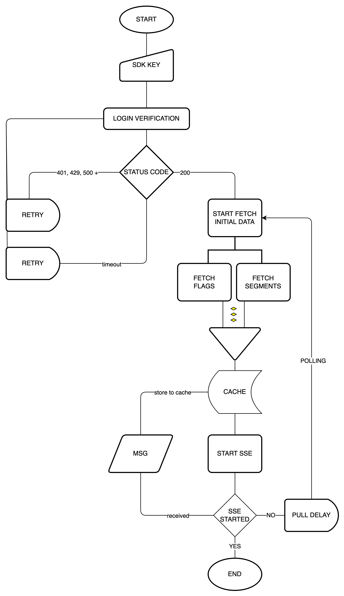

import sdk_arch from './static/1-client-side-and-server-side-sdks-00.png'

Harness Feature Flags provides several SDKs in different languages to help you access feature flags from your applications. The SDKs are divided into two main categories, regardless of the programming language:

* Client-side SDKs
* Server-side SDKs

The client and server-side SDKs have different security considerations as well as some behavioral and architectural differences. This topic will help you understand the difference between Harness Feature Flag's client-side and server-side SDKs.

## Introduction to Feature Flags SDKs

SDKs are the libraries you add to your code to authenticate, configure, and manage feature flag usage.

All of our SDKs are open-source, provided per-language, and backed by public APIs. They handle the job of authenticating with Harness, establishing the correct values for the session, handling fallback behaviors in the case of errors, and sending metrics back to Harness over time.

For more information, go to the [Feature Flags overview page](https://developer.harness.io/docs/feature-flags/get-started/overview).

## SDK architecture

The above diagram defines the behavior of an SDK. It covers various aspects like what happens at the beginning (initialization and authentication) followed by behavior of an SDK during normal operation.

* **SDK Initialization:** SDK initialization requires only one argument, SDK key, and the optional configuration argument. There is a default configuration in the SDK and based on that configuration, an API client, a repository and an evaluator are set up.
* **SDK Authentication:** Authentication is the first step in the development of the SDK. Without authentication, the evaluation function will return only the default values. To successfully log in to the system, use the SDK key. The key for client-side SDK cannot be used in the server-side SDK and vice versa. In order to log in successfully, a request is sent with SDK key. In case of client-side SDK key, add a target.

After successful login to the Feature Flags server using one of the two types of keys, the other processors like **Poll Processor, Analytics Processor and Stream Processor** start.

* **Poll Processor:** Poll Processor fetches initial data from the Feature Flags server. Data such as details on feature flags and target groups is required during implementation. Poll Processor waits for both threads to complete. It ends one cycle in data retrieval and sets a delay in the duration of the value defined in the configuration. Each thread (one for flags and one for target groups) after a successful data retrieval from the Feature Flags server are saved to the repository.
* **Stream Processor:** Stream Processor runs real time updates. This processor runs after successful fetching of data. It is a unidirectional approach where data is sent from the server to the client. When the processor completes its task, it immediately runs a thread that fetches new data in the background and stores it in a repository.
* **Analytics/Update Processor:** Update Processor returns the data after evaluations. Once the data is fetched, this processor analyses the data with certain metrics; like flag evaluations, target events, and sends the data back.

## SDK Types

The following table lists the differences between the client-side and server-side SDKs with respect to type of users, security, storage, connection state, and operation.

| **Parameter** | **Client SDK** | **Server SDK** |
| --- | --- | --- |
| **Users** | Designed to be used in applications, your users run directly on their own devices, such as mobile, desktop, and web applications. Optimized to be used by a single user and provide low bandwidth consumption. Examples: JavaScript, iOS, Android, React Native SDKs.  | Designed to be used in server-side applications, such as web servers and backend services. Optimized to be used in multi-user and secure environments. Examples, Java, Go, and, Python SDKs. |
| **Security** | The SDKs are embedded in your applications and run on the browser or on mobile devices. Therefore, these SDKs can be compromised by users when unpacking a mobile app or using the browser's developer tools to inspect the page. You should not use a server-side SDK key in client-side applications. Client-side SDKs only perform an evaluation of a flag and receive the result. They don't store all data about a flag. | The SDKs are embedded in applications that run on your servers, such as web servers or backend servers. These environments are comparatively safe. Server-side SDKs download all the feature flags that you have defined in a project and store them in memory. |
| **Storage** | Client-side SDK has a local cache. It communicates with Harness more often. | Server-side SDKs downloads and caches all flag rules and states and avoids most Harness communication. |
| **Connection state** | Client-side SDKs require a consistent connection to establish an evaluation decision. | Server-side SDKs can make an evaluation decision based on locally stored rules once instantiated. It requires a connection to pull or receive updates. |
| **Operation** | Feature evaluation happens on the server-side, and SDK only gets the evaluated results of the flags. | Server SDKs sync flag rulesets in the background and keep in-memory cache. When an application makes the call for flag value, the evaluation happens locally, and no network call is made. Hence it is very fast and efficient. |

## Supported application types

|  |  |
| --- | --- |
| **Client-Side SDKs** | **Server-Side SDKs** |
| [JavaScript](../client-sdks/java-script-sdk-references.md) | [Java](../server-sdks/integrate-feature-flag-with-java-sdk.md) |
| [iOS](../client-sdks/ios-sdk-reference.md) | [Go](../server-sdks/feature-flag-sdks-go-application.md) |
| [Android](../client-sdks/android-sdk-reference.md) | [.NET](../server-sdks/net-sdk-reference.md) |
| [Flutter](../client-sdks/flutter-sdk-reference.md) | [Python](../server-sdks/python-sdk-reference.md) |
| [React Native](../client-sdks/react-native-sdk-reference.md) | [Node.js](../server-sdks/node-js-sdk-reference.md) |
| [Xamarin](../client-sdks/xamarin-sdk-reference.md) | [Ruby](../server-sdks/ruby-sdk-reference.md) |
| [React Client](../client-sdks/react-client.md) | [PHP](../server-sdks/php-sdk-reference.md) |
|  | [Apex](../server-sdks/apex-sdk-reference.md)  |
|  | [Erlang](/docs/feature-flags/use-ff/ff-sdks/server-sdks/erlang-sdk-reference)  |

