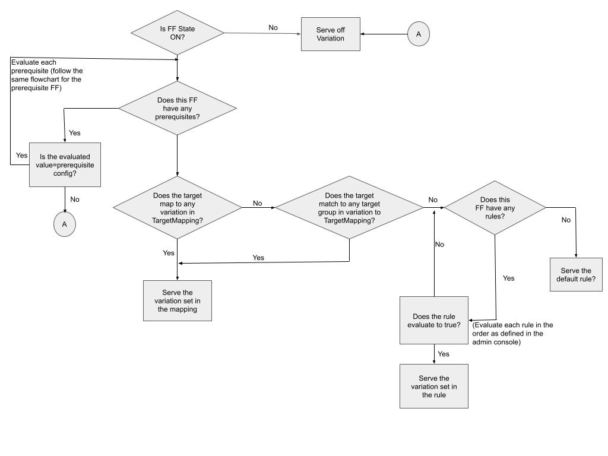

This topic describes how the Feature Flags SDKs communicate with Harness Feature Flags to receive flag changes.

## Visual summary

A summary of the communication between the Feature Flag SDKs and the Feature Flag client: 

The above diagram explains the flow a Feature Flag follows to Evaluate the Target. It can be explained by using two use cases described below.

### Feature Flag with no rules and no prerequisites

**Flag Type:** Boolean

**Flag state:** ON

1. If the flag is ON, check for any prerequisites, and additional rules.  If there are none, the default ON variation is returned, which in the above example is True.
2. Is the flag OFF, no rules are ever evaluated, and it returns the default OFF variation.  In the above example this is False.

### Feature Flag with variation target mapping

**Flag Type:** Boolean

**Flag state:** ON

The flag is ON, with target mapping.  This rule says serve False to target `user-x`. 

This means that if the user is `user-x`, they'll receive a False variation.  Everyone else will receive a True variation.

## How the SDKs communicate with Feature Flags

The SDK maintains all the Feature Flag details locally in its cache and evaluates flags based on it. The SDKs use streaming and a polling strategy to keep the local cache in sync with the flag configurations.

### Streaming

Streaming provides a persistent connection to the SDKs. Harness Feature Flags uses [Server-Sent Events](https://en.wikipedia.org/wiki/Server-sent_events) to send messages to the servers whenever the feature flag rules change. This has the following benefits:

* Updates flag in a few hundred milliseconds.
* Avoids any delays by delivering real-time updates to end-users/targets.
* Ensures that every change that is made is dispersed to every user in real-time propagating them across every server.

### Polling

In polling mode, you can define the interval of time at which you want to receive updates of flag states from the Feature Flag. The SDK will then make HTTP requests to Feature Flags to retrieve flag state changes.

Note that Feature Flags does not send any information as part of these requests; it is simply a query to update the status of a flag on the SDK side.

#### Communication loop between Harness and the SDKs

| Server-side | Client-side |
| --- | --- |
| The client authenticates with a server using an API Key. | The client authenticates with a server using an API key. The client is initialized for a specific target. |
| Configuration is fetched and cached in the memory. | All the flag evaluations are fetched from the server and cached locally. |
| One call to fetch all Feature Flag configurations for the environment. One call to fetch all Target Group configurations for the environment.  | Stream is opened to the server.  |
| In the case of streaming mode, a connection is open to the stream endpoint. | On any change in flag, an event is pushed to the SDK. The SDK fetches the flag value and caches it locally. |
| In case of polling mode, config is polled periodically (default 60 seconds), and the cache is updated.  |   |
| All the evaluations are run against the cached data. |   |

