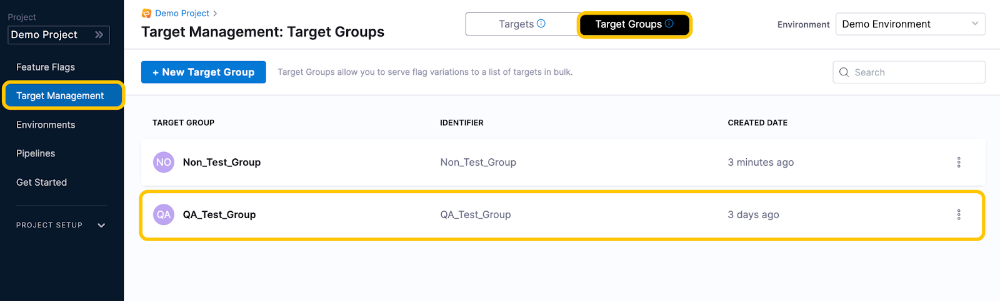

import target_group_1 from './static/2-add-target-groups-06.png'
import target_group_2 from './static/2-add-target-groups-07.png'
import target_group_3 from './static/2-add-target-groups-08.png'
import target_group_4 from './static/2-add-target-groups-09.png'
import target_group_5 from './static/2-add-target-groups-10.png'

:::info note
While targets are often users, a target can be anything that can be uniquely identified. For example, a target can be a user, an application, a system, a machine, or any resource uniquely identified by an IP address, email ID, user ID, etc.
:::

Target groups are a collection of [targets](add-targets.md) that allow you to serve Feature Flag Variations to a list of users in bulk. You can group targets into a group either by picking individual targets or by defining rules that automatically map targets to a target group. For example, you can add individual targets `joe@harness.io` and `jane@harness.io` to the QA internal users group or you can define a rule that all the emails ending with `@harness.io` are added to the QA internal users group.

You can also do the opposite and exclude specific targets from a target group.

This topic describes how to add a target group to your Environment, add targets to the group, and apply the target group to a Feature Flag.

Watch this video for an introduction to target groups:

<!-- Video:
https://www.loom.com/share/99284d3b921045858b93f2e24c6a5335-->
<DocVideo src="https://www.loom.com/share/99284d3b921045858b93f2e24c6a5335" />

## Before you begin

Make sure you've [created targets to add to the target group](add-targets.md).

## Create a target group

To create a target group:

1. In **Feature Flags**, click **Target Management**, then click **Target Groups**.
2. Click **+ New Target Group**.
3. In **Create a Target Group**, enter a Name for your group and click **Create**.
4. (Optional) In **Description**, add a description of the group.

After you have created a target group, you need to add targets to it. You can add targets to a target group by selecting them individually or by setting conditions to add all targets that meet those criteria.

## Add targets from the Target Groups page

You can add individual targets from the Targets page or the Target Groups page.

1. In **Target Management**, in **Target Groups**, select the target group you want to add targets to.

   

1. In **Criteria**, click **Edit**.

1. From here, you can [**include or exclude specific targets**](#add-or-exclude-specific-targets), or you can set rules to [**add targets based on conditions**](#add-targets-based-on-conditions) you set.

### Include or exclude specific targets

- To add specific targets, in **Include the following**, select the targets.
- To exclude targets, in **Exclude the following**, select the targets.

    

### Add targets based on conditions

:::info note
When you create a target based on Conditions, on the target overview page the group isn't displayed under the **Target Groups** column.
:::

In addition to targeting individual users, Harness Feature Flags also allows you to target a group based on the conditions you set. You can add conditions by constructing rules using the following:

- The name or identifier of the target.
- An operator.
- Text that must match the target name or identifier.

The following operators are supported:

|                        |                    |                                                                                                                                                                                        |
| ---------------------- | ------------------ | -------------------------------------------------------------------------------------------------------------------------------------------------------------------------------------- |
| **Operator**           | **Attribute Type** | **Definition**                                                                                                                                                                         |
| **starts with**        | String             | Matches the prefix of a string. If you enter multiple string values, only the first is matched.                                                                                        |
| **ends with**          | String             | Matches the suffix of a string. If you enter multiple string values, only the first is matched.                                                                                        |
| **contains**           | String             | Matches a part of a string. If you enter multiple string values, only the first is matched.                                                                                            |
| **equals**             | Number or string   | Matches the string or number. If you enter multiple string values, only the first is matched.                                                                                          |
| **equals (sensitive)** | Number or string   | Matches the number or string and is case-sensitive. If you enter multiple string values, only the first is matched.For example,  the string HELLO is different from the string hello.  |
| **in**                 | Number or string   | Acts as an “or” operator, so you can add multiple values at once.                                                                                                                      |

For example, you could set a rule to add all targets whose identifiers end in `@harness.io`.

To add targets based on conditions:

1. In **Target Group Criteria**, click **+ Add Rule**.
2. In the first drop-down menu, select whether the condition applies to the Target Name or Identifier.
3. In the second drop-down menu, select the operator to apply to the Target Name or Identifier.
4. In the search bar, enter the value you want the Target Name or Identifier to match and click the **+** button to add it. The following shows an example of a rule that adds all targets with a Target Identifier ending in harness.io to the target group.

5. Click **Save**. Targets that meet the criteria are now included in the target group.

When you add targets based on conditions, on the **Target Management:Targets** page, the target group is **not**displayed in the **Target Groups** column.

## Add or exclude targets from target settings

You can use Target Settings to include or exclude targets from a target group. Complete the following steps to include or exclude targets using the Target Settings:

1. Go to **Target Management > Targets**, and then click the target you want to add to a group.
2. Click **Target Groups**, and then select either or both of the following:

   - **Add to Target Groups** to add a this target to groups
   - **Exclude from Target Groups** to exclude a specific target

           

   You can add or exclude the target to multiple groups at once.

3. Select the group(s) to add or exclude a target to/from, then click **Add to Target Group**, or **Exclude from Target Group**.

4. The targets are now added to, or excluded from, the target groups.

## Next step

After you have added the targets and target groups, you can then [use them on your Feature Flags.](targeting-users-with-flags.md)
