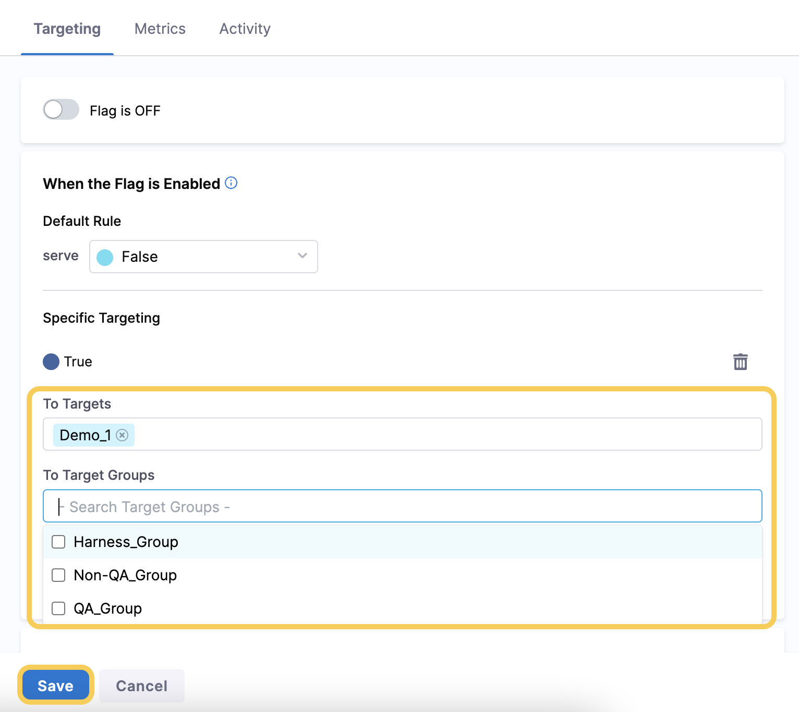
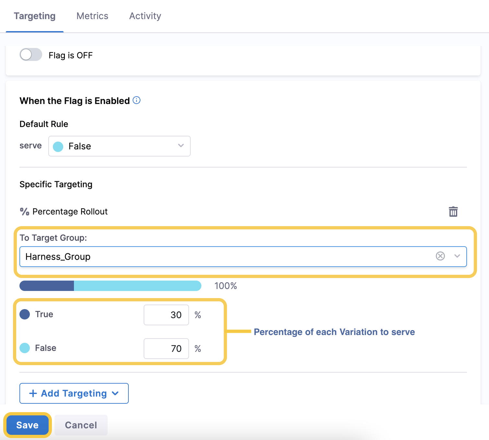
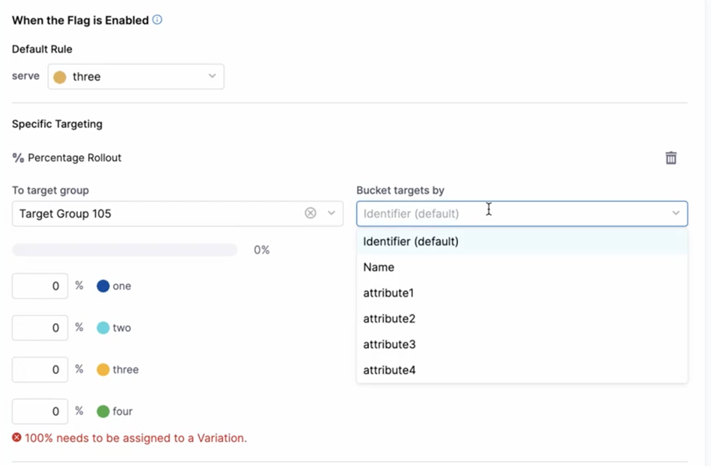

Feature Flag targeting allows you to serve a particular Variation of a flag to specific target when the flag is enabled. Targets are anything that can be uniquely identified, we refer to these Targets as users, but they could also be apps, machines, resources, emails etc. 

For example:

1. You have a new feature you want your QA team to test before a general roll-out.
2. You create a Boolean Feature Flag for the new feature.
3. You add Targeting to the flag so that the QA team are served the True Variation when the flag is enabled, and the Non-QA team are served the False Variation.
4. You enable the Feature Flag.
5. The feature is available to the QA team but is not available to the Non-QA team.

:::info note
 A flag can have values in each Environment. For example, if you have a QA Environment and a Production Environment within a single Project on the Harness Platform, the flag could be toggled ON in QA but toggled OFF in Production. 
:::

This topic describes how to set up Targeting for a Feature Flag you’ve created. 

:::info note
 To edit the default Variations that are served to Targets, go to [Changing the Variations of Your Flags](/docs/feature-flags/use-ff/ff-creating-flag/manage-variations).
:::

## How Harness prioritizes targets and target groups

You should understand how the Harness Platform prioritizes targets and target groups during evaluations, so that you know which variation of a flag you can expect. The prioritization rules are as follows: 

1. Individual targets always take precedence over target groups, for example:
   - You create a rule that enables a flag for all targets in `Group_A`, but disables that same flag for `Target_1`.
   - `Target_1` is also a part of `Group_A`.
   - The flag will be disabled for `Target_1`, as it has been added individually to the `Disabled` rule. 
2. Target groups are prioritized in the order they are added to a flag, starting from 0. Each subsequent group that is added to the flag has its prioritization incremented by 1. So if you add `Group_A`, then `Group_B`, then `Group_C`, `Group_A` is prioritized as `0 , then `Group_B` as `1`, and then `Group_C` as `2`.
3. When a target is part of two target groups that have conflicting targeting rules, the lowest priority is given precedence, for example:
   - You added `Target_1` to `Group_A`, then `Group_B`, then `Group_C`.
   - You create a rule that enables a flag for all targets in `Group_C`, but disables that same flag for `Group_A`. 
   - As the target group prioritization of `Group_A` is `0`, and the target group prioritization of `Group_C` is `2`, the flag is disabled for `Target_1`. This is because the lower-numbered target group priority, `0`, takes precedence. 

:::info note
If you have Git Experience set up with Feature Flags, you can manually edit the `priority` field of a flag via your YAML file. For more information about this, go to [Manage Your Flags Using Git Experience](/docs/feature-flags/use-ff/ff-creating-flag/manage-featureflags-in-git-repos).
:::

## Target specific users or target groups when a flag is enabled

To target specific users, you first need to add them as a target or target group on the Harness platform. To do this, go to [Adding Targets](add-targets.md) and [Managing Target Groups](add-target-groups.md). 

After you have added the target or target group, you can then choose the Variation to serve them when the Feature Flag is Enabled:

* **True**: The Targets are served the default True variation.
* **False**: The Targets are served the default False variation.
* **Percentage rollout**: You select a percentage of Targets to be served each Variation. For example, to increment how many users a feature is available for over time, you could use a percentage roll out to give 10% of users access to a feature, then 50%, then 100%. The users are selected randomly from the target group you target, and when you increase the percentage, all original users maintain their access to the feature. We can only ensure that identifiable Targets maintain their access, we can't maintain access for anonymous users.

To add specific Targets: 

1. Go to the Feature Flag you want to add Targets for and in the **Targeting** tab, under **Specific Targeting**, click **+ Add Targeting**.
2. Select which Variation you want to serve to the Target.

   * If you select one of the default Variations, for example, True or False, select the Target(s) or target group(s), then Click **Save**.

      

   * If you want to use a Percentage Rollout, select the target group, enter the percentage of each Variation you want to serve, then click **Save**.

      

## More about percentage rollouts

### Bucketing by specific attributes

In most cases, you will not want to change the bucketing behavior for a percentage rollout. By default, we us the identifier as the unique string that helps determine which state a user is allocated in to according to the assigned rollout probabilities (see below).

Occasionally, you may want to use a value other than the target ID for the percentage rollout assignment, such as in cases where you don't want the percentage distributiont to apply evenly across all possible targets in the system.

In these cases, you can choose a different attribute to use to bucket your targets by in your percentage rollout assignment. Be warned, once you are bucketing by any value other than the identifier we can no longer say with certainly what the final probabilities in your percentage rollout will end up being.

### Percentage Allocation

Percentage rollouts use the target identifier and a murmur3 hash to produce a determinstic result that will be the same across all SDKs for the same target.

This guarantees that a user who is being served a flag value as part of a percentage rollout will get the same flag value in all services regardless of which SDKs are being used.

   :::info note
   You can only use Percentage Rollouts on a single target group for each flag.
   :::

