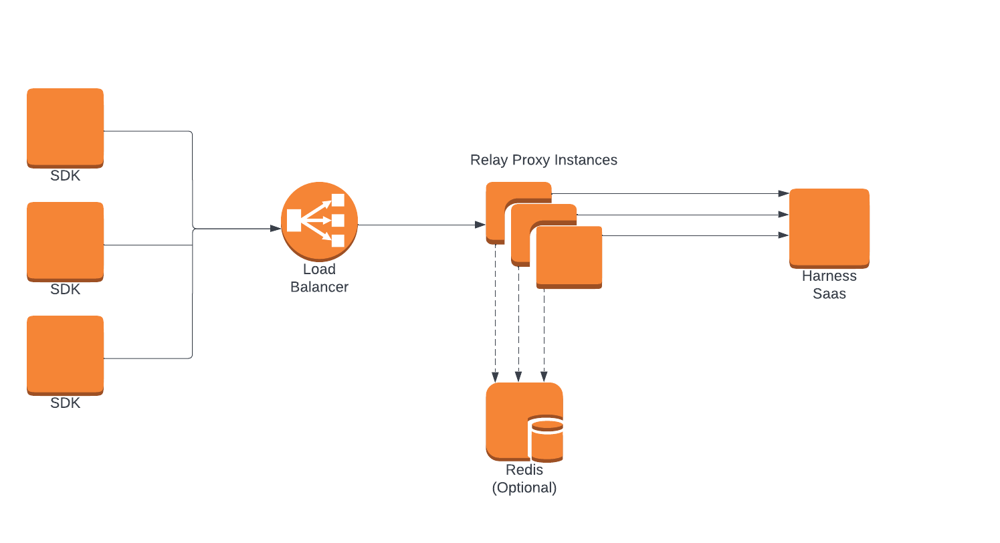

<CTABanner
  buttonText="Go to the FME Docs"
  title="Using Harness Feature Flags?"
  tagline="This documentation is for Harness Feature Flags. If your organization is using or has migrated to Feature Management & Experimentation, refer to the FME documentation for the latest features and SDK updates."
  link="https://developer.harness.io/docs/feature-management-experimentation"
  closable={true}
  target="_self"
/>

As load increases you may want to horizontally scale your proxy instances to accommodate this. With load balancing, all connected SDKs must make requests to the load balancer URL instead of hitting the Relay Proxy directly. 

A sample docker compose for this architecture along with info on running is included in our [examples folder](https://github.com/harness/ff-proxy/tree/main/examples/load_balancing) in GitHub.

**Load balancing using in memory cache**

When using an [in memory cache](/docs/feature-flags/use-ff/relay-proxy/cache-options#in-memory-cache), Harness advises you to use IP-based routing, instead of round-robin, within your load balancer. This is because when targets authenticate, Harness stores their attributes in the in memory cache, so clients will only be able to correctly retrieve flags from the same Relay Proxy they authenticated with. An example of this configuration is included in the [example nginx config](https://github.com/harness/ff-proxy/blob/main/examples/load_balancing/config/default.conf) in GitHub.

**Load balancing using redis cache**

When using [redis as a cache](/docs/feature-flags/use-ff/relay-proxy/cache-options#redis-cache), you can use either round-robin or IP-based load balancing. This is because all Relay Proxies share a common redis cache and can read target attributes written by other Relay Proxies.

## Architecture diagram with a load balancer

