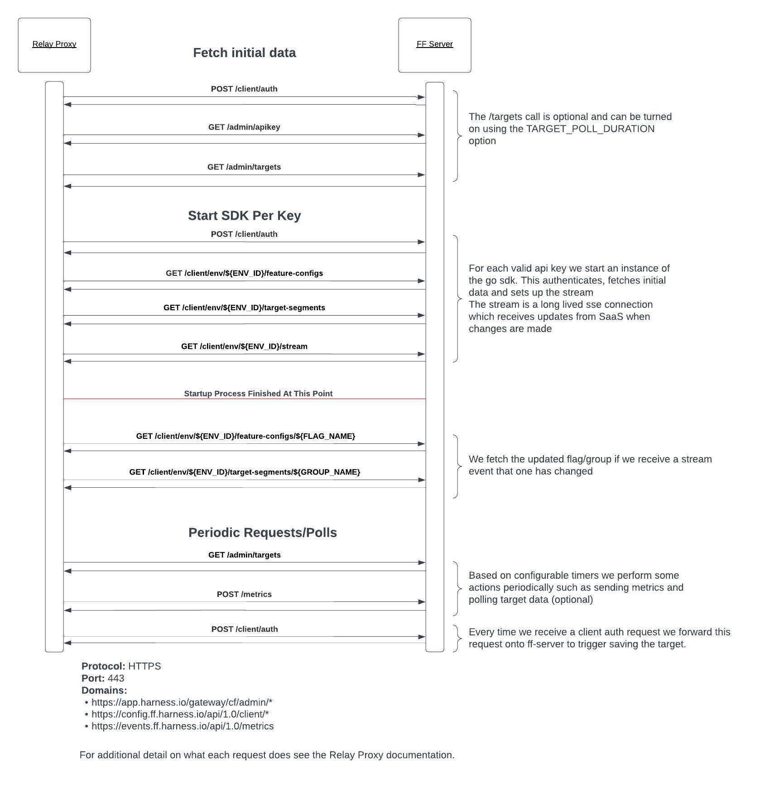

These are the endpoints requested by the Relay Proxy when it communicates with Harness SaaS. These are listed in the order they're used:
- [Startup](#basic-startup)
- [Start SDK per API key](#start-sdks)
- [Periodic requests/polls](#periodic-requestspolls)

The base URL  of these endpoints is configurable if you need to pass it through a filter or another proxy. See [Configuration reference](/docs/feature-flags/use-ff/relay-proxy/configuration) for details.

## Basic startup

This is the basic data fetched on startup. Startup authenticates each SDK key and parses the project andenvironment information from the jwt response. It then fetches the hashed API keys and, optionally, targets. This will page through this data so it may make multiple requests.

* `POST https://config.ff.harness.io/api/1.0/client/auth` authenticates the API key.

* `GET https://app.harness.io/gateway/cf/admin/apikey` gets all hashed API keys for this environment. These are required so connected SDKs can authenticate using any key from this environment. This pages through the API keys so it may make multiple requests.

* `GET https://app.harness.io/gateway/cf/admin/targets` fetches environment target data (optional - see `TARGET_POLL_DURATION` configuration option). This pages through the targets so it may make multiple requests.

## Start SDKs

These requests run for each valid API key configured. This authenticates, fetches flag and target group data, and sets up the stream. These are required to start up correctly.

* `POST https://config.ff.harness.io/api/1.0/client/auth` authenticates the API key.

* `GET https://config.ff.harness.io/api/1.0/client/env/${ENV_ID}/feature-configs` fetches flag data.

* `GET https://config.ff.harness.io/api/1.0/client/env/${ENV_ID}/target-segments` fetches target group data.

* `GET https://config.ff.harness.io/api/1.0/client/env/${ENV_ID}/stream` initializes a long-lived stream to listen for events.

* `GET https://config.ff.harness.io/api/1.0/client/env/${ENV_ID}/feature-configs/${FLAG_NAME}` fetches updated flag data after a flag stream event comes in.

* `GET https://config.ff.harness.io/api/1.0/client/env/${ENV_ID}/target-segments/${GROUP_NAME}` fetches updated target group data after a target group stream event comes in.

## Periodic requests/polls

These requests happen either on demand or by various timers while the Relay Proxy is running.

* `GET https://app.harness.io/gateway/cf/admin/targets` polls the latest environment target data (optional—see the [`TARGET_POLL_DURATION`](/docs/feature-flags/use-ff/relay-proxy/configuration#adjust-timings) configuration option). This pages through the targets so it may make multiple requests.

* `POST https://events.ff.harness.io/api/1.0/metrics` sends metrics (optional—see the [`METRIC_POST_DURATION`](/docs/feature-flags/use-ff/relay-proxy/configuration#adjust-timings) configuration option).

* `POST https://config.ff.harness.io/api/1.0/client/auth`. When a client authenticates with the Relay Proxy, Harness forwards this request to the remote server to register the target.

## Domains Requested

* `https://app.harness.io/gateway/cf/admin/*`

* `https://config.ff.harness.io/api/1.0/client/*`

* `https://events.ff.harness.io/api/1.0/metrics`

## Protocols

All requests to SaaS are made using HTTPS on port 443.

The `/stream` request is a long-lived SSE connection that receives messages over time and may need special network configuration to be allowed in corporate environments.

## Sequence diagram for proxy requests

Here is a sequence diagram describing the proxy calls:

