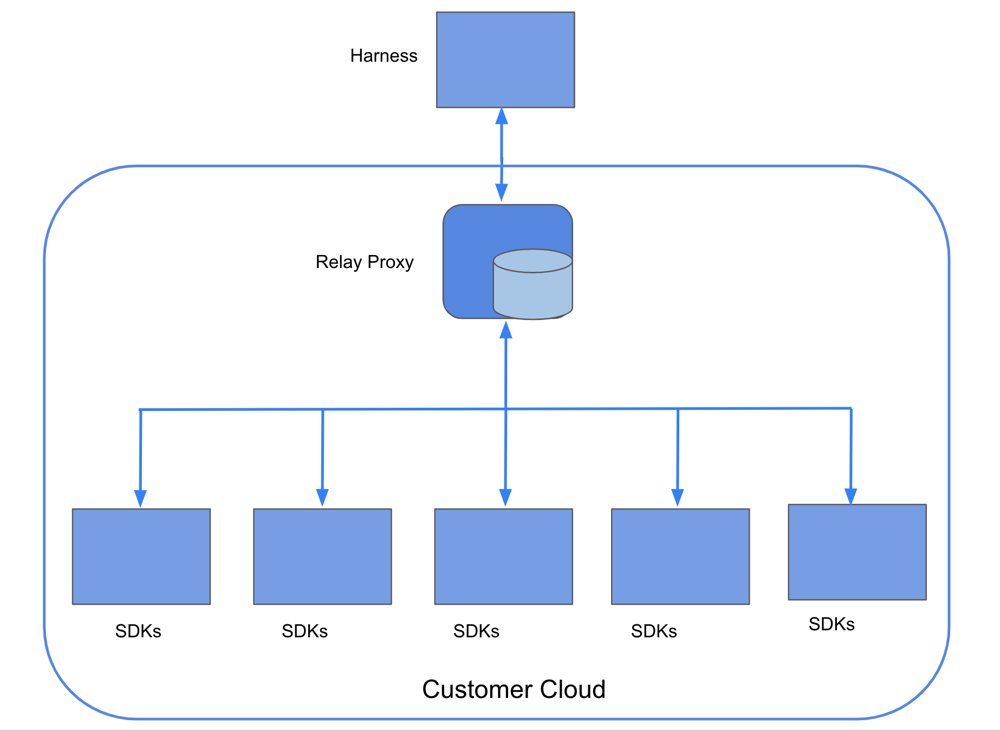

This topic describes the Harness Relay Proxy V1 and how to use it with Feature Flags (FF).

The Relay Proxy V1 enables your apps to connect directly to Feature Flag services without having to make a significant number of outbound connections to FF services. The Relay Proxy establishes a connection to the Feature Flags configuration data and relays that connection to clients in an organization's network.

:::info note
The Relay Proxy Version 2 is now available from Harness! If you want to learn more, please go to the [Relay Proxy V2](./relay_proxy_v2.md) page. You'll find information regarding how to set it up, the key features and more. 
:::

## Why use the Relay Proxy?

In the following cases, you might want to set up Relay Proxy V1:

* **Air-gap Deployments**: You can deploy the proxy in your network if you don't have or can't allow external access to your apps. Local apps connect directly to the proxy, and the proxy has external access to the remote feature flag service to synchronize configuration.
* **Offline Mode**: This is identical to air-gapped, except that the proxy does not have a connection to the internet. In that scenario, the configuration must be loaded from the outside using configuration files. Configuration files are used to link your programmes to the proxy.
* **High Availability / Reliability**: The feature flag service is extremely reliable. We will fail over to the failover cluster in the event of a major failure. However, in the event of a full network loss, the Relay Proxy ensures that your apps continue to run even after restarts.

If you decide to use the Relay Proxy, make sure it has a good place in your network design. For your app to run, it needs to be able to contact the Relay Proxy, and the architecture differs depending on the type of app. For example, if you want to link the Relay Proxy to any client-side apps, don't put it inside a firewall.

## Relay Proxy architecture

The FF Relay Proxy V1 resides between the SDKs and the hosted Harness Feature Flag services. On startup, proxy loads the necessary data from the FF services to ensure that it is completely functional even if the network connection drops temporarily.

The Proxy creates an instance of the Go SDK for each API key that’s passed to it as a part of the [Proxy Configuration](/docs/feature-flags/use-ff/relay-proxy/deploy-relay-proxy#configure-the-relay-proxy), and each instance of the SDK uses the Cache implementation. The Go SDK then takes care of populating this cache on startup and keeping it up to current whenever the remote service changes. When the Go SDK starts up, it retrieves all of the Features and Segments and then sends a request to the remote server to listen for any updates. Whenever there is an update in the remote service, it sends out an event, and when the embedded SDK sees one of these events, it sends a request to the remote service to get the most recent flag values and save them to the cache.

The Proxy can also use streaming functionality if it is configured with Redis. To view the variables that you need to configure for Redis, go to [Proxy configuration variables](/docs/feature-flags/use-ff/relay-proxy/deploy-relay-proxy#configure-the-relay-proxy).

### How the Relay Proxy V1 stores data

The Proxy stores authentication, feature, target, and target group configurations in a [cache](/docs/feature-flags/use-ff/relay-proxy/cache_options).

* Keys are stored against a map of fields and values in the feature, target, and target group settings.
* The authentication configuration is stored as a key-value pair, with the key being a hashed API key and the value being an environment ID.

When the proxy starts, an embedded Go server SDK retrieves the Feature and Segment config and populates the cache.

### How the Relay Proxy V1 fetches client and server SDK configuration details

Client and Server SDKs fetch the evaluation details in the same way as they would if they were interacting with the FF Services on ff-server.

### Supported Modes for Relay Proxy

There are various modes for both versions of Relay Proxy. The Relay Proxy V1 supports running in two different modes:

 - **Offline with in-memory cache**
 - **Offline with Redis cache**
 - **Online with in-memory cache**
 - **Online with Redis cache**

To learn more about using [Offline Mode in the Harness Relay Proxy](./offline.md), you can find more information in the Harness docs including instructions on how to generate offline configuration and how to run the proxy in offline mode. 

Whereas with the Relay Proxy V2, it only supports running **Online with Redis Cache**. Operating in this mode requires the following:

 - A connection to Harness SaaS.
 - Connectivity to a Redis cache.

To learn more about using [Caching Options in the Harness Relay Proxy](./cache_options.md), you can find more information in the Harness docs including common FAQs about the caching options. 

## More information

For more information about the Relay Proxy, go to our blog post [In-Depth: Harness Feature Flags Relay Proxy](https://harness.io/blog/in-depth-feature-flags-relay-proxy/).
