This topic describes the Harness Relay Proxy V2 and how to use it with Feature Flags (FF).

:::info note
If **Relay Proxy Version 1** is what you're looking for, please go to the [Relay Proxy V1](./relay-proxy.md) page.
:::

# Relay Proxy V2 Overview

## What is the Relay Proxy? 

The Relay Proxy enables your apps to connect directly to Feature Flag services without having to make a significant number of outbound connections to FF services. The Relay Proxy establishes a connection to the Feature Flags configuration data and relays that connection to clients in an organization's network.

## Why use Relay Proxy V2?​

In the following cases, you might want to set up Relay Proxy:

 - **Air-Gap Deployments**: You can deploy the proxy in your network if you don't have or can't allow external access to your apps. Local apps connect directly to the proxy, and the proxy has external access to the remote feature flag service to synchronize configuration.
 - **Offline Mode**: This is identical to air-gapped, except that the proxy does not have a connection to the internet. In that scenario, the configuration must be loaded from the outside using configuration files. Configuration files are used to link your programmes to the proxy.
- **High Availability / Reliability**: The feature flag service is extremely reliable. We will fail over to the failover cluster in the event of a major failure. However, in the event of a full network loss, the Relay Proxy ensures that your apps continue to run even after restarts.

If you decide to use the Relay Proxy, make sure it has a good place in your network design. For your app to run, it needs to be able to contact the Relay Proxy, and the architecture differs depending on the type of app. For example, if you want to link the Relay Proxy to any client-side apps, don't put it inside a firewall.

## Relay Proxy V2 Architecture 

### Requirements

- Container orchestration system (Kubernetes, Docker, etc.)
- Redis instance (for production deployments)
- Network access to `https://config.ff.harness.io` and `https://events.ff.harness.io`
- A Harness Relay Proxy Key

### Supported Modes for Relay Proxy V2

There are various modes for both versions of Relay Proxy. The Relay Proxy V2, it only supports running in the **Online with Redis Cache** mode. Operating in this mode requires the following:

 - A connection to Harness SaaS.
 - Connectivity to a Redis cache.

To learn more about using [Caching Options in the Harness Relay Proxy](./cache_options.md), you can find more information in the Harness docs including common FAQs about the caching options. 

:::info note
To learn more about the supported modes for **Relay Proxy Version 1**, please go to the [Relay Proxy V1](./relay-proxy.md) page.
:::

### Network Traffic Architecture

Here are some diagrams to explain the Network Traffic Architecture for Feature Flag's Relay Proxy V2. These diagrams provide detail on how network requests are made as well as the Protocols used between Harness Saas to the Client SDK or the Server SDK. 

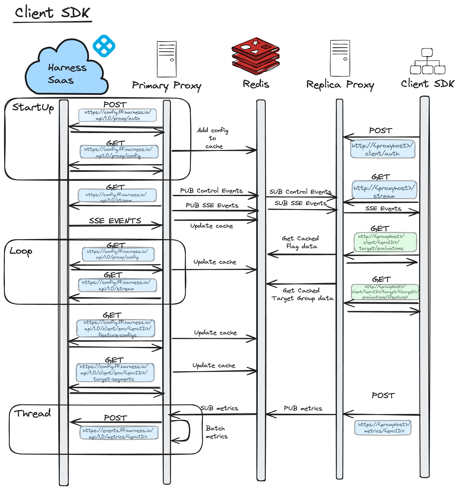


The loop, displayed in both diagrams between Harness Saas and the Primary Proxy, is only executed if the stream between the Primary Proxy and Harness Saas disconnects. Once the Primary Proxy reconnects with Harness Saas, it exits the loop and normal streaming functionality resumes.


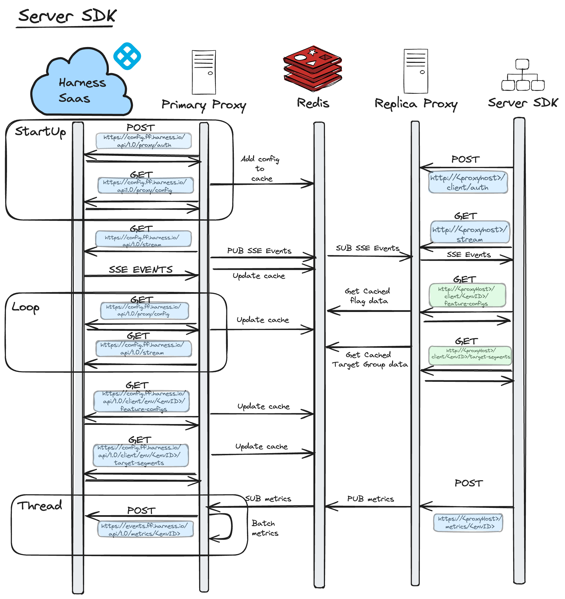


When we're in this loop, the Primary Proxy polls Harness SaaS for changes once a minute and attempts to re-establish the stream connection. If it fails to do this, it will pause its attempt to re-establish the stream connection for *one minute*. After one minute has passed, it will poll again and re-attempt the stream. This is done continuously until it has re-established the stream with Harness Saas.

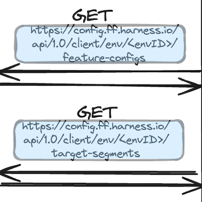

As captured above, these requests are made whenever the Proxy receives an SSE event indicating that a `Flag` or `TargetGroup` has changed. 

Within the Thread, you can see that the The Primary consumes metrics from the Redis stream as soon as they are made available. Internally, it will batch them and post them to Harness Saas. The Primary Proxy forwards metrics to Harness Saas at *one minute intervals*.

### HA Mode

Feature Flag's Relay Proxy resides between the SDKs and the hosted Harness Feature Flag services. Upon startup, proxy loads the necessary data from the Feature Flag services to ensure that it is completely functional even if the network connection drops temporarily. The diagram below shows the Relay Proxy V2 in HA Mode:

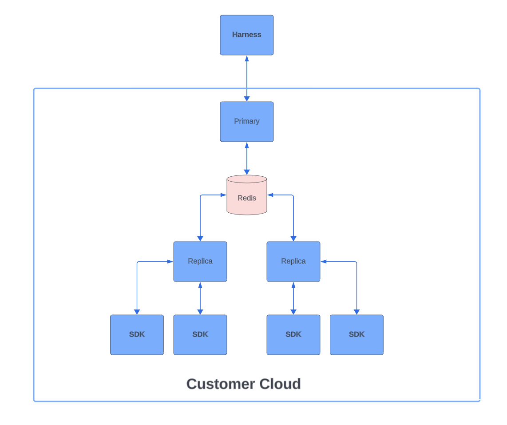

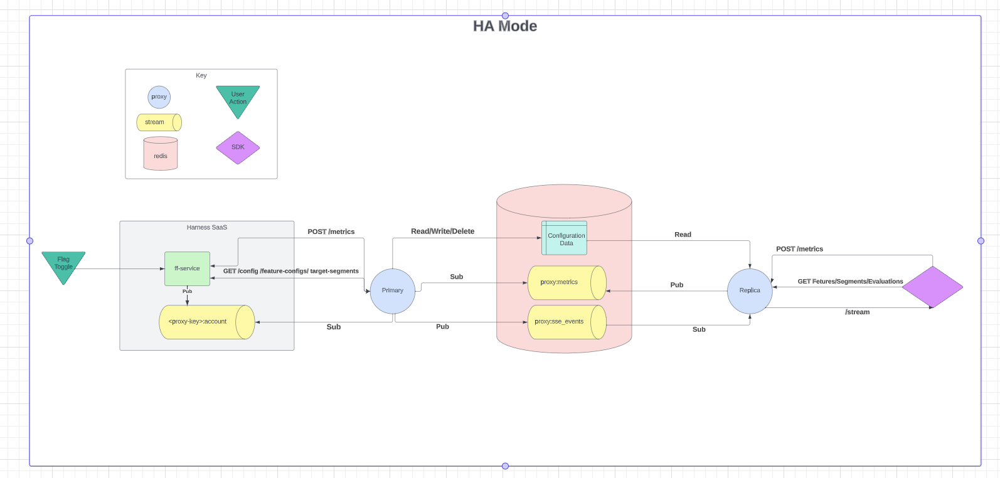

### HA Mode with single Redis example

If you want to run the Proxy in HA mode locally with a single redis instance please follow this [getting started example](https://github.com/harness/ff-proxy/tree/v2/examples/ha_mode_with_monitoring).

### HA Mode with Redis Cluster

If you want to run the Proxy in HA mode locally with a redis cluster please follow this [getting started example](https://github.com/harness/ff-proxy/tree/v2/examples/redis_cluster_ha_mode_with_monitoring).

### Single Mode

When running the Relay Proxy V2 in HA mode, the Primary Proxy starts up and retrieves the configuration from Harness SaaS. It, then, stores it in the cache and opens up a stream with Harness SaaS to listen for changes. Whenever there is an update in Harness SaaS, an event is sent to the Primary Proxy and when the Proxy receives this event, it reaches out to Harness SaaS to fetch the change. The diagram below shows the Relay Proxy V2 in Single Proxy Mode:


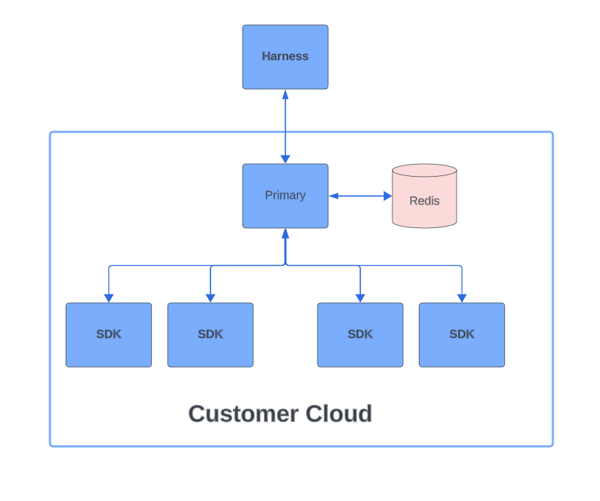

## Configuration

### Required Configuration

The below configuration options are required in order for the Primary & Replica Proxy to start up

#### Primary

| Environment Variable | Example                              | Description                                                                                                                                                                                                                                                              | Default Value |
|----------------------|--------------------------------------|--------------------------------------------------------------------------------------------------------------------------------------------------------------------------------------------------------------------------------------------------------------------------|---------------|
| PROXY_KEY            | d8ba3e2f-3993-4ae1-9bc9-014f5ec68273 | The ProxyKey you want to configure your Proxy to use                                                                                                                                                                                                                     | ""            |
| REDIS_ADDRESS        | localhost:6379                       | The host and port of the redis server you want your Proxy to connect to. If you're using redis cluster this should be a comma separated list containing the address of each node in your cluster e.g. localhost:6379,localhost:6380,localhost:6381                                                                                                                                                                                                  | ""            |
| READ_REPLICA         | false                                | Determines if the Proxy runs as a read replica or a Primary                                                                                                                                                                                                              | false         |
| AUTH_SECRET          | someRandomlyGeneratedSecretYouKeep   | Used by the Proxy to sign the JWT tokens it creates and returns to SDKs when they authenticate with the Proxy. The Proxy then checks that the token provided in any subsequent reqeusts by SDKs has been signed with this secret to ensure auth tokens can't be spoofed. | ""            |

#### Replica

| Environment Variable | Example                            | Description                                                                                                                                                                                                                                                              | Default Value |
|----------------------|------------------------------------|--------------------------------------------------------------------------------------------------------------------------------------------------------------------------------------------------------------------------------------------------------------------------|---------------|
| REDIS_ADDRESS        | localhost:6379                     | The host and port of the redis server you want your Proxy to connect to                                                                                                                                                                                                  | ""            |
| READ_REPLICA         | true                               | Determines if the Proxy runs as a read replica or a Primary                                                                                                                                                                                                              | false         |
| AUTH_SECRET          | someRandomlyGeneratedSecretYouKeep | Used by the Proxy to sign the JWT tokens it creates and returns to SDKs when they authenticate with the Proxy. The Proxy then checks that the token provided in any subsequent reqeusts by SDKs has been signed with this secret to ensure auth tokens can't be spoofed. | ""            |

### Full Breakdown of Configuration Options

The below table outlines all of the configuration options that are available for the Proixy. However in 99% of cases the only configuration options that users need to worry about are the required ones listed above.

| Environment Variable   | Example                              | Description                                                                                                                                                                                                                                                                                                                                                                                                                                                                                                                                       | Default Value                          |
|------------------------|--------------------------------------|---------------------------------------------------------------------------------------------------------------------------------------------------------------------------------------------------------------------------------------------------------------------------------------------------------------------------------------------------------------------------------------------------------------------------------------------------------------------------------------------------------------------------------------------------|----------------------------------------|
| PROXY_KEY              | d8ba3e2f-3993-4ae1-9bc9-014f5ec68273 | The ProxyKey you want to configure your Proxy to use                                                                                                                                                                                                                                                                                                                                                                                                                                                                                              | ""                                     |
| CLIENT_SERVICE         | `https://config.ff.harness.io/api/1.0` | The url of the FF Client Service running in Harness Saas that the Proxy commuincates with to fetch configuration data                                                                                                                                                                                                                                                                                                                                                                                                                             | `"https://config.ff.harness.io/api/1.0"` |
| METRIC_SERVICE         | `https://events.ff.harness.io/api/1.0` | The url of the FF Metric Service running in Harness Saas that the Proxy forwards SDK metric data onto                                                                                                                                                                                                                                                                                                                                                                                                                                             | `"https://events.ff.harness.io/api/1.0"` |
| AUTH_SECRET            | someRandomlyGeneratedSecretYouKeep   | Used by the Proxy to sign the JWT tokens it creates and returns to SDKs when they authenticate with the Proxy. The Proxy then checks that the token provided in any subsequent reqeusts by SDKs has been signed with this secret to ensure auth tokens can't be spoofed.                                                                                                                                                                                                                                                                          | "secret"                               |
| METRIC_POST_DURATION   | 60                                   | Controls how frequently in seconds the Primary Proxy posts metrics to Harness. Setting this to 0 will disable metrics forwarding from the Proxy to Saas and the absolute minimum that it can be set to is 60 seconds. It's also worth knowing that the Primary forwards metrics on to Harness Saas whenever 60 seconds has elapsed OR it has received 1MB worth of data. So if there's a high volume of metrics data going through your Proxy you may see metrics requests forwarded to Harness Saas more frequently than the value you set here. | 60                                     |
| HEARTBEAT_INTERVAL     | 60                                   | How often in seconds the proxy pings its health function. Set to 0 to disable                                                                                                                                                                                                                                                                                                                                                                                                                                                                     | 60                                     |
| READ_REPLICA           | true                                 | Determines if the Proxy runs as a read replica or a Primary                                                                                                                                                                                                                                                                                                                                                                                                                                                                                       | ""                                     |
| REDIS_ADDRESS          | localhost:6379                       | The host and port of the redis server you want your Proxy to connect to                                                                                                                                                                                                                                                                                                                                                                                                                                                                           | ""                                     |
| REDIS_PASSWORD         | foobar                               | Sets the password used to connect to your redis server. This is only required if password auth is enforced by your redis server.                                                                                                                                                                                                                                                                                                                                                                                                                  | ""                                     |
| REDIS_DB               | 0                                    | Database to be selected after connecting to the server. This is only required if you aren't using the default redis database.                                                                                                                                                                                                                                                                                                                                                                                                                     | 0                                      |
| PORT                   | 8000                                 | Port that the Proxy http server runs on inside the Relay Proxy container. This should only be changed for specific local dev purposes. The Pushpin Proxy that runs inside the Relay Proxy container expects the Proxy HTTP server to be available on port 8000. If you change this in a Production environment it is likely that SDK traffic won't be able to reach your Proxy.                                                                                                                                                                   | 8000                                   |
| TLS_ENABLED            | false                                | If true the proxy will use the tlsCert and tlsKey to run with https enabled                                                                                                                                                                                                                                                                                                                                                                                                                                                                       | false                                  |
| TLS_CERT               | ./certfile                           | Path to tls cert file. Required if tls enabled is true                                                                                                                                                                                                                                                                                                                                                                                                                                                                                            | ""                                     |
| TLS_KEY                | ./keyfile                            | Path to tls key file. Required if tls enabled is true                                                                                                                                                                                                                                                                                                                                                                                                                                                                                             | ""                                     |
| BYPASS_AUTH            | false                                | Contorls whether or not authentication is enforced on the Proxy's endpoints. This is ONLY used for local dev purposes to aid debugging, never set this to true in Production environments                                                                                                                                                                                                                                                                                                                                                         | false                                  |
| LOG_LEVEL              | INFO                                 | Contorls the logging level, valid options are INFO, DEBUG & ERROR                                                                                                                                                                                                                                                                                                                                                                                                                                                                                 | INFO                                   |
| GCP_PROFILER_ENABLED   | false                                | Enables the GCP Cloud Profiler. If you're using the Profiler in GCP to monitor your applications CPU & Memory usage then setting this to true will mean the Proxy will appear there along side your other applications. If you aren't using the GCP Profiler then you can ignore this setting.                                                                                                                                                                                                                                                    | false                                  |
| PPROF                  | false                                | Enables the golang profiler on port 6060. This is also only used for local development and we don't recommend enabling this in your production envrionments                                                                                                                                                                                                                                                                                                                                                                                       | false                                  |
| METRICS_STREAM_MAX_LEN | 1000                                 | Sets the max length of the redis stream that replicas use to send metrics to the Primary                                                                                                                                                                                                                                                                                                                                                                                                                                                          | 1000                                   |
| METRICS_STREAM_READ_CONCURRENCY | 10                          | Controls the number of threads running in the Primary that listen for metrics data being sent by replicas                                                                   | 10                                     |
| AND_RULES              | true                                 | Enables AND rule support for Target Groups in the Proxy                                                                                                                     | false                                  |
| PROMETHEUS_PORT        | 9091                                 | Port that the prometheus metrics are exposed on, defaults to 8000                                                                                                           | 8000                                   |
| FORWARD_TARGETS        | false                                 | The Proxy will forward targets sent by Client SDKs to Harness Saas | false                                   |


# The Proxy Key V2

## Creating A Proxy Key

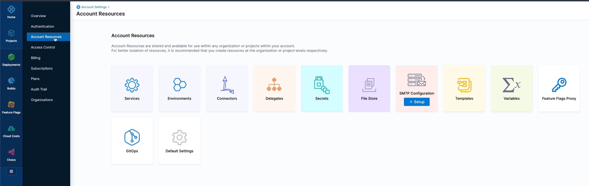

In order to create a Proxy Key, here are the steps you'll need to follow. 

 1. On the Home Page of the Harness Application, head over to *Account Settings*.
 2. Under *Account Settings*, an additional menu should appear. Click on *Account Resources*. 
 3. Once loaded, click the key icon labelled as *Feature Flags Proxy*.
 4. On the top left, Select *New Proxy Key*. Add a name and description of the key followed by *Next*.
 5. The next page allws you to select the organisation the key belongs to. Once selected, click *Next*. 
 6. Next, you will associate the proxy key with the Project Environments of your choosing. 
 7. Once selected, you can select the environments and if you'd like to select specific environments within each environment (i.e. `prod` or `non-prod`), select *Specific Environments* in the dropdown menu. 
 8. Once you are satisfied with your choices, you can go ahead and select *Generate Key and save*. 

Once the key is generated, it should automatically take you back to the *Feature Flags Proxy Keys* page in your Account Settings. 

### Rotating a Proxy Key

There are two ways that you can rotate your Proxy Key:
 1. Immediate rotation
 2. Buffered rotation

It’s worth noting that if you use immediate rotation, the old Proxy Key will become invalid and any Proxy’s using that key will be cut off from Harness Saas and unable to receive any updates until you reconfigure it to use the new key value. For this reason you’ll probably only want to use immediate key rotation if you’re concerned that your Proxy Key has been leaked.

If you just want to rotate your Proxy Key as a part of security practices then you’ll want to use the buffered rotation. With buffered rotation we allow the old key value to stay valid for a specified number of hours to give you time to reconfigure and redeploy your Proxy with the new key value. This means that there’s no down time for your Proxy where it loses connection with Harness Saas in between the time you rotate the key in the UI and redeploy your Proxy with the update key value. For example, if I set the buffer time to two hours when I rotate my key, that means my Proxy will be able to use the old key for up to two hours before it’s cut off from Harness Saas.

### Key Rotation

The user will be able to easily rotate the key by making request to the Admin API. 

A new key will be given and the old key will be rendered invalid. All auth tokens will also be invalidated.

### Startup Sequence

Below, you will find a diagram of the Primary Proxy V2 Startup Sequence:

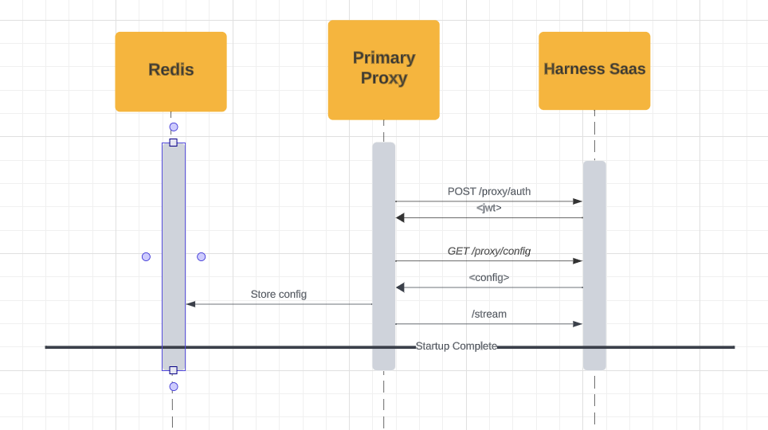

Here is a diagram of the the Replica Proxy V2 Startuo Sequence:

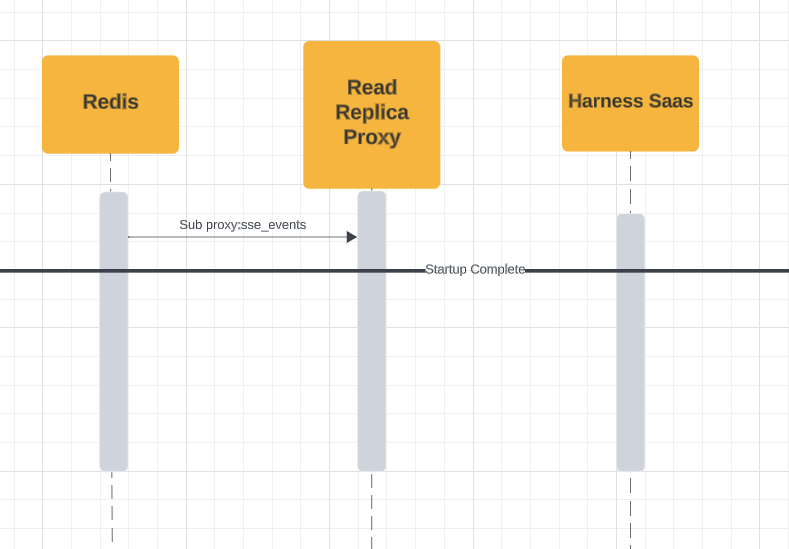

### Cached Data

Below is a table demonstrating the Cached Data:

| Key      | Type | Use Case | Example Data |
| ----------- | ----------- | ----------- | ----------- |
| `env-envID-feature-configs`   | `Key/Value`| Stores all of the `FeatureConfigs` in an environment. The Proxy returns this object to SDKs when they make a request to `/<environmentID>/feature-configs`. | <pre><code> `{ "feature": "flagOne", ... // other properties},"feature": "flagTwo",     ... // other properties }]`</code></pre> |
| `env-envID-feature-configs-<identifier`   | `Key/Value`| Stores a single flag config<br></br>- The Proxy returns this object to SDKs when they make a request to `/<environmentID>/feature-configs/<identifier>`. | <pre><code> `{ "feature": "flagOne", ... // other properties}]`</code></pre> |
| `env-envID-segments`   | `Key/Value`| Stores all of the TargetSegments in an environment<br></br>- The Proxy returns this object to SDKs when they make a request to `/<environmentID>/target-segments`. | <pre><code> `[{"identifier": "SegmentOne", ... // other properties},{ "identifier": "SegmentTwo", ... // other properties}]`</code></pre> |
| `env-envID-segments-<identifier>`   | `Key/Value`| Stores a single TargetSegment config<br></br>- The Proxy returns this object to SDKs when they make a request to `/environmentID/target-segments/<identifier>`. | <pre><code>`{ "identifier": "SegmentOne", ... // other properties}`</code></pre> |
| `auth-key-<hash>`   | `Key/Value`| Used by the Proxy authentication flow to validate SDK keys<br></br>- Stores the environmentID as the value so the Proxy can return the SDKs environmentID in the JWT claims. | <pre><code>`71716f30-aea0-4271-89b5-cb1c82be4567\`</code></pre> |
| `env-envID-api-configs`   | `Key/Value`| Binds the `auth-key-<hash>` with the environment it belongs to. This is used so we can invalidate SDK keys<br></br> that have been deleted in Harness SaaS. | <pre><code>`["auth-key-5e19dff88fb63a8afb76232f8a9b0b8c72c487314e1e497a45614be3c15ea424", "auth-key-8c60733910bb449b5395b7d445cb7562fae5f6a2ec2b83d6bdceca67a115e243", "auth-key-ddd268c12db0ee71c133774239ffa424f9abada5d47d075033eb3940f678c095"]`</code></pre> |
| `proxy:sse_events`   | `Stream`| Used by the Primary Proxy to forward SSE events to the Read Replica Proxy. | <pre><code>`{"event":"patch","domain":"flag","identifier":"f1","version":20,"environment":"71716f30-aea0-4271-89b5-cb1c82be4567","apiKey":" "`</code></pre> |
| `stream:sdk_metrics`   | `Stream`| Used to forward Metrics from Read Replica Proxy's to Primary Proxy.<br></br>- Primary proxy listens on this stream and forwards metrics data to Harness Saas. | <pre><code>`{"environment_id":"71716f30-aea0-4271-89b5-cb1c82be4567","metricsData":[{"attributes":[{"key":"featureIdentifier","value":"f1"},{"key":"featureName","value":"f1"},{"key":"variationIdentifier","value":"true"},{"key":"featureValue","value":"true"},{"key":"SDK_TYPE","value":"server"},{"key":"SDK_LANGUAGE","value":"go"},{"key":"SDK_VERSION","value":"1.0.0"},{"key":"target","value":"global"}],"count":2,"metricsType":"FFMETRICS","timestamp":1698669998778}],"targetData":[{"attributes":[],"identifier":"james","name":"james"}]}`</code></pre> |
| `ffproxy_saas_stream_health`   | `Stream`| Used to store the health status of the Harness Saas through to the Primary Proxy stream. | <pre><code>`"{\"state\":\"CONNECTED\",\"since\":1700216614438}"`</code></pre> |

### Inbound Endpoints

This hasn’t changed from Proxy v1 so these docs still apply Inbound endpoints | Harness Developer Hub .

### Outbound Endpoints

Below, you will find the endpoints requested by the Primary Relay Proxy when it communicates with Harness SaaS. Remember, 'Read Replica Proxy' only communicates with the Redis cache. 

| **Basic Startup** |
| Methods      | Link | Purpose |
| ----------- | ----------- | ----------- |
| GET      | `https://config.ff.harness.io/api/1.0/stream` | Authenticates the Proxy Key. | 
| GET   | `https://config.ff.harness.io/api/1.0/proxy/config` | Retrieves the configuration associated with the Proxy Key. |
| POST   | `https://config.ff.harness.io/api/1.0/proxy/auth` | Opens a stream with Harness SaaS to listen for changes. |

<br>
</br>

| **Periodic Requests** |
| Methods      | Link | Purpose |
| ----------- | ----------- | ----------- |
| GET      | `https://config.ff.harness.io/api/1.0/client/env/envID/feature-configs` | Retrieves the feature config changes that happen in Harness SaaS. | 
| GET      | `https://config.ff.harness.io/api/1.0/client/env/envID/target-segments` | Retrieves the target group changes that happen in Harness SaaS. | 
| GET      | `https://config.ff.harness.io/api/1.0/proxy/config?environment=envID` | Retrieves the environment specific changes that happen in Harness SaaS e.g. a new environment was associated with the Proxy Key. | 
| GET   | `https://config.ff.harness.io/api/1.0/proxy/config` | Retrieves the latest config associated with the Proxy Key. This request is made periodically if the stream between the Primary Proxy and Harness SaaS goes down to make sure the Proxy doesn't get out of sync.  |
| POST   | `https://config.ff.harness.io/api/1.0/metrics/envID` | Forwards metrics from the SDKs on to the Harness SaaS. |

<br>
</br>


## Monitoring the Proxy

The proxy uses Prometheus for recording metrics that can be used to understand how the proxy is behaving and performing. You can view and scrape these metrics by hitting the proxy's /metrics endpoint. For example, if you're running the proxy locally on port 7000, you can view the metrics it exposes by making the following request:

`$ curl localhost:7000/metrics`

### Examples

There's an example [grafana dashboard](https://grafana.com/grafana/dashboards/20091-harness-ff-proxy/) built using the Prometheus metrics the Proxy exposes that you can import into your grafana instance.

There's also a [getting started example](https://github.com/harness/ff-proxy/tree/v2/examples/ha_mode_with_monitoring) that runs the Proxy in HA mode with Prometheus and Grafana setup.

### Example Prometheus Configuration

Below is an example prometheus configuration that can be used to scrape metrics from the proxy.

```
global:
  scrape_interval:     10s
  evaluation_interval: 10s

scrape_configs:
  - job_name: 'prometheus'
    scrape_interval: 30s
    static_configs:
      - targets: ['localhost:7000']
```

### Metrics Exposed

Here is a breakdown of all the prometheus metrics exposed by the Proxy.

| **Name**                                                    | **Type**  | **Labels**                                                                                                                                                                                        | **Description**                                                                                              |
|-------------------------------------------------------------|-----------|---------------------------------------------------------------------------------------------------------------------------------------------------------------------------------------------------|--------------------------------------------------------------------------------------------------------------|
| ff_proxy_http_requests_total                                | counter   | code: The HTTP response code<br></br>envID: The environmentID<br></br>method: The HTTP method used for the request<br></br>url: The requests URL                                                     | Records the number of requests to an endpoint                                                                |
| ff_proxy_http_requests_duration                             | histogram | envID: The environmentID<br></br>url: The requests URL                                                                                                                                             | Records the request duration for an endpoint                                                                 |
| ff_http_requests_content_length_histogram                   | histogram | envID: The environmentID<br></br>url: The requests URL                                                                                                                                             | Records the value of the Content-Length header for an HTTP request                                           |
| ff_proxy_metrics_forwarded                                  | counter   | envID: The environmentID<br></br>error: Indicates if an error occurred during forwarding                                                                                                           | Tracks the number of metrics forwarded from the proxy to SaaS Feature Flags                                  |
| ff_proxy_sdk_usage                                          | counter   | envID: The environment ID<br></br>sdk_language: The programming language of the SDK<br></br>sdk_type: The type of the SDK (e.g., server, client, mobile)<br></br>sdk_version: The version of the SDK | Tracks what SDKs are using the FF proxy                                                                      |
| ff_proxy_to_client_service_requests                         | counter   | url: The URL the request is being made to<br></br>envID: The environmentID<br></br>code: The status code returned by Harness Saas                                                                  | Tracks what requests the Primary Proxy makes to Harness Saas                                                 |
| ff_proxy_to_ff_client_service_requests_duration             | histogram | url: The URL the request is being made to<br></br>envID: The environmentID                                                                                                                         | Tracks the request duration for http requests made from the Proxy to Harness Saas                            |
| ff_proxy_saas_to_primary_sse_consumer_messages_received     | counter   | topic: The name of the stream being subscribed to<br></br>error: Indicates if an error occurred consuming or publishing events to the stream                                                       | Tracks the number of SSE events that the Primary Proxy has recevied from Harness Saas                        |
| ff_proxy_primary_to_replica_sse_producer_messages_published | counter   | topic: The name of the stream being subscribed to<br></br>error: Indicates if an error occurred consuming or publishing events to the stream                                                       | Tracks the number of SSE events that have been forwarded from the Primary Proxy to Replica Proxy's           |
| ff_proxy_primary_metrics_stream_consumer_messages_received  | counter   | topic: The name of the stream being subscribed to<br></br>error: Indicates if an error occurred consuming or publishing events to the stream                                                       | Tracks the number of metrics requests the Primary has received from Replica Proxy's                          |
| ff_proxy_replica_sse_consumer_messages_received             | counter   | topic: The name of the stream being subscribed to<br></br>error: Indicates if an error occurred consuming or publishing events to the stream                                                       | Tracks the number of SSE events that Replicas have received from the Primary Proxy                           |
| ff_proxy_replica_to_sdk_sse_producer_messages_published     | counter   | topic: The name of the stream being subscribed to<br></br>error: Indicates if an error occurred consuming or publishing events to the stream                                                       | Tracks the number of SSE events that Replicas have forwarded on to SDKs                                      |
| ff_proxy_replica_metrics_stream_producer_messages_published | counter   | topic: The name of the stream being subscribed to<br></br>error: Indicates if an error occurred consuming or publishing events to the stream                                                       | Tracks the number of metrics requests that have been forwarded from Replicas to the Primary                  |
| ff_proxy_redis_cache_write_count                            | counter   | error: Indicates whether an error occurred during the write operation<br></br>key: The cache key                                                                                               | Tracks how many writes are made to the cache                                                                 |
| ff_proxy_redis_cache_remove_count                           | counter   | key: The cache key                                                                                                                                                                            | Tracks how many deletes are made to the cache                                                                |
| ff_proxy_redis_cache_delete_duration                        | histogram | N/A                                                                                                                                                                                               | Tracks how long delete operations to the cache take                                                          |
| ff_proxy_redis_cache_write_duration                         | histogram | N/A                                                                                                                                                                                               | Tracks how long write operations to the cache take                                                           |
| ff_proxy_memoize_cache_hit                                  | counter   | N/A                                                                                                                                                                                               | Tracks the number of hits on lookups in the Proxy's memoize cache.                                           |
| ff_proxy_memoize_cache_miss                                 | counter   | N/A                                                                                                                                                                                               | Tracks the number of misses on lookups in the Proxy's memoize cache.                                         |
| ff_proxy_memoize_cache_write_marshal                        | counter   | N/A                                                                                                                                                                                               | Tracks the number of writes to the memoize cache                                                             |
| ff_proxy_memoize_cache_hit_with_unmarshal                   | counter   | N/A                                                                                                                                                                                               | Tracks the number of hits in the memoize cache where we had to perform an unmarshal over returning raw bytes |

## Account Stream

When the Proxy starts assuming that the configuration is correct, it will first attempt to authenticate with the SAAS using the Proxy key configured. If the authentication is successful, the Proxy will receive and store the `proxyAuth` token to use later to:
 - start the acc level stream,
 - request configs for proxy/environment/features/segments.

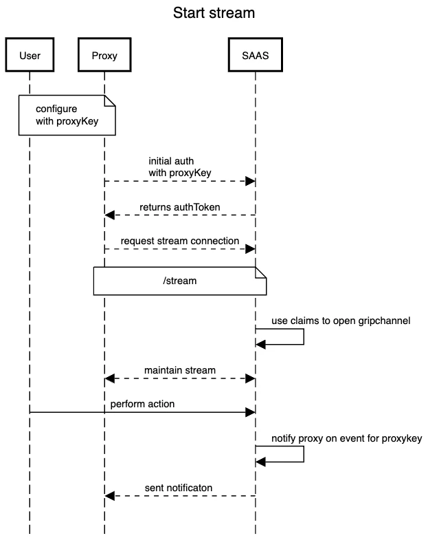

If the Proxy key is deleted by the user, the event will be sent to the proxy with information to close the stream channel.

### Stream Reconnect

If the stream were to disconnect unexpectedly, it will stop itself from connecting and will resume attempting to reconnect after a period of time.

### Stream Terminations

### SAAS - Proxy

The Proxy is configured to a specific key. Here is a breakdown of what happens when the Stream disconnects.:

 1. If the key was to be deleted by the project admin in the SAAS, a `proxyKeyDeleted` event is sent by the Account Stream to the proxy followed by a `stream close` message. 
 2. Proxy will then close the stream to the Saas. 
 3. Once this happens, the proxy will attempt to clear all the assets assigned to the key in the cache to prevent `false positive` reading values by the downstream SDKs.
 4. In this case, the SDK should no longer be able to read the actual value of the asset and will go with the default value used by client.

### Proxy - SDKs

The termination of the connection between the Proxy and the SDK occurs when `Environment` or the `APIKey` are deleted. If that were to happen:

 1. The appropriate event type is sent to the proxy by SAAS. 
 2. Similarly, the proxy will update the list of assets in the cache. This will result in either deleting the key or deleting all the assets for delete environment. This will render all existing auth tokens using deleted environment/key invalid.  All SDKs subscribed to the environment, or those using deleted APIKey will be sent “end of stream” message and should subsequently close the connection. 
Normally they would fall back to the pooling mode but because in both cases APIKey no longer exists, SDK will not be able to authenticate using its auth token. 

### Cache Cleanup 

When the proxy begins, it will attempt to fetch the proxy config from the SAAS and populate the cache with inventory of assets for each environment associated with the key which incudes: 
 - `APIKeys`,
 - Features and, 
 - Segments.

The Smart Cleanup feature has been implemented to cover a scenario in which assets in cache are off sync with the current state of SAAS. 

This could be the case if proxy is off for period of time or it cannot establish connection with SAAS. When the connection is reestablished, or when proxy starts and the cache instance is not empty, Proxy will pull the latest config and scan the existing cache entries. It will then delete all the entries which are not in the latest config to ensure the state is matching.

### Cache refresh

To minimise the api requests between Proxy and SAAS, Proxy will fetch a new config when the flag/segment is created or patched. When the asset is deleted, we will handle the cache update without any additional request to the SAAS.

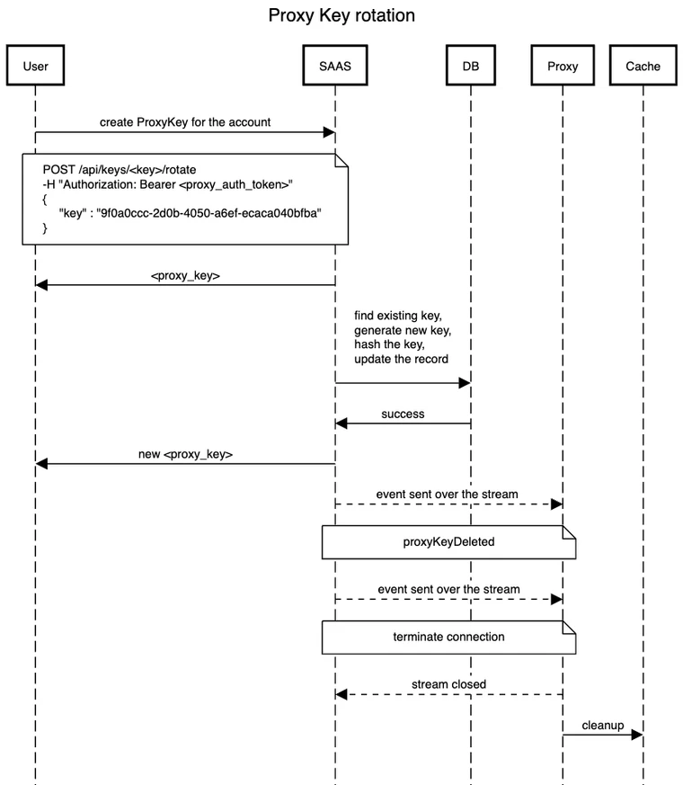

### E2E Journey

Below, you will find a diagram of the the End-to-End Journey of the Proxy Rotation. 


## FAQs About Relay Proxy V2

### Relay Proxy Version 2 vs Relay Proxy Version 1: What's the difference?

Relay Proxy V2 was developed to fix some of the limitations that came with Relay Proxy V1. The key differences were:
 - that we were unable to configure new environments without restarting the Proxy.
 - Proxy V1 required a restart any time you added new SDK keys to an environment in Harness SaaS and wanted the Proxy to pick them up.
 - Proxy V1 required a config update and restart if you wanted to configure it to use new environments.
 - Proxy V1 embedded the Harness Golang SDK and spun up an instance of this for each environmnet. This meant that there was a stream per environment open between the Relay Proxy and Harness SaaS.
 - No real HA ability.

### How does Proxy V2 address these issues?

 - Stream Per Environment
 -- Instead of embedding the Golang SDK in Proxy V2 and relying on the existing SDK streaming functionality Proxy V2 relies on a new type of Account level stream that’s associated with a Proxy Key. This means that there will only ever be one stream open between your Primary Proxy and Harness SaaS and events for all environments associated with the Proxy key will be sent down this one stream.

 - Unable to configure new environments without restarts
 -- With the new Account level stream, whenever a new environment is created or assigned to a Proxy Key we now send events down this stream to let the Proxy know that a new environment has been assigned to it. The Proxy will then reach out to Harness SaaS to retrieve this new config and store it in the cache without having to restart.

 - Unable to configure new SDK keys without restarts
 -- Like with new environments, when a new SDK key is created in an environment that the Proxy is configured to use we send the Proxy an event to let it know an SDK key has been added. The Proxy will then store the hashed SDK key in its cache so that any new SDKs spun up with this SDK key can authenticate with the Proxy.

 - No real HA ability
 -- With Proxy V2 we’ve made it possible to. configure Proxy’s to run specifically as read replicas or a Primary that communicates with Harness SaaS. This was something that isn’t available with Proxy V1 and if you want to run multiple Proxy’s in V1 they all run as Primary’s.

## Why use the Relay Proxy?

In the following cases, you might want to set up Relay Proxy:

* **Air-gap Deployments**: You can deploy the proxy in your network if you don't have or can't allow external access to your apps. Local apps connect directly to the proxy, and the proxy has external access to the remote feature flag service to synchronize configuration.
* **Offline Mode**: This is identical to air-gapped, except that the proxy does not have a connection to the internet. In that scenario, the configuration must be loaded from the outside using configuration files. Configuration files are used to link your programmes to the proxy.
* **High Availability / Reliability**: The feature flag service is extremely reliable. We will fail over to the failover cluster in the event of a major failure. However, in the event of a full network loss, the Relay Proxy ensures that your apps continue to run even after restarts.

If you decide to use the Relay Proxy, make sure it has a good place in your network design. For your app to run, it needs to be able to contact the Relay Proxy, and the architecture differs depending on the type of app. For example, if you want to link the Relay Proxy to any client-side apps, don't put it inside a firewall.

## Are there any constraints to the Relay Proxy V2?

- At this current time and due to the way Harness implements the authentication tokens, users have a limit of 1000 environments per key.
- When running in HA mode Read replica's will not forward targets on to Harness Saas. This doesn't impact functionality as the Proxy will still add the Targets to the redis cache, it just means you won't see them in the Feature Flags UI.
