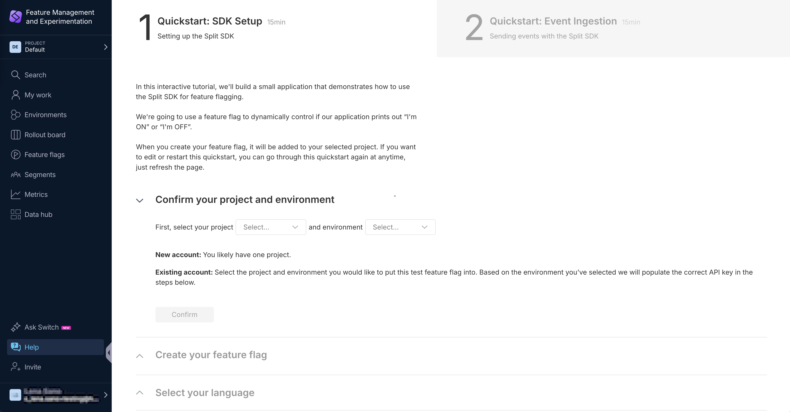

import Link from "@docusaurus/Link";

This guide describes the basic steps for getting started with Split Feature Management & Experimentation.

## Quickstarts

Take a look at these step-by-step guides for getting started with Split FME.

* <Link to="/docs/feature-management-experimentation/getting-started/docs/tutorials/create-a-feature-flag">Create a feature flag</Link>
* <Link to="/docs/feature-management-experimentation/getting-started/docs/tutorials/create-a-progressive-rollout">Create a progressive rollout</Link>
* <Link to="/docs/feature-management-experimentation/getting-started/docs/tutorials/create-an-a-b-test">Create an A/B test</Link>

You can also follow the SDK Setup and Event Ingestion **Quickstart wizard** in Split. Navigate to `https://app.split.io/org/[your-account-id]/ws/[your-project-id]/help/guides/sdk`.

## Advanced features

Gain a more in-depth view of the power of Feature Management & Experimenation, and its benefits for you.

* <Link to="/docs/feature-management-experimentation/getting-started/docs/tutorials/set-up-release-monitoring">Set up feature monitoring for your software release</Link>