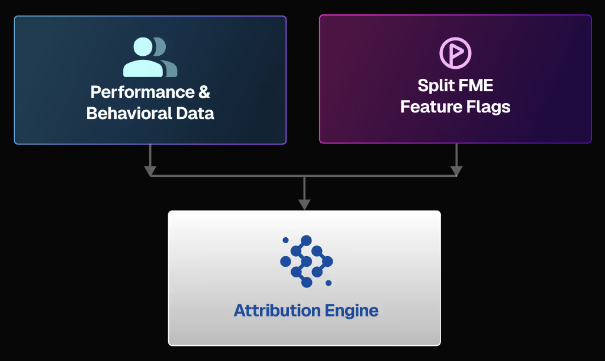

  <button style={{borderRadius:'8px', border:'1px', fontFamily:'Courier New', fontWeight:'800', textAlign:'left'}}> help.split.io link: https://help.split.io/hc/en-us/articles/360016583411-Videos-Product-overview   ✘ images still hosted on help.split.io </button>

Harness Feature Management & Experimentation (FME) combines capabilities for feature delivery and control with built-in tools for measurement and learning. FME connects insightful data to every feature release, eliminates hesitation from the software development process, and supports modern practices like continuous delivery and progressive delivery.

### Architected for Performance, Security, and Resilience

Split is built on a global feature flag and data processing architecture that serves 50 billion daily feature flags to over 2 billion end users around the globe.

* **Performance:** FME streaming architecture pushes changes to its SDKs in milliseconds.
* **Security:** The SDKs evaluate feature flags locally, so customer data is never sent over the internet.
* **Resilience:** Our SaaS app, data platform, and API span multiple data centers. Plus, our SDKs cache locally to handle any network interruptions.

Our stateless architecture scales to millions of users with no degradation in performance. Our SDKs reside in your frontend, backend, and mobile apps where they make feature flags and targeting decisions locally, without the need to send private user data outside your app for evaluation.

### Attribution engine

The platform is backed by a patented Attribution Engine that joins feature flag data with performance and behavioral data, empowering teams to speed up releases, mitigate risk, and maximize business outcomes for every application change.

### Instant feature impact detection

Split pairs feature flags with performance and behavior data. From page load times to errors and shopping cart values, Split immediately calculates the impact of new features on every metric of every rollout. With pinpoint precision, FME helps you quickly catch issues that affect your application, far surpassing the precision of APM tools, and leading you to quick actionable data that drive your decisions and customer satisfaction.

## Get started with FME

Some resources to get started with FME:

* [What's supported?](./../whats-supported.md)
* [Onboarding guide](./onboarding-guide.md)
* [Key concepts](./key-concepts/)